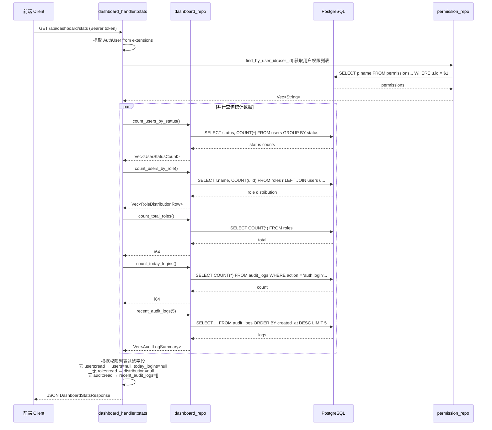
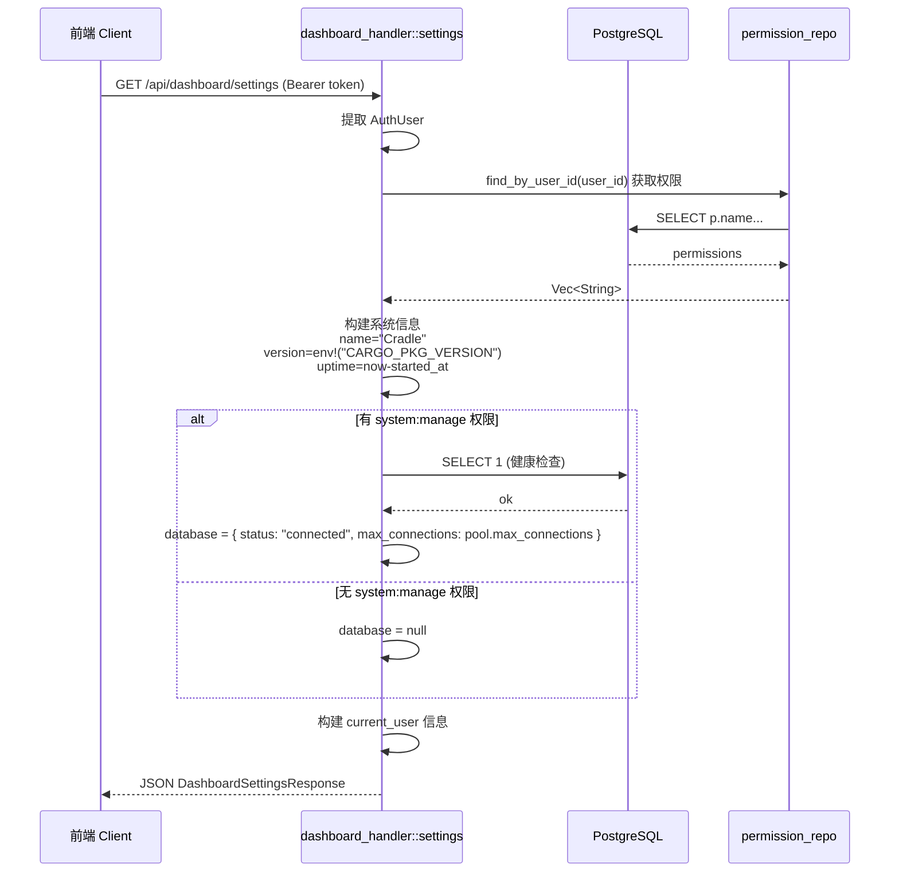
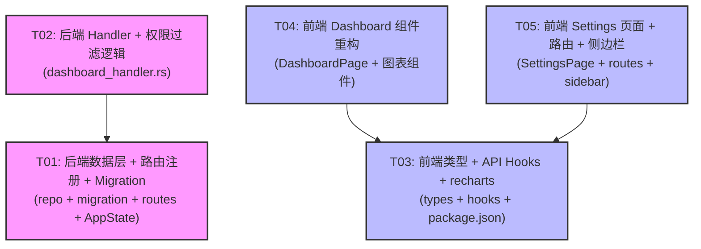

# cradle Phase 3 架构设计文档

> Dashboard 统计 & 系统设置

## 1. 实现方案

### 1.1 核心技术挑战

1. **聚合查询性能**：Dashboard API 需要在单次请求中返回多维度统计数据（用户数/角色数/今日登录/角色分布/最近审计日志），需在 repository 层做高效聚合 SQL，避免 N+1 查询
2. **字段级权限过滤**：同一 API 根据调用者的权限返回不同层级的数据字段（`users.*` 需要 `users:read`、`roles.distribution` 需要 `roles:read` 等），需在 handler 层动态构建响应
3. **前端权限感知渲染**：前端需要根据返回字段是否为 `null` 来决定是否渲染对应卡片/图表，而不是硬编码
4. **系统运行时长追踪**：需要在 AppState 中记录服务启动时间，uptime 从启动时间差值计算
5. **增量开发**：不能破坏 Phase 1（认证）和 Phase 2（RBAC）的现有功能

### 1.2 框架与库选型

| 组件 | 选型 | 理由 |
|------|------|------|
| 后端聚合查询 | 原生 SQL via sqlx | 项目已使用 sqlx，聚合统计直接写 SQL 最直观高效 |
| 后端 JSON 动态构建 | `serde_json::json!` 宏 | 字段级过滤用 `json!` 动态构建比定义多个 struct 更灵活 |
| 系统版本 | `env!("CARGO_PKG_VERSION")` | 编译时从 `Cargo.toml` 注入，零运行时成本 |
| 前端图表库 | `recharts@^2.12` | React 生态最成熟的声明式图表库，与 shadcn/ui 风格兼容好 |
| 前端 API 层 | TanStack Query `useQuery` | 项目已在用，保持一致性 |
| 前端路由 | react-router-dom v7 | 项目已在用，直接新增路由 |

### 1.3 架构模式

延续项目现有分层架构，不做变更：

```
Handler（HTTP 层，权限过滤，响应构建）
  → Service（业务编排）
    → Repository（数据访问，SQL 聚合查询）
```

Dashboard 模块特殊之处：
- **无独立 service 层**：统计查询逻辑简单，handler 直接调用 repo 获取数据后拼装；settings 查询逻辑也简单，直接在 handler 中处理
- **AppState 扩展**：新增 `started_at: Instant` 用于 uptime 计算

---

## 2. 文件列表

### 2.1 后端新增文件

| 文件路径 | 说明 |
|----------|------|
| `apps/backend/src/handlers/dashboard_handler.rs` | Dashboard HTTP handler（stats + settings） |
| `apps/backend/src/repository/dashboard_repo.rs` | Dashboard 聚合查询 |
| `apps/backend/migrations/20260524000001_phase3_dashboard.sql` | 新增 `dashboard:read` 权限种子数据 |

### 2.2 后端修改文件

| 文件路径 | 说明 |
|----------|------|
| `apps/backend/src/handlers/mod.rs` | 新增 `pub mod dashboard_handler;` |
| `apps/backend/src/repository/mod.rs` | 新增 `pub mod dashboard_repo;` |
| `apps/backend/src/routes/mod.rs` | 新增 `dashboard_routes()` |
| `apps/backend/src/lib.rs` | AppState 新增 `started_at`，routes 注册 dashboard |

### 2.3 前端新增文件

| 文件路径 | 说明 |
|----------|------|
| `apps/frontend/src/types/dashboard.ts` | Dashboard 相关 TypeScript 类型定义 |
| `apps/frontend/src/hooks/useDashboard.ts` | Dashboard API hooks（useDashboardStats, useDashboardSettings） |
| `apps/frontend/src/components/dashboard/StatsCards.tsx` | 统计数字卡片组件 |
| `apps/frontend/src/components/dashboard/RoleDistributionChart.tsx` | 角色分布图表 |
| `apps/frontend/src/components/dashboard/UserStatusChart.tsx` | 用户状态分布图表 |
| `apps/frontend/src/components/dashboard/RecentAuditLogs.tsx` | 最近审计日志表格 |
| `apps/frontend/src/components/dashboard/SettingsPage.tsx` | 系统设置页面 |

### 2.4 前端修改文件

| 文件路径 | 说明 |
|----------|------|
| `apps/frontend/src/components/dashboard/DashboardPage.tsx` | 重构：替换硬编码数据，组合新组件 |
| `apps/frontend/src/components/layout/Sidebar.tsx` | 新增 Settings 导航项 |
| `apps/frontend/src/routes/index.tsx` | 新增 `/dashboard/settings` 路由，替换占位组件 |
| `apps/frontend/package.json` | 新增 `recharts` 依赖 |

---

## 3. 数据结构与接口

### 3.1 Class Diagram

```mermaid
classDiagram
    class AppState {
        +db: PgPool
        +jwt_secret: String
        +access_exp_secs: i64
        +refresh_exp_secs: i64
        +started_at: Instant
    }

    class DashboardHandler {
        +stats(State, AuthUser) Json~DashboardStatsResponse~
        +settings(State, AuthUser) Json~DashboardSettingsResponse~
    }

    class DashboardRepo {
        +count_users_by_status(PgPool) UserStatusCount
        +count_users_by_role(PgPool) Vec~RoleDistribution~
        +count_total_roles(PgPool) i64
        +count_today_logins(PgPool) i64
        +recent_audit_logs(PgPool, limit: i64) Vec~AuditLogResponse~
    }

    class DashboardStatsResponse {
        +users: UserStats or null
        +roles: RoleStats
        +today_logins: i64 or null
        +recent_audit_logs: Vec~AuditLogSummary~
    }

    class UserStats {
        +total: i64
        +active: i64
        +disabled: i64
    }

    class RoleStats {
        +total: i64
        +distribution: Vec~RoleDistribution~ or null
    }

    class RoleDistribution {
        +role_name: String
        +count: i64
    }

    class AuditLogSummary {
        +id: Uuid
        +action: String
        +user_email: String or null
        +resource_type: String or null
        +created_at: DateTime~Utc~
    }

    class DashboardSettingsResponse {
        +system: SystemInfo
        +database: DatabaseInfo or null
        +current_user: CurrentUserInfo
    }

    class SystemInfo {
        +name: String
        +version: String
        +uptime_seconds: u64
    }

    class DatabaseInfo {
        +status: String
        +max_connections: u32
    }

    class CurrentUserInfo {
        +id: Uuid
        +email: String
        +name: String or null
        +role: String
        +permissions: Vec~String~
        +created_at: DateTime~Utc~
    }

    class AuthUser {
        +user_id: Uuid
        +email: String
        +role: String
        +role_id: Option~Uuid~
        +jti: Uuid
        +is_superadmin() bool
        +require_permission(PgPool, str) Result
    }

    DashboardHandler --> AppState : uses
    DashboardHandler --> AuthUser : extracts
    DashboardHandler --> DashboardRepo : calls
    DashboardStatsResponse --> UserStats
    DashboardStatsResponse --> RoleStats
    DashboardStatsResponse --> AuditLogSummary
    RoleStats --> RoleDistribution
    DashboardSettingsResponse --> SystemInfo
    DashboardSettingsResponse --> DatabaseInfo
    DashboardSettingsResponse --> CurrentUserInfo
```



### 3.2 关键 Struct 定义

#### 后端 — Repository 查询结果

```rust
// dashboard_repo.rs

#[derive(sqlx::FromRow)]
pub struct UserStatusCount {
    pub status: String,
    pub count: i64,
}

#[derive(sqlx::FromRow)]
pub struct RoleDistributionRow {
    pub role_name: String,
    pub count: i64,
}

#[derive(sqlx::FromRow)]
struct CountResult {
    count: i64,
}
```

#### 后端 — API 响应（动态 JSON 构建）

由于字段级权限过滤需要部分字段返回 `null`，使用 `serde_json::json!` 动态构建，不定义固定 struct。Handler 返回 `Json<serde_json::Value>`。

核心 SQL 查询：

```sql
-- 用户按状态统计
SELECT status, COUNT(*) as count FROM users GROUP BY status;

-- 角色分布
SELECT r.name as role_name, COUNT(u.id) as count
FROM roles r LEFT JOIN users u ON u.role_id = r.id
GROUP BY r.name ORDER BY count DESC;

-- 角色总数
SELECT COUNT(*) as count FROM roles;

-- 今日登录次数 (action = 'auth.login')
SELECT COUNT(*) as count FROM audit_logs
WHERE action = 'auth.login' AND created_at >= CURRENT_DATE;

-- 最近 N 条审计日志
SELECT al.id, al.action, u.email AS user_email, al.resource_type, al.created_at
FROM audit_logs al LEFT JOIN users u ON al.user_id = u.id
ORDER BY al.created_at DESC LIMIT $1;
```

#### 前端 — TypeScript 类型

```typescript
// types/dashboard.ts

export interface DashboardStats {
  users: {
    total: number
    active: number
    disabled: number
  } | null
  roles: {
    total: number
    distribution: { role_name: string; count: number }[] | null
  }
  today_logins: number | null
  recent_audit_logs: {
    id: string
    action: string
    user_email: string | null
    resource_type: string | null
    created_at: string
  }[]
}

export interface DashboardSettings {
  system: {
    name: string
    version: string
    uptime_seconds: number
  }
  database: {
    status: string
    max_connections: number
  } | null
  current_user: {
    id: string
    email: string
    name: string | null
    role: string
    permissions: string[]
    created_at: string
  }
}
```

---

## 4. 程序调用流程

### 4.1 Dashboard Stats API 调用序列



### 4.2 Dashboard Settings API 调用序列



---

## 5. 不明确之处（假设）

| # | 问题 | 假设/决策 |
|---|------|----------|
| 1 | 今日登录统计口径 | 按 `action = 'auth.login'` 的记录数统计（含重复登录）— 已确认 |
| 2 | `dashboard:read` 权限 | 新增 `dashboard:read` 权限属 `dashboard` module，用于 settings API — P1 |
| 3 | 图表库选择 | `recharts` — 已确认 |
| 4 | 设置页可编辑性 | 只读展示，不可编辑 — 已确认 |
| 5 | 时间范围筛选 | P2 不做 — 已确认 |
| 6 | 在线用户 | 不做 — 已确认 |
| 7 | 聚合查询策略 | 采用多个独立查询并行调用，不使用复杂 JOIN 单查询，因为各统计数据源独立，并行更灵活且性能可接受 |
| 8 | AppState `started_at` 类型 | 使用 `std::time::Instant`，不适合 serde，仅在内存中使用 |
| 9 | 数据库状态 `max_connections` | 从 `AppState.db` 的 PgPoolOptions 获取，如果无法直接获取则从 config 读取 `database.max_connections` |

---

## 6. 依赖包列表

### 后端（无新增 Cargo 包）

Phase 3 后端不引入新的第三方依赖。所有功能基于现有 sqlx / serde_json / axum 实现。

### 前端

```
- recharts@^2.12.0: React 声明式图表库，用于角色分布和用户状态图表
```

---

## 7. 任务列表

### T01: 后端数据层 + 路由注册 + Migration

**源文件**:
- `apps/backend/migrations/20260524000001_phase3_dashboard.sql` （新增）
- `apps/backend/src/repository/dashboard_repo.rs` （新增）
- `apps/backend/src/repository/mod.rs` （修改）
- `apps/backend/src/handlers/mod.rs` （修改）
- `apps/backend/src/routes/mod.rs` （修改）
- `apps/backend/src/lib.rs` （修改）

**具体内容**:
1. 创建 migration 文件，向 `permissions` 表插入 `dashboard:read` 权限（module='dashboard'），并将其分配给 superadmin 和 admin 角色
2. 创建 `dashboard_repo.rs`，实现以下函数：
   - `count_users_by_status(pool) -> Vec<UserStatusCount>` — 用户按状态分组统计
   - `count_users_by_role(pool) -> Vec<RoleDistributionRow>` — 角色分布统计
   - `count_total_roles(pool) -> i64` — 角色总数
   - `count_today_logins(pool) -> i64` — 今日登录次数（`action = 'auth.login'`）
   - `recent_audit_logs(pool, limit) -> Vec<AuditLogSummary>` — 最近 N 条审计日志摘要
3. `repository/mod.rs` 新增 `pub mod dashboard_repo;`
4. `handlers/mod.rs` 新增 `pub mod dashboard_handler;`
5. `routes/mod.rs` 新增 `dashboard_routes()` 函数，注册 `GET /api/dashboard/stats` 和 `GET /api/dashboard/settings`
6. `lib.rs`:
   - AppState 新增 `started_at: std::time::Instant` 字段
   - 在 app 构建中注册 dashboard_routes 并应用 auth middleware

**预估复杂度**: 中等

**依赖**: 无

**优先级**: P0

---

### T02: 后端 Handler + 权限过滤逻辑

**源文件**:
- `apps/backend/src/handlers/dashboard_handler.rs` （新增）
- `apps/backend/src/extractors/auth.rs` （可能微调，如新增辅助方法）

**具体内容**:
1. 创建 `dashboard_handler.rs`，实现：
   - `stats()` handler:
     - 提取 AuthUser
     - 调用 `permission_repo::find_by_user_id` 获取权限列表
     - 并行调用 dashboard_repo 的 5 个聚合查询函数（可用 `tokio::join!` 并行）
     - 根据权限列表动态构建 JSON 响应：
       - `users:read` 权限 → 填充 `users` 和 `today_logins`，否则 `null`
       - `roles:read` 权限 → 填充 `roles.distribution`，否则 `null`
       - `audit:read` 权限 → 填充 `recent_audit_logs`，否则空数组
       - `roles.total` 对所有认证用户可见
   - `settings()` handler:
     - 提取 AuthUser，检查 `dashboard:read` 权限（无权限返回 403）
     - 构建系统信息（name / version / uptime）
     - 有 `system:manage` 权限时查询数据库状态（`SELECT 1`）+ max_connections
     - 构建当前用户信息卡片
     - 返回 JSON 响应

**预估复杂度**: 中高（核心权限过滤逻辑）

**依赖**: T01

**优先级**: P0

---

### T03: 前端类型定义 + API Hooks + 图表库

**源文件**:
- `apps/frontend/src/types/dashboard.ts` （新增）
- `apps/frontend/src/hooks/useDashboard.ts` （新增）
- `apps/frontend/package.json` （修改 — 新增 recharts）

**具体内容**:
1. 安装 `recharts` 依赖
2. 创建 `types/dashboard.ts`，定义：
   - `DashboardStats` 接口（对应后端 stats API 响应）
   - `DashboardSettings` 接口（对应后端 settings API 响应）
3. 创建 `hooks/useDashboard.ts`，实现：
   - `useDashboardStats()` — `useQuery` 封装 `GET /dashboard/stats`，queryKey: `["dashboard", "stats"]`
   - `useDashboardSettings()` — `useQuery` 封装 `GET /dashboard/settings`，queryKey: `["dashboard", "settings"]`

**预估复杂度**: 低

**依赖**: 无（可与 T01/T02 并行）

**优先级**: P0

---

### T04: 前端 Dashboard 组件重构 + 图表组件

**源文件**:
- `apps/frontend/src/components/dashboard/DashboardPage.tsx` （修改）
- `apps/frontend/src/components/dashboard/StatsCards.tsx` （新增）
- `apps/frontend/src/components/dashboard/RoleDistributionChart.tsx` （新增）
- `apps/frontend/src/components/dashboard/UserStatusChart.tsx` （新增）
- `apps/frontend/src/components/dashboard/RecentAuditLogs.tsx` （新增）

**具体内容**:
1. `StatsCards.tsx` — 4 个统计卡片组件：
   - 接收 `DashboardStats` 数据，根据字段是否为 null 条件渲染
   - 用户总数 / 活跃用户 / 角色总数 / 今日登录
   - 使用 shadcn Card 组件 + lucide-react 图标
2. `RoleDistributionChart.tsx` — 角色分布条形图：
   - 使用 recharts `BarChart` 组件
   - 仅当 `roles.distribution` 不为 null 时渲染
3. `UserStatusChart.tsx` — 用户状态饼图/环形图：
   - 使用 recharts `PieChart` / `Pie` 组件
   - 仅当 `users` 不为 null 时渲染
4. `RecentAuditLogs.tsx` — 最近审计日志表格：
   - 使用 shadcn Table 组件展示最近 5 条日志
   - 显示时间、操作、操作者
   - "查看全部" 链接跳转到 `/dashboard/audit-logs`
5. `DashboardPage.tsx` 重构：
   - 调用 `useDashboardStats()` hook
   - 加载状态 / 错误状态处理
   - 组合以上组件

**预估复杂度**: 中

**依赖**: T03

**优先级**: P0

---

### T05: 前端 Settings 页面 + 路由 + 侧边栏更新

**源文件**:
- `apps/frontend/src/components/dashboard/SettingsPage.tsx` （新增）
- `apps/frontend/src/routes/index.tsx` （修改）
- `apps/frontend/src/components/layout/Sidebar.tsx` （修改）

**具体内容**:
1. `SettingsPage.tsx` — 系统设置页面：
   - 调用 `useDashboardSettings()` hook
   - 系统信息卡片（名称、版本、运行时长格式化显示）
   - 数据库状态卡片（仅当 `database` 不为 null 时显示）
   - 当前用户信息卡片（邮箱、姓名、角色、权限列表、注册时间）
   - 只读模式，无编辑功能
2. `routes/index.tsx` 修改：
   - 新增 `<Route path="settings" element={<SettingsPage />} />`
   - 替换现有占位 `<div>Settings page (coming soon)</div>`
3. `Sidebar.tsx` 修改：
   - navItems 新增 `{ label: "Settings", icon: Settings, path: "/dashboard/settings" }` 导航项
   - 导入 Settings 图标（lucide-react）

**预估复杂度**: 低

**依赖**: T03

**优先级**: P1

---

## 8. 共享知识

### 后端约定

- **API 响应格式**: 所有 API 直接返回 JSON 数据（非 `{code, data, message}` 包装），错误响应格式为 `{ "error": "message", "status": 403 }`
- **权限检查**: 使用 `AuthUser::require_permission(pool, permission)` 做权限验证，superadmin 自动跳过检查
- **字段级过滤**: 在 handler 层通过 `serde_json::json!` 动态构建，无权限的字段设为 `null`
- **今日登录统计**: 按 `audit_logs.action = 'auth.login'` 记录数统计
- **系统版本**: 从 `env!("CARGO_PKG_VERSION")` 编译时注入
- **运行时长**: `AppState.started_at` 使用 `std::time::Instant::now()` 初始化，响应时计算 `(Instant::now() - started_at).as_secs()`
- **路由前缀**: Dashboard 路由挂载在 `/api/dashboard/` 下
- **聚合查询并行**: 使用 `tokio::join!` 并行执行多个独立查询
- **数据库健康检查**: settings API 使用 `SELECT 1` 简单查询判断连接状态
- **max_connections**: 从 config 中的 `database.max_connections` 读取（AppState 中已加载）

### 前端约定

- **API 调用**: 统一使用 `api` 实例（`@/lib/api`），通过 TanStack Query `useQuery` 封装
- **Query Key 命名**: `["dashboard", "stats"]` 和 `["dashboard", "settings"]`
- **null 字段渲染**: 组件内通过 `if (data.field === null) return null` 控制条件渲染
- **图表配色**: 使用 shadcn/ui 主题色（CSS 变量 `--chart-1` 到 `--chart-5`），recharts 配色与之一致
- **运行时长格式化**: 前端将 `uptime_seconds` 格式化为 "Xd Xh Xm" 形式
- **导航权限**: Settings 导航项无 permission 要求（所有登录用户可见）
- **路由结构**: `/dashboard/settings` 为 settings 页面路径

### 数据库约定

- **权限种子数据**: `dashboard:read` 权限插入 `permissions` 表，module='dashboard'，并关联到 superadmin 和 admin 角色
- **Migration 命名**: `20260524000001_phase3_dashboard.sql`
- **不做表结构变更**: Phase 3 不新增表，仅新增权限种子数据行

---

## 9. 任务依赖图



> **并行策略**: T01+T03 可并行（后端 repo + 前端 types/hooks 无依赖），T02 依赖 T01，T04+T05 依赖 T03 且可并行。
> **关键路径**: T01 → T02 → 集成测试，T03 → T04/T05。
