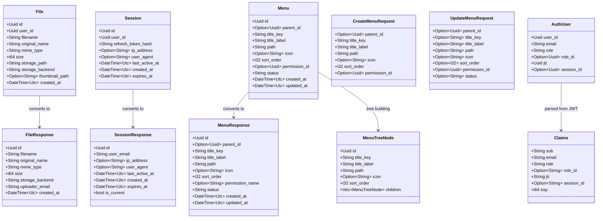
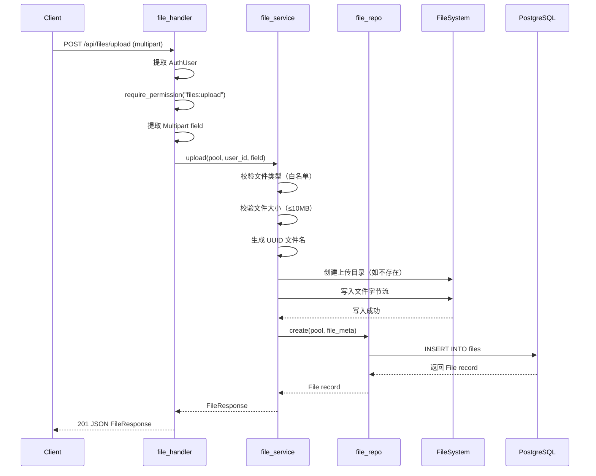
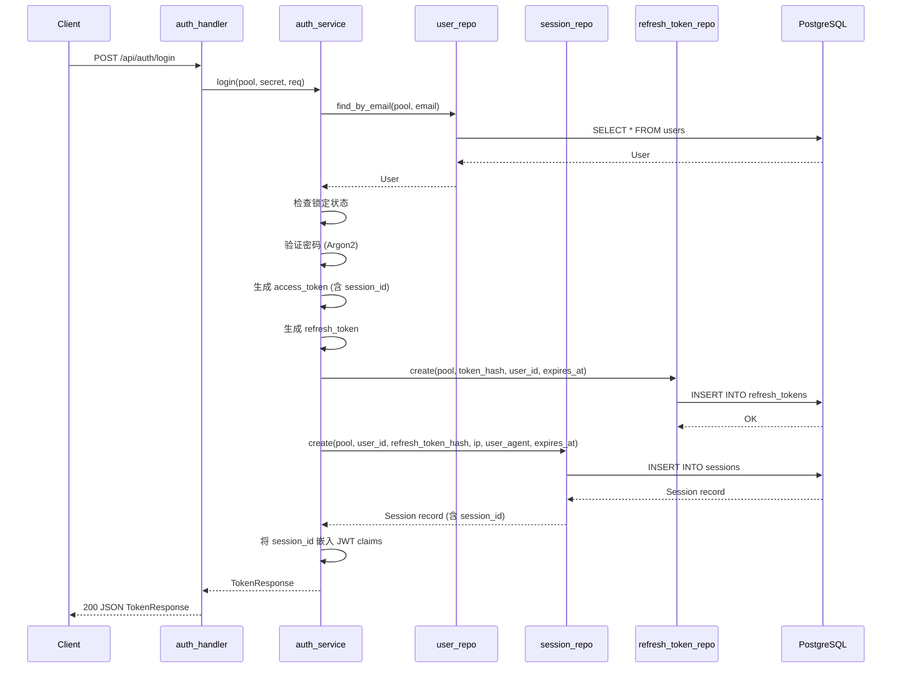
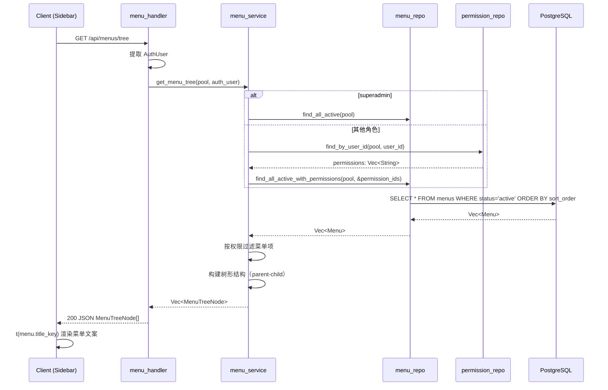
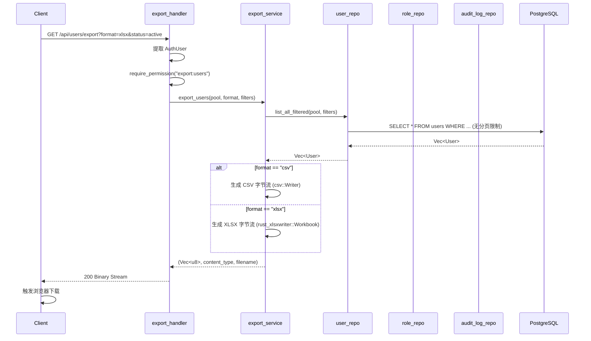
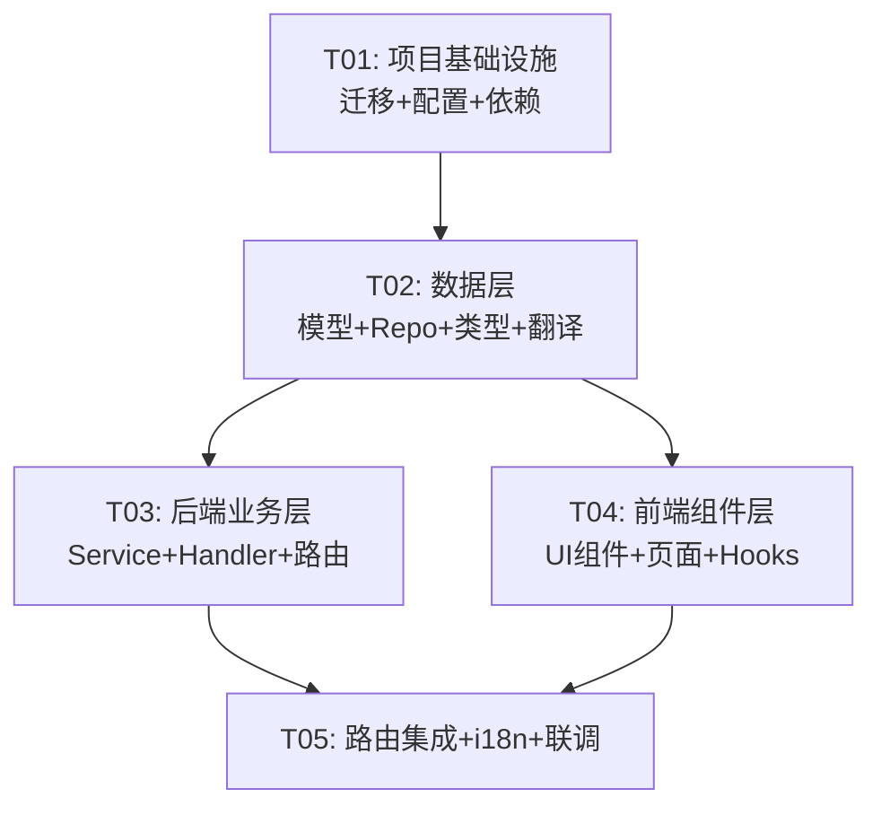

# cradle Phase 4 架构设计文档

> 文件管理 · 数据导出 · 会话管理 · 动态菜单 · 国际化

## 1. 实现方案

### 1.1 核心技术挑战

1. **文件上传 multipart 处理**：Axum 原生支持 `Multipart` 提取器，但需配置 `RequestBodyLimit` 中间件限制上传大小（默认 10MB），并在 service 层实现文件类型白名单校验、文件名去冲突（UUID 前缀）、本地存储目录创建
2. **数据导出流式响应**：导出 API 需要直接返回文件流（`Content-Type: text/csv` 或 `application/vnd.openxmlformats-officedocument.spreadsheetml.sheet`），复用现有 repo 的查询逻辑但绕过分页限制，需在 handler 层将数据写入内存 buffer 后一次性返回
3. **会话与 JWT 协同**：JWT 仍为主认证机制，session 仅追踪在线状态。登录时创建 session 记录并将 `session_id` 嵌入 JWT claims。强制下线需同时删除 session 记录和将关联的 refresh_token 加入黑名单
4. **动态菜单权限过滤**：菜单树的 `/api/menus/tree` 端点需根据当前用户的权限列表动态过滤，仅返回用户有权访问的菜单项。支持最多 3 级嵌套，数据库层用 CHECK 约束保障
5. **i18n 前后端同步**：前端使用 `react-i18next` 管理翻译，菜单的 `title_key` 与翻译文件的 key 对应。后端通过 `Accept-Language` header 返回对应语言的错误消息

### 1.2 框架与库选型

| 组件 | 选型 | 理由 |
|------|------|------|
| 后端文件上传 | `axum::extract::Multipart` + `tower_http::limit::RequestBodyLimit` | Axum 内建 multipart 支持，tower-http 提供请求体大小限制中间件 |
| 后端 CSV 导出 | `csv@^1.3` | Rust 生态最成熟的 CSV 库，API 简洁 |
| 后端 XLSX 导出 | `rust_xlsxwriter@^0.82` | 纯 Rust 实现，无系统依赖，性能优秀 |
| 后端 i18n | 内建 HashMap 方案 | 后端仅需翻译有限数量的错误消息，无需重量级框架 |
| 前端 i18n | `react-i18next@^15` + `i18next@^24` + `i18next-browser-languagedetector` | React 生态标准 i18n 方案，社区成熟 |
| 前端文件上传 | 内建 `fetch`/`axios` + 自定义组件 | 无需额外上传库，使用现有 axios 实例 |
| 前端动态菜单 | 从现有 `navItems` 重构为 API 驱动 | 利用 Zustand 缓存菜单数据 |

### 1.3 架构模式

延续项目现有三层架构：

```
Handler（HTTP 层，参数提取，权限检查，响应构建）
  → Service（业务编排，文件存储，导出格式化）
    → Repository（数据访问，SQL 查询）
```

特殊之处：
- **文件管理**：Service 层负责文件系统 I/O（读写本地文件），Repository 仅管理数据库元信息
- **数据导出**：Service 层调用现有 repo 获取全量数据，格式化为 CSV/XLSX 字节流
- **会话管理**：修改现有 `auth_service::login` 流程，在创建 JWT 的同时创建 session 记录
- **i18n**：后端新增一个轻量 `i18n` 模块，提供 `t(key, lang)` 函数用于错误消息翻译

---

## 2. 文件列表

### 2.1 数据库迁移文件

| 文件路径 | 说明 |
|----------|------|
| `apps/backend/migrations/20260525000001_phase4.sql` | Phase 4 全部表结构 + 种子数据（files、sessions、menus 表，users.avatar_url，12 项新权限，菜单种子数据） |

### 2.2 后端新增文件

| 文件路径 | 说明 |
|----------|------|
| `apps/backend/src/models/file.rs` | 文件模型（File、FileResponse） |
| `apps/backend/src/models/session.rs` | 会话模型（Session、SessionResponse） |
| `apps/backend/src/models/menu.rs` | 菜单模型（Menu、MenuResponse、MenuTreeNode、CreateMenuRequest、UpdateMenuRequest） |
| `apps/backend/src/models/i18n.rs` | 后端翻译消息定义 |
| `apps/backend/src/handlers/file_handler.rs` | 文件上传/列表/删除 handler |
| `apps/backend/src/handlers/export_handler.rs` | 数据导出 handler（CSV/XLSX） |
| `apps/backend/src/handlers/session_handler.rs` | 会话管理 handler（在线列表/强制下线/我的会话） |
| `apps/backend/src/handlers/menu_handler.rs` | 菜单 CRUD + 动态菜单树 handler |
| `apps/backend/src/handlers/i18n_handler.rs` | i18n 翻译获取 handler |
| `apps/backend/src/services/file_service.rs` | 文件存储逻辑（本地存储、文件名校验、目录管理） |
| `apps/backend/src/services/export_service.rs` | 导出格式化逻辑（CSV/XLSX 生成） |
| `apps/backend/src/services/session_service.rs` | 会话业务逻辑（创建/查询/销毁/惰性清理） |
| `apps/backend/src/services/menu_service.rs` | 菜单业务逻辑（CRUD + 权限过滤树构建） |
| `apps/backend/src/repository/file_repo.rs` | 文件数据访问 |
| `apps/backend/src/repository/session_repo.rs` | 会话数据访问 |
| `apps/backend/src/repository/menu_repo.rs` | 菜单数据访问 |

### 2.3 后端修改文件

| 文件路径 | 说明 |
|----------|------|
| `apps/backend/Cargo.toml` | 新增 csv、rust_xlsxwriter、tower-http（multipart feature）依赖 |
| `apps/backend/src/models/mod.rs` | 新增 `pub mod file; pub mod session; pub mod menu; pub mod i18n;` |
| `apps/backend/src/handlers/mod.rs` | 新增 5 个 handler 模块声明 |
| `apps/backend/src/services/mod.rs` | 新增 4 个 service 模块声明 |
| `apps/backend/src/repository/mod.rs` | 新增 3 个 repo 模块声明 |
| `apps/backend/src/routes/mod.rs` | 新增 5 组路由函数 |
| `apps/backend/src/lib.rs` | AppState 扩展（upload_dir 配置），注册新路由 |
| `apps/backend/src/middleware/auth.rs` | Claims 新增 `session_id` 字段 |
| `apps/backend/src/services/auth_service.rs` | login 流程中创建 session，JWT claims 嵌入 session_id |
| `apps/backend/src/error.rs` | AppError 新增 `PayloadTooLarge` 变体 |
| `apps/backend/src/config.rs` | Settings 新增 `storage` 和 `upload` 配置节 |
| `apps/backend/config/default.toml` | 新增存储和上传相关默认配置 |

### 2.4 前端新增文件

| 文件路径 | 说明 |
|----------|------|
| `apps/frontend/src/locales/zh-CN.json` | 中文翻译文件 |
| `apps/frontend/src/locales/en-US.json` | 英文翻译文件 |
| `apps/frontend/src/i18n.ts` | i18next 初始化配置 |
| `apps/frontend/src/types/file.ts` | 文件相关 TypeScript 类型 |
| `apps/frontend/src/types/session.ts` | 会话相关 TypeScript 类型 |
| `apps/frontend/src/types/menu.ts` | 菜单相关 TypeScript 类型 |
| `apps/frontend/src/hooks/useFiles.ts` | 文件 API hooks |
| `apps/frontend/src/hooks/useSessions.ts` | 会话 API hooks |
| `apps/frontend/src/hooks/useMenus.ts` | 菜单 API hooks |
| `apps/frontend/src/hooks/useExport.ts` | 导出 API hook |
| `apps/frontend/src/components/files/FileUploader.tsx` | 文件上传组件（拖拽+进度条） |
| `apps/frontend/src/components/files/FileListPage.tsx` | 文件管理页面 |
| `apps/frontend/src/components/sessions/SessionListPage.tsx` | 会话管理页面 |
| `apps/frontend/src/components/sessions/MyDevices.tsx` | 个人设备列表组件 |
| `apps/frontend/src/components/menus/MenuListPage.tsx` | 菜单管理页面 |
| `apps/frontend/src/components/menus/MenuEditDialog.tsx` | 菜单编辑对话框 |
| `apps/frontend/src/components/menus/MenuCreateDialog.tsx` | 菜单创建对话框 |
| `apps/frontend/src/components/shared/LanguageSwitcher.tsx` | 语言切换组件 |
| `apps/frontend/src/components/shared/ExportButton.tsx` | 通用导出按钮（CSV/XLSX 下拉） |
| `apps/frontend/src/components/shared/AvatarUpload.tsx` | 头像上传组件 |
| `apps/frontend/src/stores/menuStore.ts` | 菜单数据 Zustand store |

### 2.5 前端修改文件

| 文件路径 | 说明 |
|----------|------|
| `apps/frontend/package.json` | 新增 react-i18next、i18next 依赖 |
| `apps/frontend/src/main.tsx` | 引入 i18n 初始化 |
| `apps/frontend/src/components/layout/Sidebar.tsx` | 替换硬编码 navItems 为动态菜单渲染 |
| `apps/frontend/src/components/layout/Header.tsx` | 新增语言切换按钮，用户名/头像显示 |
| `apps/frontend/src/components/layout/AppShell.tsx` | 顶层加载菜单数据 |
| `apps/frontend/src/routes/index.tsx` | 新增文件管理/会话管理/菜单管理路由 |
| `apps/frontend/src/components/profile/ProfilePage.tsx` | 新增头像上传区域 + 我的设备 |
| `apps/frontend/src/components/users/UserListPage.tsx` | 新增导出按钮 |
| `apps/frontend/src/components/roles/RoleListPage.tsx` | 新增导出按钮 |
| `apps/frontend/src/components/audit/AuditLogListPage.tsx` | 新增导出按钮 |
| `apps/frontend/src/lib/api.ts` | 支持 blob response type（导出下载） |
| `apps/frontend/src/types/api.ts` | User 接口新增 `avatar_url` 字段 |
| `apps/frontend/src/stores/authStore.ts` | User 类型扩展（avatar_url） |

---

## 3. 数据结构和接口

### 3.1 类图



### 3.2 API 请求/响应结构

#### 文件上传

```
POST /api/files/upload
Content-Type: multipart/form-data
Body: file (binary), category? (string: "avatar" | "general")
Response: FileResponse
```

#### 文件列表

```
GET /api/files?page=1&per_page=20&search=&mime_type=
Response: { data: FileResponse[], pagination: { page, per_page, total } }
```

#### 数据导出

```
GET /api/users/export?format=csv|xlsx&search=&role=&status=
GET /api/roles/export?format=csv|xlsx
GET /api/audit-logs/export?format=csv|xlsx&action=&user_id=&from=&to=
Response: Binary file stream
  Content-Type: text/csv | application/vnd.openxmlformats-officedocument.spreadsheetml.sheet
  Content-Disposition: attachment; filename="users_export_20260525.csv"
```

#### 会话管理

```
GET /api/sessions?page=1&per_page=20
Response: { data: SessionResponse[], pagination: {...} }

GET /api/sessions/me
Response: { data: SessionResponse[] }

DELETE /api/sessions/{id}
Response: { message: "Session terminated" }

DELETE /api/sessions/me/{id}
Response: { message: "Session terminated" }
```

#### 菜单管理

```
GET /api/menus/tree
Response: MenuTreeNode[]

GET /api/menus?page=1&per_page=50
Response: { data: MenuResponse[], pagination: {...} }

POST /api/menus
Body: CreateMenuRequest
Response: MenuResponse

PUT /api/menus/{id}
Body: UpdateMenuRequest
Response: MenuResponse

DELETE /api/menus/{id}
Response: { message: "Menu deleted" }
```

---

## 4. 程序调用流程

### 4.1 文件上传流程



### 4.2 登录 + Session 创建流程



### 4.3 动态菜单加载流程



### 4.4 数据导出流程



---

## 5. 任务列表

### 依赖包列表

#### 后端 Cargo.toml 新增依赖

```toml
# 文件上传
tower-http = { version = "0.6", features = ["cors", "trace", "limit"] }  # 追加 limit feature

# 数据导出
csv = "1.3"
rust_xlsxwriter = "0.82"
```

#### 前端 package.json 新增依赖

```json
{
  "i18next": "^24.2.2",
  "react-i18next": "^15.4.1",
  "i18next-browser-languagedetector": "^8.0.4"
}
```

### 任务分解

#### T01: 项目基础设施（数据库迁移 + 配置 + 依赖）

| 项目 | 内容 |
|------|------|
| **任务描述** | 添加 Phase 4 所需的所有基础设施：数据库迁移文件（新表、字段变更、种子数据）、后端 Cargo.toml 依赖、前端 package.json 依赖、后端配置扩展 |
| **涉及文件** | `apps/backend/migrations/20260525000001_phase4.sql`（新建）、`apps/backend/Cargo.toml`（修改）、`apps/frontend/package.json`（修改）、`apps/backend/src/config.rs`（修改）、`apps/backend/src/lib.rs`（修改）、`apps/backend/src/error.rs`（修改）、`apps/backend/config/default.toml`（修改）、`apps/backend/src/models/mod.rs`（修改）、`apps/backend/src/handlers/mod.rs`（修改）、`apps/backend/src/services/mod.rs`（修改）、`apps/backend/src/repository/mod.rs`（修改） |
| **依赖任务** | 无 |
| **优先级** | P0 |
| **复杂度** | M |

#### T02: 数据层（模型 + Repository + 配置初始化）

| 项目 | 内容 |
|------|------|
| **任务描述** | 定义 Phase 4 所有数据模型（File、Session、Menu）、Repository 数据访问函数、后端 i18n 消息定义、前端 TypeScript 类型定义和 i18n 翻译文件 |
| **涉及文件** | `apps/backend/src/models/file.rs`（新建）、`apps/backend/src/models/session.rs`（新建）、`apps/backend/src/models/menu.rs`（新建）、`apps/backend/src/models/i18n.rs`（新建）、`apps/backend/src/repository/file_repo.rs`（新建）、`apps/backend/src/repository/session_repo.rs`（新建）、`apps/backend/src/repository/menu_repo.rs`（新建）、`apps/frontend/src/locales/zh-CN.json`（新建）、`apps/frontend/src/locales/en-US.json`（新建）、`apps/frontend/src/i18n.ts`（新建）、`apps/frontend/src/types/file.ts`（新建）、`apps/frontend/src/types/session.ts`（新建）、`apps/frontend/src/types/menu.ts`（新建）、`apps/frontend/src/main.tsx`（修改）、`apps/frontend/src/types/api.ts`（修改） |
| **依赖任务** | T01 |
| **优先级** | P0 |
| **复杂度** | L |

#### T03: 后端业务层（Service + Handler + 路由注册）

| 项目 | 内容 |
|------|------|
| **任务描述** | 实现所有 Phase 4 后端业务逻辑：文件上传/管理服务、数据导出服务、会话管理服务（含修改 login 流程）、菜单 CRUD + 权限过滤树服务、所有 Handler 函数、路由注册、JWT Claims 扩展（session_id） |
| **涉及文件** | `apps/backend/src/services/file_service.rs`（新建）、`apps/backend/src/services/export_service.rs`（新建）、`apps/backend/src/services/session_service.rs`（新建）、`apps/backend/src/services/menu_service.rs`（新建）、`apps/backend/src/handlers/file_handler.rs`（新建）、`apps/backend/src/handlers/export_handler.rs`（新建）、`apps/backend/src/handlers/session_handler.rs`（新建）、`apps/backend/src/handlers/menu_handler.rs`（新建）、`apps/backend/src/handlers/i18n_handler.rs`（新建）、`apps/backend/src/routes/mod.rs`（修改）、`apps/backend/src/middleware/auth.rs`（修改 Claims）、`apps/backend/src/services/auth_service.rs`（修改 login 流程）、`apps/backend/src/extractors/auth.rs`（修改 AuthUser） |
| **依赖任务** | T02 |
| **优先级** | P0 |
| **复杂度** | XL |

#### T04: 前端组件层（UI 组件 + 页面 + API Hooks）

| 项目 | 内容 |
|------|------|
| **任务描述** | 实现所有 Phase 4 前端组件：文件上传组件、文件管理页面、会话管理页面、菜单管理页面、导出按钮组件、头像上传组件、我的设备组件、语言切换组件。实现所有 API hooks（useFiles、useSessions、useMenus、useExport）。修改 Sidebar 为动态菜单渲染。修改 Header 添加语言切换。修改 ProfilePage 添加头像上传和我的设备。修改 UserListPage/RoleListPage/AuditLogListPage 添加导出按钮。新建 menuStore (Zustand)。 |
| **涉及文件** | `apps/frontend/src/hooks/useFiles.ts`（新建）、`apps/frontend/src/hooks/useSessions.ts`（新建）、`apps/frontend/src/hooks/useMenus.ts`（新建）、`apps/frontend/src/hooks/useExport.ts`（新建）、`apps/frontend/src/stores/menuStore.ts`（新建）、`apps/frontend/src/components/files/FileUploader.tsx`（新建）、`apps/frontend/src/components/files/FileListPage.tsx`（新建）、`apps/frontend/src/components/sessions/SessionListPage.tsx`（新建）、`apps/frontend/src/components/sessions/MyDevices.tsx`（新建）、`apps/frontend/src/components/menus/MenuListPage.tsx`（新建）、`apps/frontend/src/components/menus/MenuEditDialog.tsx`（新建）、`apps/frontend/src/components/menus/MenuCreateDialog.tsx`（新建）、`apps/frontend/src/components/shared/LanguageSwitcher.tsx`（新建）、`apps/frontend/src/components/shared/ExportButton.tsx`（新建）、`apps/frontend/src/components/shared/AvatarUpload.tsx`（新建）、`apps/frontend/src/components/layout/Sidebar.tsx`（修改）、`apps/frontend/src/components/layout/Header.tsx`（修改）、`apps/frontend/src/components/layout/AppShell.tsx`（修改）、`apps/frontend/src/components/profile/ProfilePage.tsx`（修改）、`apps/frontend/src/components/users/UserListPage.tsx`（修改）、`apps/frontend/src/components/roles/RoleListPage.tsx`（修改）、`apps/frontend/src/components/audit/AuditLogListPage.tsx`（修改）、`apps/frontend/src/lib/api.ts`（修改）、`apps/frontend/src/stores/authStore.ts`（修改） |
| **依赖任务** | T02 |
| **优先级** | P0 |
| **复杂度** | XL |

#### T05: 路由集成 + 全页面 i18n + 端到端调试

| 项目 | 内容 |
|------|------|
| **任务描述** | 将所有新页面注册到前端路由，给所有现有页面和组件的文案替换为 i18n key（侧边栏、表单、表格、按钮、提示等），给后端错误消息接入 i18n 翻译，最终端到端联调确保 5 个模块全部功能正常 |
| **涉及文件** | `apps/frontend/src/routes/index.tsx`（修改）、所有前端组件文件（i18n 文案替换）、`apps/frontend/src/components/auth/LoginForm.tsx`（i18n）、`apps/frontend/src/components/dashboard/DashboardPage.tsx`（i18n）、`apps/frontend/src/components/dashboard/StatsCards.tsx`（i18n）、`apps/frontend/src/components/dashboard/SettingsPage.tsx`（i18n）、`apps/frontend/src/components/dashboard/RoleDistributionChart.tsx`（i18n）、`apps/frontend/src/components/dashboard/UserStatusChart.tsx`（i18n）、`apps/frontend/src/components/dashboard/RecentAuditLogs.tsx`（i18n） |
| **依赖任务** | T03, T04 |
| **优先级** | P0 |
| **复杂度** | L |

### 任务依赖图



---

## 6. 共享知识（跨文件约定）

### 6.1 命名约定

- **后端模型**：数据库行映射用 `XxxRecord` 或 `Xxx`（如 `File`、`Session`、`Menu`），公开响应用 `XxxResponse`（如 `FileResponse`、`SessionResponse`）
- **请求类型**：`CreateXxxRequest`、`UpdateXxxRequest`
- **Repository 函数**：`find_by_id`、`find_all`、`create`、`update`、`delete`，返回 `Result<Option<T>, AppError>` 或 `Result<Vec<T>, AppError>`
- **Service 函数**：业务语义命名，如 `upload_file`、`export_users`、`terminate_session`、`build_menu_tree`
- **Handler 函数**：与 HTTP 方法对应，如 `list_files`、`upload_file`、`delete_file`

### 6.2 API 响应格式

- **列表接口**：`{ "data": [...], "pagination": { "page": 1, "per_page": 20, "total": 100 } }`
- **单条记录**：直接返回对象 `{ "id": "...", ... }`
- **操作确认**：`{ "message": "操作成功" }`
- **错误响应**：`{ "error": "错误描述", "status": 400 }`
- **导出响应**：二进制文件流，`Content-Type` 和 `Content-Disposition` header

### 6.3 错误码规范

| HTTP 状态码 | 含义 | 使用场景 |
|-------------|------|----------|
| 400 | Bad Request | 参数校验失败、文件类型不允许、文件过大 |
| 401 | Unauthorized | JWT 无效/过期 |
| 403 | Forbidden | 权限不足 |
| 404 | Not Found | 资源不存在（文件/会话/菜单） |
| 409 | Conflict | 菜单 title_key 重复 |
| 413 | Payload Too Large | 上传文件超过大小限制 |
| 500 | Internal Server Error | 服务器内部错误 |

### 6.4 i18n Key 命名规范

```
模块.类别.具体项

示例：
  menu.dashboard        — 侧边栏菜单
  menu.users
  menu.roles
  menu.audit_logs
  
  users.table.name      — 用户管理表格列
  users.table.email
  users.table.role
  users.filter.search   — 筛选区
  users.button.create   — 操作按钮
  
  common.save            — 通用操作
  common.cancel
  common.delete
  common.confirm
  common.loading
  
  error.unauthorized     — 错误消息
  error.forbidden
  error.notFound
  
  export.csv             — 导出相关
  export.xlsx
```

### 6.5 文件存储约定

- 上传根目录：配置文件中 `storage.upload_dir`，默认 `./uploads`
- 文件名格式：`{uuid_v4}.{original_extension}`
- 头像子目录：`./uploads/avatars/`
- 通用文件子目录：`./uploads/files/`
- 文件类型白名单：`image/jpeg`, `image/png`, `image/gif`, `image/webp`, `application/pdf`, `text/csv`, `application/vnd.openxmlformats-officedocument.spreadsheetml.sheet`, `application/msword`
- 头像额外限制：最大 2MB，仅 `image/jpeg`, `image/png`, `image/webp`

### 6.6 会话管理约定

- Session 与 Refresh Token 一一对应（通过 `refresh_token_hash` 关联）
- JWT claims 中 `session_id` 为可选字段（向后兼容旧 token）
- 惰性清理：每次 `create_session` 时 1% 概率触发 `cleanup_expired`
- 强制下线 = 删除 session 记录 + 将关联 refresh_token 加入黑名单

### 6.7 菜单层级约定

- 最多 3 级（root → level1 → level2）
- 数据库 CHECK 约束防止超过 3 级
- `sort_order` 数值越小越靠前
- `status` 字段：`active` | `disabled`，仅返回 `active` 菜单给前端
- 菜单种子数据与现有路由一一对应

---

## 7. 待明确事项

| # | 事项 | 当前假设 | 建议 |
|---|------|----------|------|
| 1 | S3/MinIO 存储后端是否纳入 P0 | P0 仅本地存储 | Phase 4 P0 仅实现本地存储，`storage_backend` 字段预留 `s3` 值，P1 实现 S3 后端 |
| 2 | 导出数据量限制 | 同步导出最大 10000 行 | P0 同步导出，Handler 中设置 LIMIT 10000，超过时提示用户缩小范围 |
| 3 | 文件上传的 `category` 参数用途 | 区分头像和通用附件 | 头像上传走单独的 `/api/users/me/avatar` 端点，通用文件走 `/api/files/upload` |
| 4 | 菜单管理页面是否 P0 | P0 仅实现后端 CRUD + 动态侧边栏 | 菜单管理前端页面归入 P1，但后端 API 和种子数据是 P0 |
| 5 | i18n 后端翻译文件格式 | Rust 代码内嵌 HashMap | 后端错误消息量有限（~30 条），直接在代码中定义，无需外部文件 |
| 6 | 会话的 `last_active_at` 更新策略 | P0 不实现请求中间件更新 | P0 仅在登录时设置，P1 添加中间件节流更新 |
| 7 | `/api/i18n/{locale}` 端点是否必要 | 暂不实现 | 前端翻译文件直接打包在前端 bundle 中，后端错误消息翻译通过错误码 + 前端翻译表实现，无需额外 API |

---

## 附录：数据库迁移 SQL 概要

```sql
-- Phase 4 迁移文件：20260525000001_phase4.sql

-- 1. 用户表新增头像字段
ALTER TABLE users ADD COLUMN IF NOT EXISTS avatar_url VARCHAR(500);

-- 2. 文件管理表
CREATE TABLE files (
    id UUID PRIMARY KEY DEFAULT gen_random_uuid(),
    user_id UUID NOT NULL REFERENCES users(id) ON DELETE CASCADE,
    filename VARCHAR(255) NOT NULL,
    original_name VARCHAR(255) NOT NULL,
    mime_type VARCHAR(100) NOT NULL,
    size BIGINT NOT NULL,
    storage_path VARCHAR(500) NOT NULL,
    storage_backend VARCHAR(20) NOT NULL DEFAULT 'local',
    thumbnail_path VARCHAR(500),
    created_at TIMESTAMPTZ NOT NULL DEFAULT NOW()
);
CREATE INDEX idx_files_user_id ON files(user_id);
CREATE INDEX idx_files_mime_type ON files(mime_type);

-- 3. 会话表
CREATE TABLE sessions (
    id UUID PRIMARY KEY DEFAULT gen_random_uuid(),
    user_id UUID NOT NULL REFERENCES users(id) ON DELETE CASCADE,
    refresh_token_hash VARCHAR(255) NOT NULL,
    ip_address VARCHAR(45),
    user_agent TEXT,
    last_active_at TIMESTAMPTZ NOT NULL DEFAULT NOW(),
    created_at TIMESTAMPTZ NOT NULL DEFAULT NOW(),
    expires_at TIMESTAMPTZ NOT NULL
);
CREATE INDEX idx_sessions_user_id ON sessions(user_id);
CREATE INDEX idx_sessions_expires_at ON sessions(expires_at);

-- 4. 菜单表
CREATE TABLE menus (
    id UUID PRIMARY KEY DEFAULT gen_random_uuid(),
    parent_id UUID REFERENCES menus(id) ON DELETE CASCADE,
    title_key VARCHAR(100) NOT NULL,
    title_label VARCHAR(100) NOT NULL,
    path VARCHAR(200) NOT NULL,
    icon VARCHAR(50),
    sort_order INT NOT NULL DEFAULT 0,
    permission_id UUID REFERENCES permissions(id) ON DELETE SET NULL,
    status VARCHAR(20) NOT NULL DEFAULT 'active',
    created_at TIMESTAMPTZ NOT NULL DEFAULT NOW(),
    updated_at TIMESTAMPTZ NOT NULL DEFAULT NOW(),
    CONSTRAINT uq_menus_title_key UNIQUE (title_key),
    CONSTRAINT chk_menus_status CHECK (status IN ('active', 'disabled'))
);
CREATE INDEX idx_menus_parent_id ON menus(parent_id);
CREATE INDEX idx_menus_sort_order ON menus(sort_order);

-- 5. 新增权限种子数据
INSERT INTO permissions (name, description, module) VALUES
    ('files:read', 'View file list', 'files'),
    ('files:upload', 'Upload files', 'files'),
    ('files:delete', 'Delete files', 'files'),
    ('export:users', 'Export user list', 'export'),
    ('export:audit', 'Export audit logs', 'export'),
    ('export:roles', 'Export role list', 'export'),
    ('sessions:read', 'View all sessions', 'sessions'),
    ('sessions:manage', 'Terminate sessions', 'sessions'),
    ('menus:read', 'View menu list', 'menus'),
    ('menus:create', 'Create menu items', 'menus'),
    ('menus:update', 'Update menu items', 'menus'),
    ('menus:delete', 'Delete menu items', 'menus')
ON CONFLICT (name) DO NOTHING;

-- 6. 分配新权限给 superadmin
INSERT INTO role_permissions (role_id, permission_id)
SELECT (SELECT id FROM roles WHERE name = 'superadmin'), id
FROM permissions WHERE module IN ('files', 'export', 'sessions', 'menus')
ON CONFLICT (role_id, permission_id) DO NOTHING;

-- 7. 分配部分新权限给 admin
INSERT INTO role_permissions (role_id, permission_id)
SELECT (SELECT id FROM roles WHERE name = 'admin'), id
FROM permissions WHERE name IN (
    'files:read', 'files:upload', 'files:delete',
    'export:users', 'export:audit', 'export:roles',
    'sessions:read', 'sessions:manage',
    'menus:read'
)
ON CONFLICT (role_id, permission_id) DO NOTHING;

-- 8. 分配基础权限给 user
INSERT INTO role_permissions (role_id, permission_id)
SELECT (SELECT id FROM roles WHERE name = 'user'), id
FROM permissions WHERE name IN ('files:upload')
ON CONFLICT (role_id, permission_id) DO NOTHING;

-- 9. 菜单种子数据
INSERT INTO menus (title_key, title_label, path, icon, sort_order, permission_id) VALUES
    ('menu.dashboard', 'Dashboard', '/dashboard', 'LayoutDashboard', 1, NULL),
    ('menu.users', 'Users', '/dashboard/users', 'Users', 2, (SELECT id FROM permissions WHERE name = 'users:read')),
    ('menu.roles', 'Roles', '/dashboard/roles', 'Shield', 3, (SELECT id FROM permissions WHERE name = 'roles:read')),
    ('menu.auditLogs', 'Audit Logs', '/dashboard/audit-logs', 'ScrollText', 4, (SELECT id FROM permissions WHERE name = 'audit:read')),
    ('menu.files', 'Files', '/dashboard/files', 'FolderOpen', 5, (SELECT id FROM permissions WHERE name = 'files:read')),
    ('menu.sessions', 'Sessions', '/dashboard/sessions', 'Monitor', 6, (SELECT id FROM permissions WHERE name = 'sessions:read')),
    ('menu.profile', 'Profile', '/dashboard/profile', 'UserCircle', 99, NULL),
    ('menu.settings', 'Settings', '/dashboard/settings', 'Settings', 100, NULL);
```
