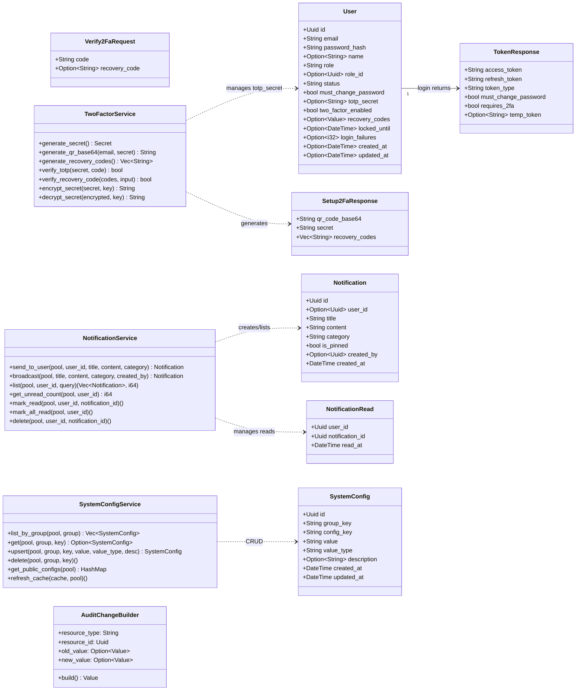
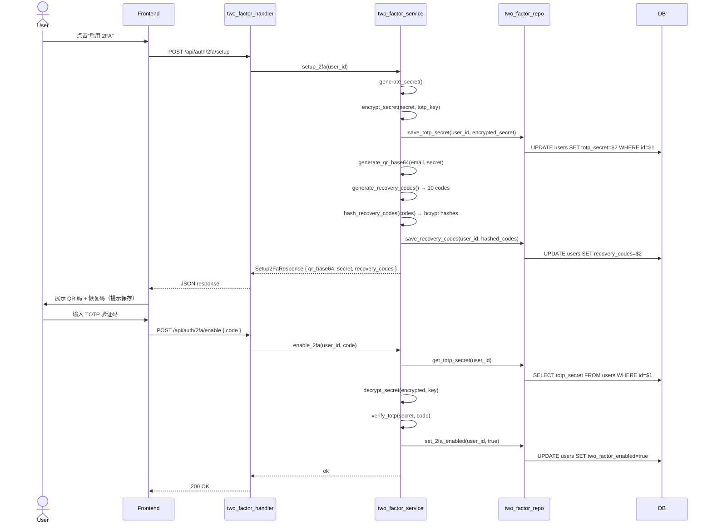
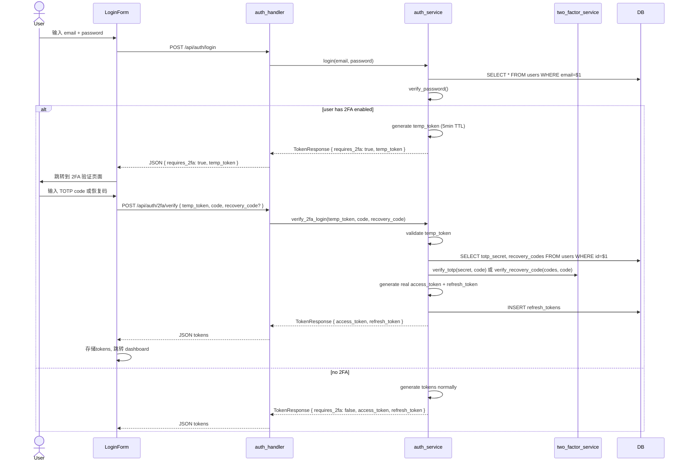
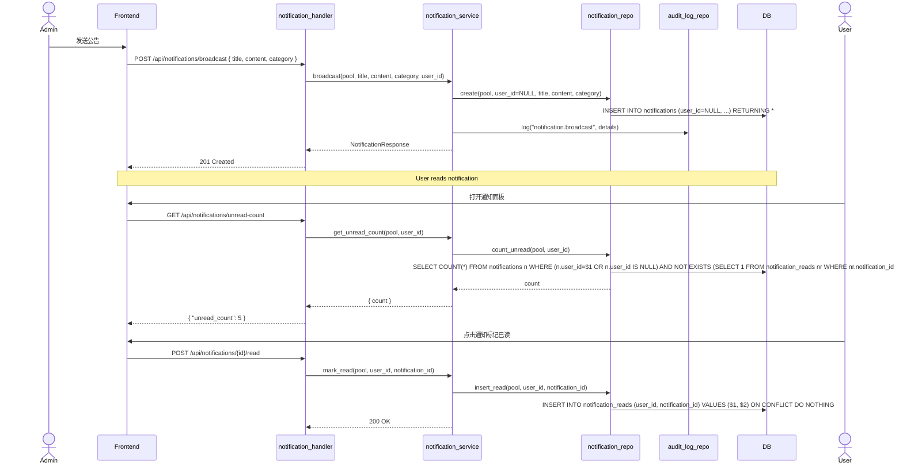
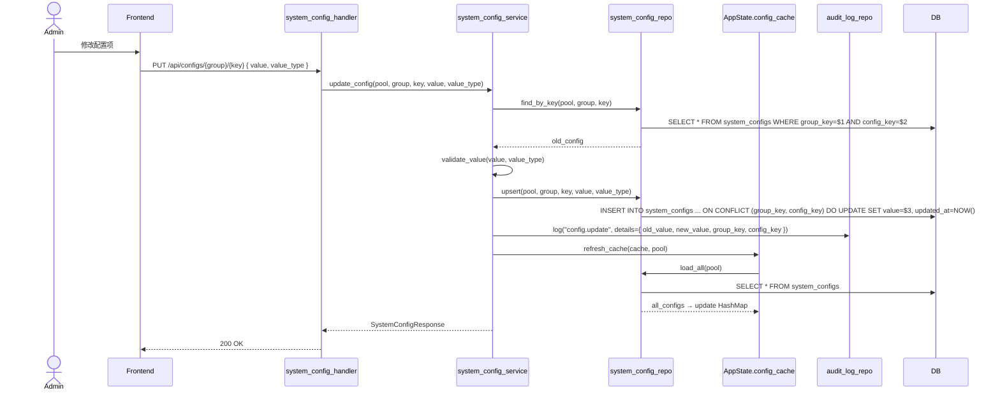
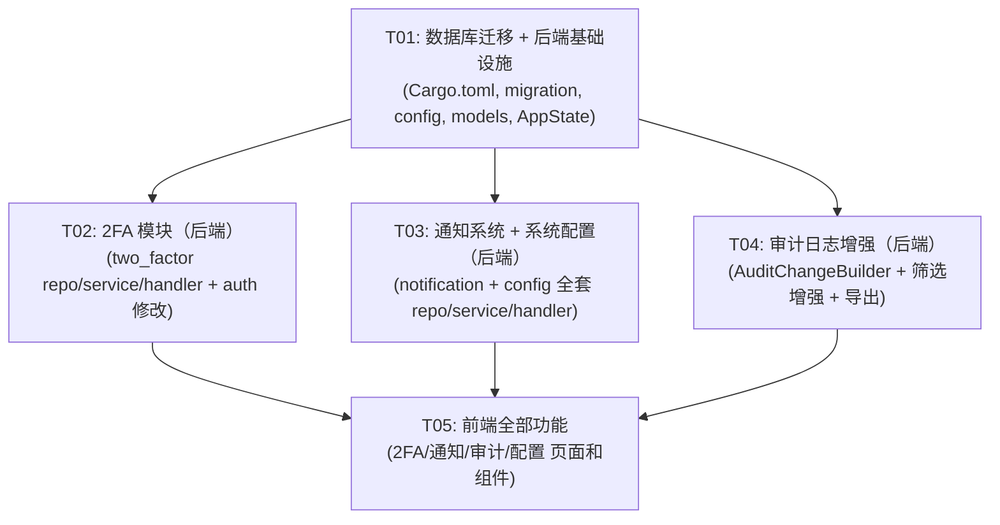

# Phase 5 Architecture: 2FA / Notifications / Audit Enhancement / System Config

## 1. Implementation Approach

### 1.1 Core Technical Challenges

| Challenge | Solution |
|-----------|----------|
| TOTP secret 安全存储 | AES-256-GCM 对称加密，密钥从环境变量 `APP_TOTP_ENCRYPTION_KEY` 加载，base64 编码的 32 字节 key |
| 登录二次验证流程 | login 返回 `requires_2fa` + 短生命临时 token(5min)，新增 `/api/auth/2fa/verify` 端点完成验证 |
| QR 码生成 | 使用 `qrcode` crate 生成 SVG，base64 编码为 data URI 返回前端 |
| 恢复码安全 | 生成 10 个随机码，明文仅返回一次；数据库存储 bcrypt 哈希 |
| 广播通知 | `notifications.user_id = NULL` 表示广播，`notification_reads` 表记录各用户已读状态 |
| 未读计数轮询 | 前端 30s 间隔 `GET /api/notifications/unread-count`，后续可升级 SSE |
| 审计 diff | `AuditChangeBuilder` 封装 `old_value`/`new_value`/`changes` 写入 `details` JSONB |
| 配置缓存 | 启动时加载到 `AppState.config_cache: Arc<RwLock<HashMap>>`，更新时主动刷新 |
| 导出 CSV/XLSX | 复用已有 `csv` + `rust_xlsxwriter` 依赖，新增导出路由 |

### 1.2 Framework & Library Selection

**Backend 新增依赖：**
- `totp-rs@^5`: TOTP 生成与验证（RFC 6238）
- `qrcode@^0.14`: QR 码生成（SVG 输出）
- `base64@^0.22`: 编码工具（QR PNG base64、TOTP secret 编码）

**前端无新增依赖**，使用现有 `@tanstack/react-query` + `zustand` + `axios` + `shadcn/ui`。

### 1.3 Architecture Patterns

沿用现有三层架构：`handler → service → repository`

```
┌─────────────┐     ┌──────────────┐     ┌──────────────────┐
│   Handler    │────▶│   Service    │────▶│   Repository     │
│ (HTTP I/O)   │     │ (业务逻辑)    │     │ (SQL queries)    │
└─────────────┘     └──────────────┘     └──────────────────┘
                           │
                    ┌──────┴───────┐
                    │  AppState    │
                    │ (cache, cfg) │
                    └──────────────┘
```

---

## 2. File List

### 2.1 Backend — New Files

| # | Path | Description |
|---|------|-------------|
| 1 | `migrations/20260526000001_phase5.sql` | Phase 5 DDL：users 扩展字段 + notifications + notification_reads + system_configs + 新权限种子 |
| 2 | `src/models/two_factor.rs` | 2FA 相关请求/响应模型 |
| 3 | `src/models/notification.rs` | 通知相关请求/响应模型 |
| 4 | `src/models/system_config.rs` | 系统配置相关请求/响应模型 |
| 5 | `src/repository/two_factor_repo.rs` | 2FA 数据访问（secret 存取、recovery_codes 存取） |
| 6 | `src/repository/notification_repo.rs` | 通知数据访问（CRUD + 已读标记 + 未读计数） |
| 7 | `src/repository/system_config_repo.rs` | 系统配置数据访问（CRUD + 按 group 查询） |
| 8 | `src/services/two_factor_service.rs` | 2FA 业务逻辑（绑定、解绑、验证、恢复码、QR 生成） |
| 9 | `src/services/notification_service.rs` | 通知业务逻辑（发送、列表、已读、删除、广播） |
| 10 | `src/services/system_config_service.rs` | 系统配置业务逻辑（CRUD + 缓存刷新 + 类型校验） |
| 11 | `src/services/audit_change_builder.rs` | `AuditChangeBuilder` 工具（构建 diff details JSONB） |
| 12 | `src/handlers/two_factor_handler.rs` | 2FA HTTP handler |
| 13 | `src/handlers/notification_handler.rs` | 通知 HTTP handler |
| 14 | `src/handlers/system_config_handler.rs` | 系统配置 HTTP handler |

### 2.2 Backend — Modified Files

| # | Path | Changes |
|---|------|---------|
| 15 | `Cargo.toml` | 添加 `totp-rs`、`qrcode`、`base64` 依赖 |
| 16 | `src/config.rs` | 添加 `totp_encryption_key` 到 `JwtSettings` 或独立 `TotpSettings` |
| 17 | `src/lib.rs` | AppState 添加 `config_cache`、`totp_key`；注册新路由 |
| 18 | `src/models/user.rs` | User 结构体添加 `totp_secret`、`two_factor_enabled`、`recovery_codes` 字段；`TokenResponse` 添加 `requires_2fa`、`temp_token` |
| 19 | `src/models/mod.rs` | 注册新模型模块 |
| 20 | `src/models/audit_log.rs` | `AuditLogListQuery` 添加 `resource_type`、`resource_id`、`ip_address` 筛选字段 |
| 21 | `src/handlers/mod.rs` | 注册新 handler 模块 |
| 22 | `src/handlers/auth_handler.rs` | 新增 `verify_2fa` handler |
| 23 | `src/services/mod.rs` | 注册新 service 模块 |
| 24 | `src/services/auth_service.rs` | 修改 `login()` 增加 2FA 检查分支，新增 `verify_2fa_login()` |
| 25 | `src/services/audit_service.rs` | 增强 `list_logs` 多维筛选，新增 `export_logs` |
| 26 | `src/repository/mod.rs` | 注册新 repo 模块 |
| 27 | `src/repository/audit_log_repo.rs` | `AuditLogQueryParams` 增加 `resource_type`/`resource_id`/`ip_address` 字段，扩展 `apply_filters`；新增 `export_all` 方法 |
| 28 | `src/routes/mod.rs` | 添加 2FA、通知、系统配置、审计导出路由组 |
| 29 | `src/error.rs` | 可选：添加 `TwoFactorRequired` 变体（或复用 `Unauthorized`） |

### 2.3 Frontend — New Files

| # | Path | Description |
|---|------|-------------|
| 30 | `src/types/notification.ts` | 通知类型定义 |
| 31 | `src/types/systemConfig.ts` | 系统配置类型定义 |
| 32 | `src/types/twoFactor.ts` | 2FA 类型定义 |
| 33 | `src/stores/notificationStore.ts` | 通知 Zustand store（未读计数、轮询） |
| 34 | `src/components/auth/TwoFactorForm.tsx` | 2FA 验证码输入表单 |
| 35 | `src/components/twofactor/TwoFactorSetupDialog.tsx` | 2FA 绑定/解绑对话框（QR 码展示 + 恢复码展示） |
| 36 | `src/components/notifications/NotificationBell.tsx` | Header 铃铛角标 + 弹出面板 |
| 37 | `src/components/notifications/NotificationListPage.tsx` | 通知列表页（分页 + 筛选） |
| 38 | `src/components/notifications/NotificationSendDialog.tsx` | 管理员发送公告对话框 |
| 39 | `src/components/audit/AuditLogDetailDialog.tsx` | 审计日志详情对话框（含 diff 高亮） |
| 40 | `src/components/configs/ConfigListPage.tsx` | 系统配置管理页（分组 Tab + 编辑） |
| 41 | `src/components/configs/ConfigEditDialog.tsx` | 配置项编辑对话框 |

### 2.4 Frontend — Modified Files

| # | Path | Changes |
|---|------|---------|
| 42 | `src/routes/index.tsx` | 添加通知页、系统配置页路由；2FA 验证路由 |
| 43 | `src/components/layout/Sidebar.tsx` | 添加 "Notifications"、"System Config" 导航项 |
| 44 | `src/components/layout/Header.tsx` | 嵌入 `NotificationBell` 组件 |
| 45 | `src/components/auth/LoginForm.tsx` | 处理 `requires_2fa` 响应，跳转 2FA 验证 |
| 46 | `src/components/audit/AuditLogListPage.tsx` | 增强筛选条件 + 导出按钮 + 详情弹窗入口 |
| 47 | `src/components/profile/ProfilePage.tsx` | 添加 2FA 绑定/解绑入口 |
| 48 | `src/types/api.ts` | `TokenResponse` 添加 `requires_2fa`、`temp_token` 字段 |

---

## 3. Data Structures and Interfaces

### 3.1 Database Schema (Phase 5 Migration)

```sql
-- ═══════════════════════════════════════════════════════════════
-- 1. users 表扩展字段
-- ═══════════════════════════════════════════════════════════════
ALTER TABLE users ADD COLUMN IF NOT EXISTS totp_secret TEXT;          -- AES-256-GCM 加密的 TOTP secret
ALTER TABLE users ADD COLUMN IF NOT EXISTS two_factor_enabled BOOLEAN NOT NULL DEFAULT false;
ALTER TABLE users ADD COLUMN IF NOT EXISTS recovery_codes JSONB DEFAULT '[]'::jsonb;
-- recovery_codes 存储: [{"hash": "<bcrypt_hash>", "used": false}, ...]

-- ═══════════════════════════════════════════════════════════════
-- 2. notifications 表
-- ═══════════════════════════════════════════════════════════════
CREATE TABLE notifications (
    id UUID PRIMARY KEY DEFAULT gen_random_uuid(),
    user_id UUID REFERENCES users(id) ON DELETE CASCADE,  -- NULL = broadcast
    title VARCHAR(255) NOT NULL,
    content TEXT NOT NULL,
    category VARCHAR(50) NOT NULL DEFAULT 'system',  -- system / security / operation
    is_pinned BOOLEAN NOT NULL DEFAULT false,
    created_by UUID REFERENCES users(id),
    created_at TIMESTAMPTZ NOT NULL DEFAULT NOW()
);

CREATE INDEX idx_notifications_user_id ON notifications(user_id) WHERE user_id IS NOT NULL;
CREATE INDEX idx_notifications_created_at ON notifications(created_at DESC);
CREATE INDEX idx_notifications_category ON notifications(category);

-- ═══════════════════════════════════════════════════════════════
-- 3. notification_reads 表（已读记录）
-- ═══════════════════════════════════════════════════════════════
CREATE TABLE notification_reads (
    user_id UUID NOT NULL REFERENCES users(id) ON DELETE CASCADE,
    notification_id UUID NOT NULL REFERENCES notifications(id) ON DELETE CASCADE,
    read_at TIMESTAMPTZ NOT NULL DEFAULT NOW(),
    PRIMARY KEY (user_id, notification_id)
);

CREATE INDEX idx_notification_reads_user ON notification_reads(user_id);

-- ═══════════════════════════════════════════════════════════════
-- 4. system_configs 表
-- ═══════════════════════════════════════════════════════════════
CREATE TABLE system_configs (
    id UUID PRIMARY KEY DEFAULT gen_random_uuid(),
    group_key VARCHAR(100) NOT NULL,     -- general / email / security / storage
    config_key VARCHAR(100) NOT NULL,
    value TEXT NOT NULL,
    value_type VARCHAR(20) NOT NULL DEFAULT 'string',  -- string / number / boolean / json
    description TEXT,
    created_at TIMESTAMPTZ NOT NULL DEFAULT NOW(),
    updated_at TIMESTAMPTZ NOT NULL DEFAULT NOW(),
    UNIQUE(group_key, config_key)
);

CREATE INDEX idx_system_configs_group ON system_configs(group_key);

-- 预置配置
INSERT INTO system_configs (group_key, config_key, value, value_type, description) VALUES
    ('general', 'site_name', 'Cradle', 'string', '站点名称'),
    ('general', 'site_description', 'Administration Panel', 'string', '站点描述'),
    ('email', 'smtp_host', '', 'string', 'SMTP 服务器地址'),
    ('email', 'smtp_port', '587', 'number', 'SMTP 端口'),
    ('email', 'smtp_user', '', 'string', 'SMTP 用户名'),
    ('email', 'smtp_from', '', 'string', '发件人地址'),
    ('security', 'session_timeout', '30', 'number', '会话超时时间(分钟)'),
    ('security', 'max_login_attempts', '5', 'number', '最大登录尝试次数'),
    ('security', 'password_min_length', '8', 'number', '密码最小长度'),
    ('storage', 'max_upload_size', '10485760', 'number', '最大上传大小(字节)'),
    ('storage', 'allowed_extensions', 'jpg,jpeg,png,gif,pdf,doc,docx,xlsx,csv', 'string', '允许的文件扩展名');

-- ═══════════════════════════════════════════════════════════════
-- 5. 新增权限种子
-- ═══════════════════════════════════════════════════════════════
INSERT INTO permissions (name, description, module) VALUES
    ('2fa:manage', 'Manage two-factor authentication settings', 'auth'),
    ('notifications:read', 'View notifications', 'notifications'),
    ('notifications:send', 'Send announcements', 'notifications'),
    ('configs:read', 'View system configuration', 'system'),
    ('configs:update', 'Update system configuration', 'system');

-- superadmin 授予所有新权限
INSERT INTO role_permissions (role_id, permission_id)
SELECT (SELECT id FROM roles WHERE name = 'superadmin'), id
FROM permissions WHERE name IN ('2fa:manage', 'notifications:read', 'notifications:send', 'configs:read', 'configs:update');

-- admin 授予部分新权限
INSERT INTO role_permissions (role_id, permission_id)
SELECT (SELECT id FROM roles WHERE name = 'admin'), id
FROM permissions WHERE name IN ('2fa:manage', 'notifications:read', 'notifications:send', 'configs:read');

-- user 基础权限
INSERT INTO role_permissions (role_id, permission_id)
SELECT (SELECT id FROM roles WHERE name = 'user'), id
FROM permissions WHERE name IN ('notifications:read');
```

### 3.2 Core Data Structures (Rust)



### 3.3 API Endpoints Summary

#### 2FA Endpoints

| Method | Path | Auth | Permission | Description |
|--------|------|------|------------|-------------|
| POST | `/api/auth/2fa/setup` | ✅ | — | 初始化 2FA，返回 QR + 恢复码 |
| POST | `/api/auth/2fa/enable` | ✅ | — | 用 TOTP code 确认启用 2FA |
| POST | `/api/auth/2fa/disable` | ✅ | — | 禁用自身 2FA（需密码或 TOTP） |
| POST | `/api/auth/2fa/verify` | ❌ | — | 登录二次验证（临时 token + TOTP/恢复码） |
| POST | `/api/users/{id}/2fa/reset` | ✅ | `2fa:manage` | 管理员重置用户 2FA |

#### Notification Endpoints

| Method | Path | Auth | Permission | Description |
|--------|------|------|------------|-------------|
| GET | `/api/notifications` | ✅ | `notifications:read` | 通知列表（分页+筛选） |
| GET | `/api/notifications/unread-count` | ✅ | `notifications:read` | 未读通知计数 |
| POST | `/api/notifications/{id}/read` | ✅ | `notifications:read` | 标记已读 |
| POST | `/api/notifications/read-all` | ✅ | `notifications:read` | 全部已读 |
| DELETE | `/api/notifications/{id}` | ✅ | `notifications:read` | 删除通知 |
| POST | `/api/notifications/broadcast` | ✅ | `notifications:send` | 发送广播公告 |

#### Audit Enhancement Endpoints

| Method | Path | Auth | Permission | Description |
|--------|------|------|------------|-------------|
| GET | `/api/audit-logs` | ✅ | `audit:read` | 增强多维筛选 |
| GET | `/api/audit-logs/{id}` | ✅ | `audit:read` | 详情含 diff |
| GET | `/api/audit-logs/export` | ✅ | `audit:read` | 导出 CSV/XLSX |

#### System Config Endpoints

| Method | Path | Auth | Permission | Description |
|--------|------|------|------------|-------------|
| GET | `/api/configs/public` | ❌ | — | 公开配置（无需认证） |
| GET | `/api/configs` | ✅ | `configs:read` | 所有配置（按组筛选） |
| GET | `/api/configs/{group}` | ✅ | `configs:read` | 按组获取配置 |
| PUT | `/api/configs/{group}/{key}` | ✅ | `configs:update` | 更新配置项 |

---

## 4. Program Call Flow

### 4.1 2FA Setup Flow



### 4.2 Login with 2FA Flow



### 4.3 Notification Send & Read Flow



### 4.4 System Config Update Flow



---

## 5. Task List (Ordered by Dependency)

### T01: 数据库迁移 + 后端基础设施

**Priority**: P0  
**Dependencies**: None  
**Files**:
- `apps/backend/Cargo.toml` — 添加 `totp-rs`、`qrcode`、`base64` 依赖
- `apps/backend/migrations/20260526000001_phase5.sql` — 新建迁移文件
- `apps/backend/src/config.rs` — 添加 `TotpSettings`（`encryption_key` 字段）
- `apps/backend/src/lib.rs` — AppState 添加 `totp_encryption_key: String`、`config_cache: Arc<RwLock<HashMap<String, HashMap<String, String>>>>`
- `apps/backend/src/models/user.rs` — User 添加 `totp_secret`、`two_factor_enabled`、`recovery_codes` 字段；TokenResponse 添加 `requires_2fa`、`temp_token`
- `apps/backend/src/models/mod.rs` — 注册新模块
- `apps/backend/src/handlers/mod.rs` — 注册新 handler 模块
- `apps/backend/src/services/mod.rs` — 注册新 service 模块
- `apps/backend/src/repository/mod.rs` — 注册新 repo 模块
- `apps/backend/src/error.rs` — 添加 `TwoFactorRequired(String)` 变体

**Description**: 
- 创建 Phase 5 数据库迁移文件，包含 users 扩展字段、notifications 表、notification_reads 表、system_configs 表、新权限种子
- 在 `Cargo.toml` 添加 `totp-rs@^5`、`qrcode@^0.14`、`base64@^0.22` 依赖
- 在 `config.rs` 新增 `TotpSettings` 配置节（含 `encryption_key` 字段）
- 在 `AppState` 中添加 `totp_encryption_key` 和 `config_cache` 字段
- 扩展 `User` 模型和 `TokenResponse` 模型
- 在各 `mod.rs` 中注册新模块声明

---

### T02: 2FA 模块（后端完整实现）

**Priority**: P0  
**Dependencies**: T01  
**Files**:
- `apps/backend/src/models/two_factor.rs` — 新建：`Setup2FaRequest`、`Setup2FaResponse`、`Enable2FaRequest`、`Disable2FaRequest`、`Verify2FaRequest`、`ResetUser2FaRequest`
- `apps/backend/src/repository/two_factor_repo.rs` — 新建：`get_totp_secret`、`save_totp_secret`、`get_recovery_codes`、`save_recovery_codes`、`set_2fa_enabled`、`reset_2fa`
- `apps/backend/src/services/two_factor_service.rs` — 新建：`setup_2fa`、`enable_2fa`、`disable_2fa`、`verify_totp`、`verify_recovery_code`、`generate_qr_base64`、`encrypt_secret`、`decrypt_secret`、`generate_recovery_codes`
- `apps/backend/src/handlers/two_factor_handler.rs` — 新建：`setup`、`enable`、`disable`、`reset_user_2fa`
- `apps/backend/src/services/auth_service.rs` — 修改 `login()`：密码验证成功后检查 `two_factor_enabled`，若为 true 则返回 `{ requires_2fa: true, temp_token }` 而非正式 token；新增 `verify_2fa_login()` 函数
- `apps/backend/src/handlers/auth_handler.rs` — 新增 `verify_2fa` handler，处理 `/api/auth/2fa/verify`
- `apps/backend/src/routes/mod.rs` — 添加 2FA 路由组

**Description**:
- 实现完整的 TOTP 2FA 生命周期：生成 secret → 加密存储 → QR 码生成 → 恢复码生成 → 启用 → 验证 → 禁用 → 管理员重置
- TOTP secret 使用 AES-256-GCM 加密存储，密钥从配置加载
- 恢复码使用 bcrypt 哈希存储，明文仅在 setup 时返回一次
- 修改现有 `login` 流程：用户启用 2FA 后，登录密码正确时返回临时 token（5min TTL），前端跳转到 2FA 验证页
- `/api/auth/2fa/verify` 接受临时 token + TOTP code 或恢复码，验证通过后发放正式 token
- 新增 `/api/users/{id}/2fa/reset` 管理员端点（需 `2fa:manage` 权限）

---

### T03: 通知系统 + 系统配置管理（后端）

**Priority**: P0  
**Dependencies**: T01  
**Files**:
- `apps/backend/src/models/notification.rs` — 新建：`Notification`、`NotificationResponse`、`NotificationListQuery`、`CreateNotificationRequest`、`BroadcastNotificationRequest`
- `apps/backend/src/repository/notification_repo.rs` — 新建：`create`、`find_by_id`、`list_paginated`、`count_unread`、`insert_read`、`mark_all_read`、`delete`
- `apps/backend/src/services/notification_service.rs` — 新建：`send_to_user`、`broadcast`、`list`、`get_unread_count`、`mark_read`、`mark_all_read`、`delete`
- `apps/backend/src/handlers/notification_handler.rs` — 新建：`list`、`unread_count`、`mark_read`、`mark_all_read`、`delete_notification`、`broadcast`
- `apps/backend/src/models/system_config.rs` — 新建：`SystemConfig`、`SystemConfigResponse`、`UpsertConfigRequest`、`ConfigGroupQuery`
- `apps/backend/src/repository/system_config_repo.rs` — 新建：`find_all`、`find_by_group`、`find_by_key`、`upsert`、`delete`、`find_public`
- `apps/backend/src/services/system_config_service.rs` — 新建：`list_by_group`、`get`、`upsert`、`delete_config`、`get_public_configs`、`refresh_cache`
- `apps/backend/src/handlers/system_config_handler.rs` — 新建：`list_all`、`list_by_group`、`update_config`、`get_public`
- `apps/backend/src/routes/mod.rs` — 添加通知路由组 + 配置路由组 + 公开配置路由

**Description**:
- **通知系统**：完整 CRUD + 广播。`user_id=NULL` 表示广播通知，所有用户可见。`notification_reads` 表记录已读。未读计数 = 总通知（个人+广播）- 已读数。管理员可发送公告广播。自动触发通知（2FA 绑定/解绑、账户锁定等安全事件）在相应 service 中调用 `notification_service::send_to_user`。
- **系统配置管理**：`system_configs` 表按 `group_key` + `config_key` 唯一索引。支持 string/number/boolean/json 四种 value_type，service 层做类型校验。配置变更自动写审计日志。启动时加载到 `AppState.config_cache`，更新时刷新缓存。`/api/configs/public` 返回 `general` 分组的公开配置。

---

### T04: 审计日志增强（后端）

**Priority**: P1  
**Dependencies**: T01  
**Files**:
- `apps/backend/src/services/audit_change_builder.rs` — 新建：`AuditChangeBuilder` 结构体，`old()`、`new()`、`resource()`、`build()` 方法，生成 `{ old_value, new_value, changes: {...} }` JSONB
- `apps/backend/src/models/audit_log.rs` — 修改 `AuditLogListQuery`：添加 `resource_type`、`resource_id`、`ip_address` 筛选字段
- `apps/backend/src/repository/audit_log_repo.rs` — 修改 `AuditLogQueryParams` 增加字段，扩展 `apply_filters` 支持新筛选维度；新增 `export_filtered` 方法返回全量查询结果（不分页）
- `apps/backend/src/services/audit_service.rs` — 修改 `list_logs` 支持新筛选参数；新增 `export_logs` 方法
- `apps/backend/src/handlers/audit_handler.rs` — 新增 `export_logs` handler（根据 `?format=csv|xlsx` 参数输出）
- `apps/backend/src/routes/mod.rs` — 添加 `/api/audit-logs/export` 路由

**Description**:
- 封装 `AuditChangeBuilder` 工具：链式 API，`AuditChangeBuilder::new("user", id).old(old_json).new(new_json).build()` 生成包含 diff 的 details JSONB
- 在后续的 user update、role update、config update 等 service 方法中使用 `AuditChangeBuilder` 构建审计日志
- 增强 `GET /api/audit-logs`：新增 `resource_type`、`resource_id`、`ip_address` 查询参数
- `GET /api/audit-logs/{id}` 详情已包含 `details` 字段（含 diff 信息）
- `GET /api/audit-logs/export?format=csv|xlsx`：复用现有 `csv` 和 `rust_xlsxwriter` 依赖，导出支持所有筛选条件

---

### T05: 前端全部功能实现

**Priority**: P0  
**Dependencies**: T02, T03, T04  
**Files**:
- `apps/frontend/src/types/twoFactor.ts` — 新建：`Setup2FaResponse`、`Verify2FaRequest`、`Enable2FaRequest` 类型
- `apps/frontend/src/types/notification.ts` — 新建：`Notification`、`NotificationListParams`、`BroadcastRequest` 类型
- `apps/frontend/src/types/systemConfig.ts` — 新建：`SystemConfig`、`ConfigGroup`、`UpsertConfigRequest` 类型
- `apps/frontend/src/types/api.ts` — 修改：`TokenResponse` 添加 `requires_2fa`、`temp_token` 字段
- `apps/frontend/src/stores/notificationStore.ts` — 新建：Zustand store（`unreadCount`、`fetchUnreadCount`、30s 轮询 interval）
- `apps/frontend/src/components/auth/TwoFactorForm.tsx` — 新建：2FA 验证码输入表单（6 位数字 + 恢复码输入切换）
- `apps/frontend/src/components/auth/LoginForm.tsx` — 修改：处理 `requires_2fa` 响应 → 跳转 2FA 验证
- `apps/frontend/src/components/twofactor/TwoFactorSetupDialog.tsx` — 新建：QR 码展示 + 恢复码展示 + 启用/禁用 2FA 对话框
- `apps/frontend/src/components/notifications/NotificationBell.tsx` — 新建：Header 铃铛图标 + 角标数字 + 弹出面板（最近 5 条通知）
- `apps/frontend/src/components/notifications/NotificationListPage.tsx` — 新建：完整通知列表页（分页 + 分类筛选 + 批量已读）
- `apps/frontend/src/components/notifications/NotificationSendDialog.tsx` — 新建：管理员发送公告表单
- `apps/frontend/src/components/audit/AuditLogDetailDialog.tsx` — 新建：审计日志详情弹窗（含 diff 高亮展示）
- `apps/frontend/src/components/audit/AuditLogListPage.tsx` — 修改：增加筛选条件 + 导出按钮 + 详情弹窗入口
- `apps/frontend/src/components/configs/ConfigListPage.tsx` — 新建：配置管理页（Tab 按 group 切换 + 配置列表 + 编辑）
- `apps/frontend/src/components/configs/ConfigEditDialog.tsx` — 新建：配置项编辑弹窗
- `apps/frontend/src/components/profile/ProfilePage.tsx` — 修改：添加 2FA 绑定/解绑区域
- `apps/frontend/src/components/layout/Header.tsx` — 修改：嵌入 `NotificationBell` 组件
- `apps/frontend/src/components/layout/Sidebar.tsx` — 修改：添加 "Notifications"、"System Config" 导航项
- `apps/frontend/src/routes/index.tsx` — 修改：添加 `/login/2fa`、`/dashboard/notifications`、`/dashboard/configs` 路由

**Description**:
- **2FA 前端**：Login 流程处理 `requires_2fa` 响应，展示 2FA 验证页面；Profile 页面展示 2FA 状态和绑定/解绑操作
- **通知前端**：Header 铃铛角标（30s 轮询未读数），弹出面板展示最近通知，独立通知列表页，管理员发送公告对话框
- **审计增强前端**：增加筛选条件（资源类型、资源 ID、IP 地址），新增导出按钮（CSV/XLSX），新增详情弹窗展示 diff 信息
- **系统配置前端**：Tab 按 group 切换（general/email/security/storage），配置项列表展示，编辑弹窗（根据 value_type 显示不同输入控件）
- **路由 & 导航**：添加新页面路由和侧边栏导航项

---

## 6. Task Dependency Graph



**并行性说明**：T02、T03、T04 相互独立，可以并行开发。T05 依赖三个后端任务完成。

---

## 7. Required Packages

### Backend (Rust)

```
# 现有依赖（保持不变）
axum@0.8          — Web 框架
sqlx@0.8          — 数据库
jsonwebtoken@9     — JWT
argon2@0.5         — 密码哈希
serde@1            — 序列化
serde_json@1       — JSON
uuid@1             — UUID
chrono@0.4         — 时间
validator@0.20     — 校验
csv@1.3            — CSV 导出（已有）
rust_xlsxwriter@0.82  — XLSX 导出（已有）
rand@0.9           — 随机数（已有）
sha2@0.10          — 哈希（已有）

# Phase 5 新增依赖
totp-rs@^5         — TOTP 生成与验证（RFC 6238）
qrcode@^0.14       — QR 码生成（支持 SVG 输出）
base64@^0.22       — Base64 编解码
```

### Frontend (无新增依赖)

所有前端功能使用现有依赖实现：`react`、`zustand`、`@tanstack/react-query`、`axios`、`shadcn/ui`、`react-router-dom`、`zod`、`lucide-react`。

---

## 8. Shared Knowledge (Cross-cutting Concerns)

### 8.1 API 响应格式
- 所有 API 返回 JSON，错误格式：`{ "error": "message", "status": 403 }`
- 分页列表返回：`{ "data": [...], "pagination": { "page": 1, "per_page": 20, "total": 100 } }`
- 单条资源返回：直接返回资源对象

### 8.2 认证与授权
- JWT access token 通过 `Authorization: Bearer <token>` 传递
- `AuthUser` extractor 从请求扩展中获取（由 auth middleware 注入）
- 权限检查：`auth.require_permission(pool, "resource:action").await?`
- superadmin 跳过所有权限检查

### 8.3 2FA 临时 Token
- 格式与普通 JWT 相同，但 `exp` 为 5 分钟
- Claims 中包含 `two_factor_pending: true` 标记
- `/api/auth/2fa/verify` 验证临时 token 有效性后发放正式 token

### 8.4 审计日志约定
- 所有写操作必须记录审计日志
- 关键资源 update 使用 `AuditChangeBuilder` 生成 diff
- 日志 action 格式：`<module>.<action>`（如 `auth.login`、`user.update`、`config.update`）
- 审计日志不可修改/删除（数据库触发器保护）

### 8.5 通知系统约定
- `user_id = NULL` 表示广播通知，所有用户可见
- 通知分类：`system`、`security`、`operation`
- 已读通过 `notification_reads` 表记录
- 前端轮询间隔 30s（`GET /api/notifications/unread-count`）

### 8.6 系统配置约定
- `group_key + config_key` 联合唯一
- `value_type` 决定前端输入控件类型和后端校验逻辑
- 配置变更自动写审计日志
- 公开配置（`/api/configs/public`）仅返回 `general` 分组

### 8.7 密码/加密
- 用户密码：Argon2 哈希
- 恢复码：bcrypt 哈希（复用 `argon2` 库即可，无需引入 bcrypt）
- TOTP secret：AES-256-GCM 对称加密，密钥从 `APP_TOTP__ENCRYPTION_KEY` 环境变量加载（base64 编码的 32 字节 key）
- 临时 token：JWT，5 分钟有效期

### 8.8 前端状态管理
- 认证状态：`useAuthStore`（Zustand）
- 通知未读计数：`useNotificationStore`（Zustand，30s 轮询）
- 服务端数据：`@tanstack/react-query`（列表、详情等）

---

## 9. UNCLEAR Items / Assumptions

| # | Item | Decision / Assumption |
|---|------|-----------------------|
| 1 | TOTP secret 加密方式 | AES-256-GCM，密钥从环境变量加载。需要引入 `aes-gcm` crate（若 `totp-rs` 不含加密功能） |
| 2 | 恢复码哈希 | 使用 Argon2（已有依赖）而非 bcrypt，避免新增依赖 |
| 3 | 临时 token 存储 | 使用 JWT（包含 `two_factor_pending` claim），无需数据库存储。验证时检查 claim 存在性 |
| 4 | 角色级 2FA 强制策略 | P1 延后实现，Phase 5 仅实现用户自主启用/禁用 + 管理员重置 |
| 5 | 配置缓存实现 | 使用 `Arc<RwLock<HashMap<String, HashMap<String, String>>>>` 存储于 AppState，启动时加载，更新时刷新 |
| 6 | 通知自动触发 | 在 2FA 绑定/解绑、账户锁定、密码重置等事件中调用 notification_service，属于集成工作 |
| 7 | 审计导出文件大小限制 | 不做特殊限制，依赖数据库查询结果集大小。前端提示"导出中..."加载状态 |
| 8 | 前端未读角标实现 | 30s 轮询 `GET /api/notifications/unread-count`，组件 mount 时启动 interval，unmount 清理 |
