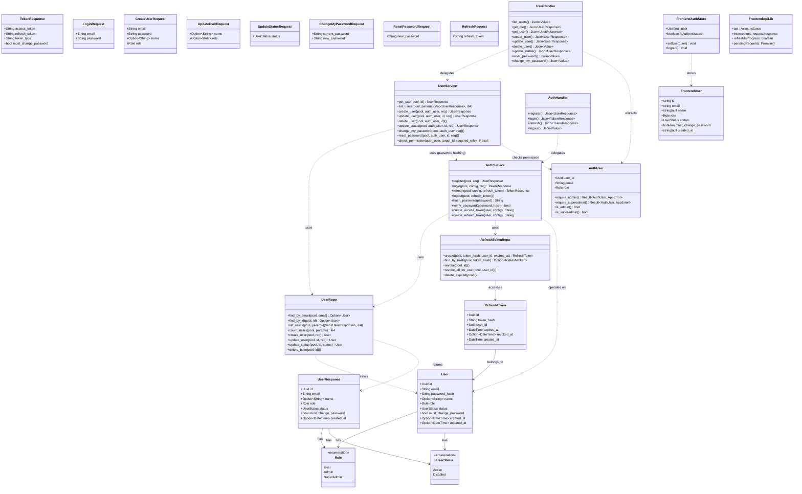
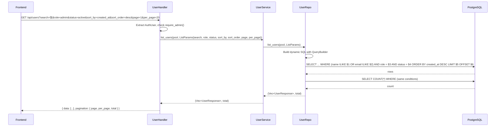
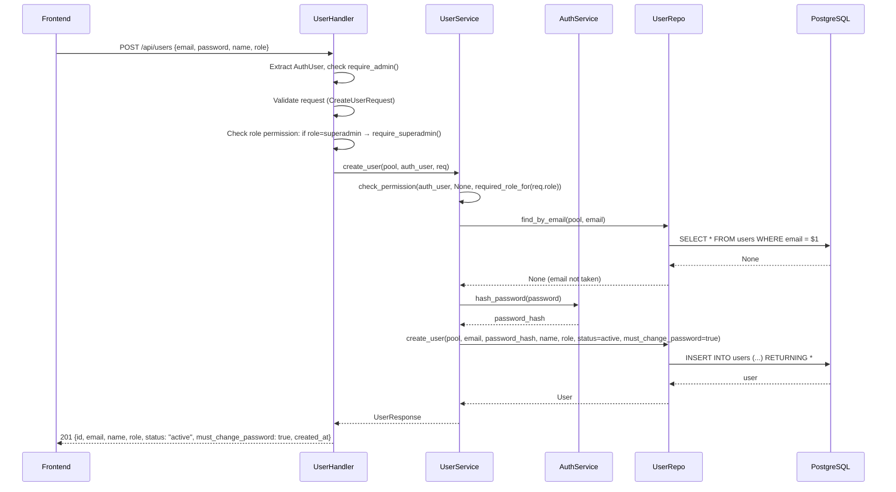
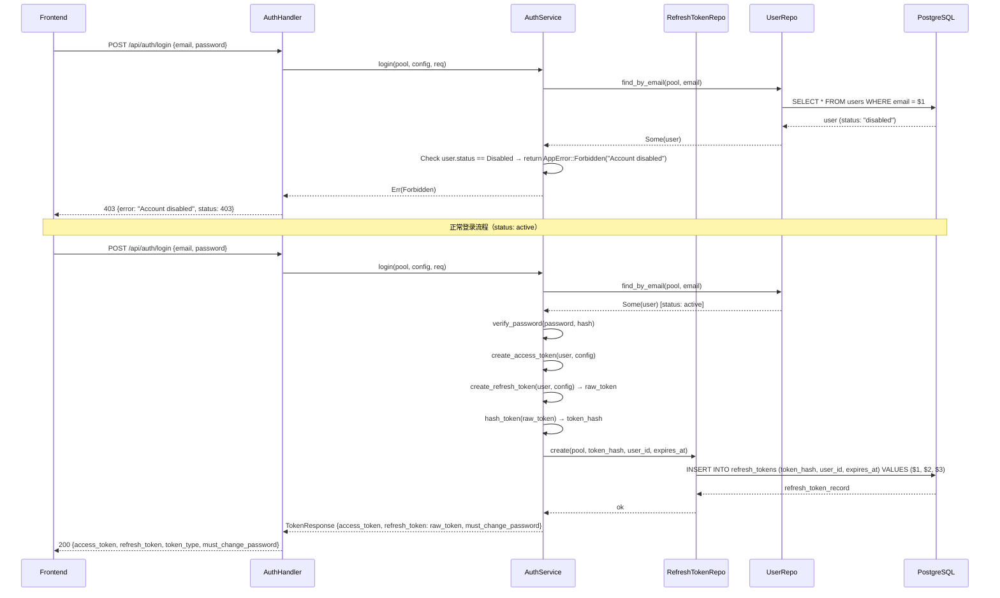
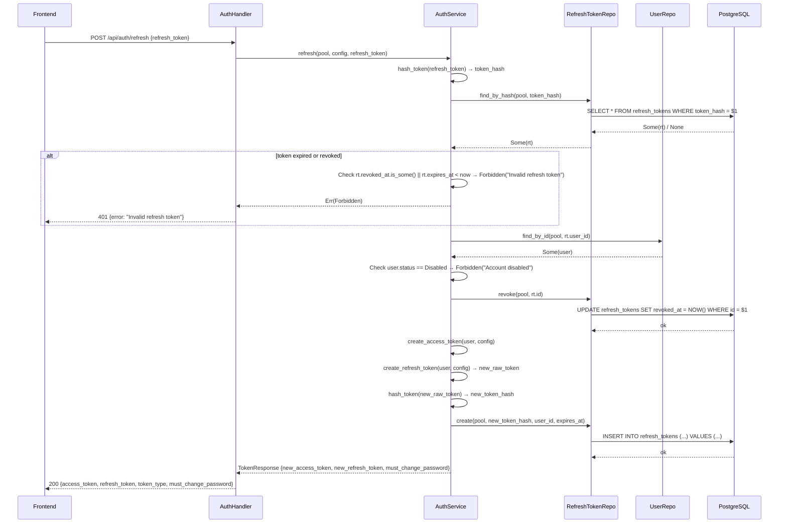
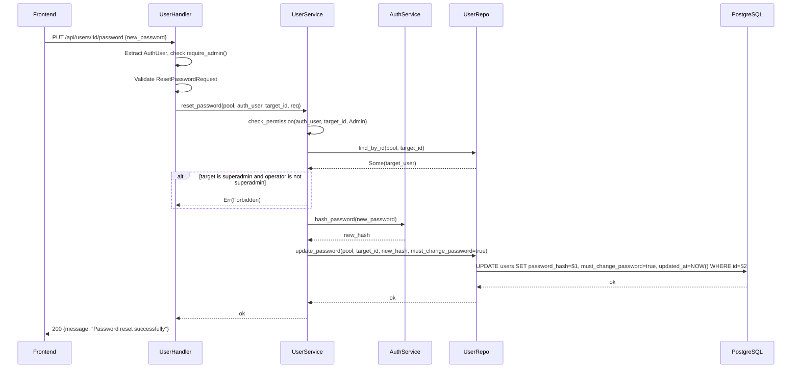
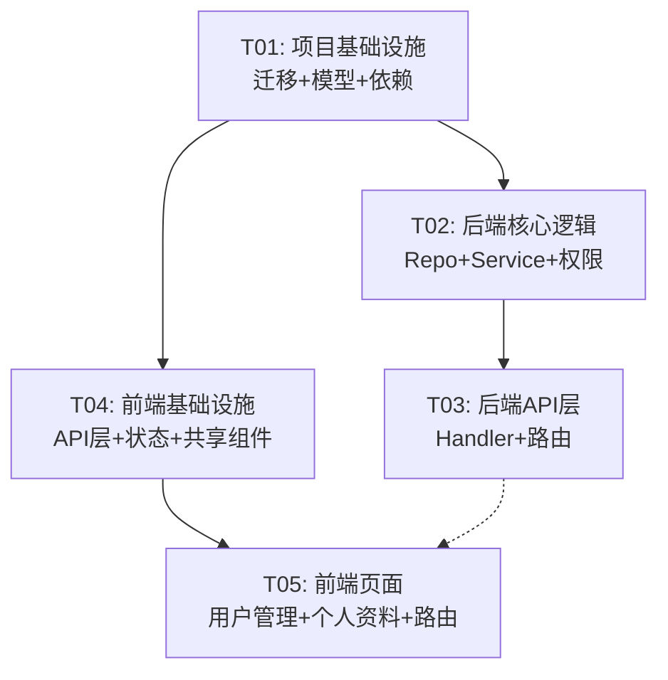

# Phase 1 Architecture: 用户管理

## 1. Implementation Approach

### 核心技术挑战

1. **权限守卫体系**：当前后端只有一个 `AuthUser` 提取器，缺少基于角色的鉴权中间件。需要在 handler 层或中间件层实现 admin+/superadmin 的分级权限检查，确保 superadmin 账号仅 superadmin 可管理、角色变更仅 superadmin 可操作。
2. **Refresh Token 轮转**：当前 refresh/logout 为 TODO 状态，需要新增 `refresh_tokens` 表，实现 token 存储、轮转（旧 token 失效 + 新 token 签发）、登出时吊销。
3. **动态查询构建**：用户列表需要支持 search/role/status/sort_by/sort_order 多维参数组合查询，需在 repository 层动态拼接 SQL（使用 SQLx 的 `query_builder` 或条件式 SQL 拼接）。
4. **前端依赖缺失**：当前 `package.json` 仅有 react/react-dom，缺失 zustand/tanstack-query/react-router-dom/react-hook-form/zod/axios/lucide-react/shadcn-ui 等核心依赖，需要在 T01 中统一安装。
5. **状态字段与禁用检查**：登录时需额外检查 `status` 字段，disabled 用户返回 403 而非 401。

### 框架选型（无需引入新框架）

基于现有技术栈即可满足所有需求，**不需要引入新的框架或库**（除必要的 npm 依赖补全）：

| 领域 | 选用 | 理由 |
|------|------|------|
| 后端 Web 框架 | Axum 0.8 | 已有，成熟稳定 |
| 数据库访问 | SQLx 0.8 | 已有，编译期 SQL 检查，动态查询用 `QueryBuilder` |
| 认证 | jsonwebtoken + argon2 | 已有，refresh token 用数据库存储 |
| 前端 UI | shadcn/ui | 已有基础组件，需补充 Dialog/Select/Badge/Switch 等 |
| 状态管理 | Zustand | PRD 已选型，需安装 |
| 数据获取 | TanStack Query | PRD 已选型，需安装 |
| 表单 | React Hook Form + Zod | 已在 LoginForm 中使用，需安装为正式依赖 |

### 架构模式

保持现有的分层架构：**Handler → Service → Repository → Database**

```
┌─────────────────────────────────────────────────────┐
│                    Routes (Axum Router)              │
├─────────────────────────────────────────────────────┤
│  Middleware Layer                                    │
│  ┌─────────────┐  ┌──────────────────────────────┐  │
│  │ require_auth │  │ require_role(Role::Admin+)   │  │
│  └─────────────┘  └──────────────────────────────┘  │
├─────────────────────────────────────────────────────┤
│  Handler Layer                                       │
│  auth_handler | user_handler                         │
├─────────────────────────────────────────────────────┤
│  Service Layer                                       │
│  auth_service | user_service                         │
├─────────────────────────────────────────────────────┤
│  Repository Layer                                    │
│  user_repo | refresh_token_repo                      │
├─────────────────────────────────────────────────────┤
│  Database (PostgreSQL)                               │
│  users | refresh_tokens                              │
└─────────────────────────────────────────────────────┘
```

权限校验在 **Handler 层** 实现（通过 `AuthUser` 提取器 + 内联角色检查函数），而非独立中间件。原因：
- 不同端点对角色的要求不同（admin+ vs superadmin vs 任意认证用户）
- 内联检查更灵活，可同时判断"操作者 vs 目标用户"关系

---

## 2. File List

### 后端文件（新增 / 修改）

| # | 路径 | 操作 | 说明 |
|---|------|------|------|
| 1 | `apps/backend/migrations/20260521000001_phase1_user_management.sql` | 新增 | 新增 status/must_change_password 字段、role CHECK、refresh_tokens 表 |
| 2 | `apps/backend/src/models/user.rs` | 修改 | User/UserResponse 增加 status/must_change_password；新增 Role/UserStatus 枚举；新增 CreateUserRequest/UpdateStatusRequest/ChangePasswordRequest/ResetPasswordRequest/ChangeMyPasswordRequest |
| 3 | `apps/backend/src/models/refresh_token.rs` | 新增 | RefreshToken 模型 |
| 4 | `apps/backend/src/models/mod.rs` | 新增 | models 模块导出 |
| 5 | `apps/backend/src/repository/user_repo.rs` | 修改 | 动态查询 list_users、create_user、update_status、find_by_id 含 status |
| 6 | `apps/backend/src/repository/refresh_token_repo.rs` | 新增 | refresh token CRUD（create/find_by_hash/revoke/revoke_all_for_user） |
| 7 | `apps/backend/src/repository/mod.rs` | 新增 | repository 模块导出 |
| 8 | `apps/backend/src/services/auth_service.rs` | 修改 | 登录增加 status 检查；实现 refresh_token 轮转；实现 logout；register 改为仅内部用 |
| 9 | `apps/backend/src/services/user_service.rs` | 修改 | 增加创建用户/更新状态/修改密码/重置密码/权限校验逻辑 |
| 10 | `apps/backend/src/services/mod.rs` | 新增 | services 模块导出 |
| 11 | `apps/backend/src/handlers/auth_handler.rs` | 修改 | 实现 refresh/logout handler |
| 12 | `apps/backend/src/handlers/user_handler.rs` | 修改 | 新增 create_user/update_status/reset_password/change_my_password；增强 list/update/delete 权限校验 |
| 13 | `apps/backend/src/handlers/mod.rs` | 新增 | handlers 模块导出 |
| 14 | `apps/backend/src/extractors/auth.rs` | 修改 | AuthUser 增加 require_role/require_admin/require_superadmin 方法 |
| 15 | `apps/backend/src/routes/mod.rs` | 修改 | 新增路由：POST /users, PUT /users/:id/status, PUT /users/:id/password, PUT /users/me/password |
| 16 | `apps/backend/src/lib.rs` | 修改 | AppState 增加 config 引用；模块声明改为 mod.rs 方式 |

### 前端文件（新增 / 修改）

| # | 路径 | 操作 | 说明 |
|---|------|------|------|
| 17 | `apps/frontend/package.json` | 修改 | 补全缺失依赖 |
| 18 | `apps/frontend/src/types/api.ts` | 修改 | 增加 Role/UserStatus 枚举、status/must_change_password 字段、新请求/响应类型 |
| 19 | `apps/frontend/src/types/index.ts` | 新增 | 类型统一导出 |
| 20 | `apps/frontend/src/lib/api.ts` | 修改 | 增加 refresh token 自动刷新逻辑（401 时尝试 refresh，失败才跳登录） |
| 21 | `apps/frontend/src/stores/authStore.ts` | 修改 | 增加 must_change_password 状态；集成 refresh/logout API 调用 |
| 22 | `apps/frontend/src/hooks/useUsers.ts` | 新增 | TanStack Query hooks：useUsers/useCreateUser/useUpdateUser/useDeleteUser/useToggleStatus/useResetPassword |
| 23 | `apps/frontend/src/hooks/useAuth.ts` | 新增 | TanStack Query hooks：useLogin/useRefresh/useLogout/useChangePassword/useChangeMyPassword |
| 24 | `apps/frontend/src/hooks/index.ts` | 新增 | hooks 统一导出 |
| 25 | `apps/frontend/src/components/shared/RoleBadge.tsx` | 新增 | 角色标签组件 |
| 26 | `apps/frontend/src/components/shared/StatusBadge.tsx` | 新增 | 状态标签组件 |
| 27 | `apps/frontend/src/components/shared/PermissionGuard.tsx` | 新增 | 权限守卫组件 |
| 28 | `apps/frontend/src/components/shared/index.ts` | 新增 | shared 统一导出 |
| 29 | `apps/frontend/src/components/ui/dialog.tsx` | 新增 | shadcn Dialog 组件 |
| 30 | `apps/frontend/src/components/ui/select.tsx` | 新增 | shadcn Select 组件 |
| 31 | `apps/frontend/src/components/ui/badge.tsx` | 新增 | shadcn Badge 组件 |
| 32 | `apps/frontend/src/components/ui/switch.tsx` | 新增 | shadcn Switch 组件 |
| 33 | `apps/frontend/src/components/ui/pagination.tsx` | 新增 | shadcn Pagination 组件 |
| 34 | `apps/frontend/src/components/ui/dropdown-menu.tsx` | 新增 | shadcn DropdownMenu 组件 |
| 35 | `apps/frontend/src/components/ui/separator.tsx` | 新增 | shadcn Separator 组件 |
| 36 | `apps/frontend/src/components/ui/alert.tsx` | 新增 | shadcn Alert 组件 |
| 37 | `apps/frontend/src/components/users/UserListPage.tsx` | 新增 | 用户列表页主组件 |
| 38 | `apps/frontend/src/components/users/UserSearchBar.tsx` | 新增 | 搜索+筛选栏 |
| 39 | `apps/frontend/src/components/users/UserTable.tsx` | 新增 | 用户数据表格 |
| 40 | `apps/frontend/src/components/users/UserCreateDialog.tsx` | 新增 | 新增用户对话框 |
| 41 | `apps/frontend/src/components/users/UserEditDialog.tsx` | 新增 | 编辑用户对话框 |
| 42 | `apps/frontend/src/components/users/UserDeleteDialog.tsx` | 新增 | 删除确认对话框 |
| 43 | `apps/frontend/src/components/users/UserStatusToggle.tsx` | 新增 | 启用/禁用切换 |
| 44 | `apps/frontend/src/components/users/UserResetPasswordDialog.tsx` | 新增 | 重置密码对话框 |
| 45 | `apps/frontend/src/components/users/index.ts` | 新增 | users 统一导出 |
| 46 | `apps/frontend/src/components/profile/ProfilePage.tsx` | 新增 | 个人资料页 |
| 47 | `apps/frontend/src/components/profile/ChangePasswordForm.tsx` | 新增 | 修改密码表单 |
| 48 | `apps/frontend/src/components/profile/index.ts` | 新增 | profile 统一导出 |
| 49 | `apps/frontend/src/components/auth/ProtectedRoute.tsx` | 修改 | 增加 must_change_password 检查 |
| 50 | `apps/frontend/src/components/auth/LoginForm.tsx` | 修改 | 处理 403 disabled 提示；处理 must_change_password 跳转 |
| 51 | `apps/frontend/src/components/layout/Sidebar.tsx` | 修改 | 增加 Profile 导航项 |
| 52 | `apps/frontend/src/components/layout/Header.tsx` | 修改 | 增加用户角色显示 + Profile 链接 |
| 53 | `apps/frontend/src/routes/index.tsx` | 修改 | 增加 /dashboard/users、/dashboard/profile、/dashboard/change-password 路由 |

---

## 3. Data Structures and Interfaces



---

## 4. Program Call Flow

### 4.1 用户列表查询（含搜索/筛选/排序）



### 4.2 创建用户



### 4.3 登录 + 禁用检查 + Refresh Token 存储



### 4.4 Refresh Token 轮转



### 4.5 管理员重置密码



---

## 5. Task List (Ordered by Dependency)

### T01: 项目基础设施 — 数据库迁移 + 依赖安装 + 模型定义

**源文件**：
- `apps/backend/migrations/20260521000001_phase1_user_management.sql` (新增)
- `apps/backend/src/models/user.rs` (修改)
- `apps/backend/src/models/refresh_token.rs` (新增)
- `apps/backend/src/models/mod.rs` (新增)
- `apps/backend/src/error.rs` (修改)
- `apps/backend/src/lib.rs` (修改)
- `apps/backend/Cargo.toml` (修改，如需新增依赖)
- `apps/frontend/package.json` (修改)
- `apps/frontend/src/types/api.ts` (修改)
- `apps/frontend/src/types/index.ts` (新增)

**依赖**：无
**优先级**：P0
**说明**：
1. 创建数据库迁移脚本：users 表增加 status/must_change_password 字段和 CHECK 约束，创建 refresh_tokens 表
2. 后端：定义 Role/UserStatus 枚举（实现 Serialize/Deserialize/sqlx::Type），更新 User/UserResponse 模型，新增所有请求/响应模型，新增 RefreshToken 模型，修改 lib.rs 的模块声明
3. 后端：error.rs 增加 `AccountDisabled` 变体（映射 403）
4. 前端：安装缺失依赖（zustand, @tanstack/react-query, react-router-dom, react-hook-form, @hookform/resolvers, zod, axios, lucide-react, @radix-ui/* 等），更新 TypeScript 类型定义
5. 运行 `cargo build` 和 `npm install` 验证

### T02: 后端核心逻辑 — Repository + Service + 权限校验

**源文件**：
- `apps/backend/src/repository/user_repo.rs` (修改)
- `apps/backend/src/repository/refresh_token_repo.rs` (新增)
- `apps/backend/src/repository/mod.rs` (新增)
- `apps/backend/src/services/auth_service.rs` (修改)
- `apps/backend/src/services/user_service.rs` (修改)
- `apps/backend/src/services/mod.rs` (新增)
- `apps/backend/src/extractors/auth.rs` (修改)
- `apps/backend/src/config.rs` (修改)

**依赖**：T01
**优先级**：P0
**说明**：
1. Repository 层：user_repo 实现动态查询（search/role/status/sort_by/sort_order）、create_user、update_status、update_password；refresh_token_repo 实现 create/find_by_hash/revoke/revoke_all_for_user
2. Service 层：auth_service 实现登录 status 检查、refresh token 轮转（hash 存储 + 旧 token 吊销 + 新 token 签发）、logout；user_service 实现创建用户、更新状态、修改密码、重置密码、权限校验逻辑
3. AuthUser 增加 require_admin()/require_superadmin()/is_admin()/is_superadmin() 方法
4. config.rs 中 JwtSettings 增加 refresh_exp_secs（已有）确保可获取

### T03: 后端 API 层 — Handler + 路由注册

**源文件**：
- `apps/backend/src/handlers/auth_handler.rs` (修改)
- `apps/backend/src/handlers/user_handler.rs` (修改)
- `apps/backend/src/handlers/mod.rs` (新增)
- `apps/backend/src/routes/mod.rs` (修改)
- `apps/backend/src/middleware/auth.rs` (修改)

**依赖**：T02
**优先级**：P0
**说明**：
1. auth_handler：实现 refresh handler（调用 auth_service::refresh）、实现 logout handler（调用 auth_service::logout）
2. user_handler：新增 create_user/update_status/reset_password/change_my_password handler；增强 list_users（接受搜索/筛选/排序参数）、增强 update_user（权限校验）、增强 delete_user（权限校验 + 不能删自己 + superadmin 保护）
3. routes：新增 POST /api/users、PUT /api/users/:id/status、PUT /api/users/:id/password、PUT /api/users/me/password 路由，按需分组中间件
4. middleware/auth.rs：增加 require_role 中间件函数（可选，或直接在 handler 中用 AuthUser 方法校验）
5. 整体 API 联调验证

### T04: 前端基础设施 — API 层 + 状态管理 + 共享组件

**源文件**：
- `apps/frontend/src/lib/api.ts` (修改)
- `apps/frontend/src/stores/authStore.ts` (修改)
- `apps/frontend/src/hooks/useUsers.ts` (新增)
- `apps/frontend/src/hooks/useAuth.ts` (新增)
- `apps/frontend/src/hooks/index.ts` (新增)
- `apps/frontend/src/components/shared/RoleBadge.tsx` (新增)
- `apps/frontend/src/components/shared/StatusBadge.tsx` (新增)
- `apps/frontend/src/components/shared/PermissionGuard.tsx` (新增)
- `apps/frontend/src/components/shared/index.ts` (新增)
- `apps/frontend/src/components/ui/dialog.tsx` (新增)
- `apps/frontend/src/components/ui/select.tsx` (新增)
- `apps/frontend/src/components/ui/badge.tsx` (新增)
- `apps/frontend/src/components/ui/switch.tsx` (新增)
- `apps/frontend/src/components/ui/pagination.tsx` (新增)
- `apps/frontend/src/components/ui/dropdown-menu.tsx` (新增)
- `apps/frontend/src/components/ui/separator.tsx` (新增)
- `apps/frontend/src/components/ui/alert.tsx` (新增)
- `apps/frontend/src/components/auth/LoginForm.tsx` (修改)
- `apps/frontend/src/components/auth/ProtectedRoute.tsx` (修改)

**依赖**：T01
**优先级**：P0
**说明**：
1. api.ts：实现 refresh token 自动刷新（401 时尝试 refresh，并发请求排队等待，refresh 失败才清除 token 跳登录）；处理 403（Account disabled）特殊提示
2. authStore：增加 must_change_password 状态；logout 调用 API；增加 updateUser 方法
3. TanStack Query hooks：useUsers（分页+搜索+筛选）、useCreateUser、useUpdateUser、useDeleteUser、useToggleStatus、useResetPassword、useChangeMyPassword
4. 安装并配置 shadcn/ui 组件：dialog、select、badge、switch、pagination、dropdown-menu、separator、alert
5. 共享组件：RoleBadge（颜色区分 user/admin/superadmin）、StatusBadge（绿/红）、PermissionGuard（条件渲染）
6. LoginForm：处理 403 disabled 提示、must_change_password 跳转
7. ProtectedRoute：检查 must_change_password 强制跳转改密页

### T05: 前端页面 — 用户管理页 + 个人资料页 + 路由集成

**源文件**：
- `apps/frontend/src/components/users/UserListPage.tsx` (新增)
- `apps/frontend/src/components/users/UserSearchBar.tsx` (新增)
- `apps/frontend/src/components/users/UserTable.tsx` (新增)
- `apps/frontend/src/components/users/UserCreateDialog.tsx` (新增)
- `apps/frontend/src/components/users/UserEditDialog.tsx` (新增)
- `apps/frontend/src/components/users/UserDeleteDialog.tsx` (新增)
- `apps/frontend/src/components/users/UserStatusToggle.tsx` (新增)
- `apps/frontend/src/components/users/UserResetPasswordDialog.tsx` (新增)
- `apps/frontend/src/components/users/index.ts` (新增)
- `apps/frontend/src/components/profile/ProfilePage.tsx` (新增)
- `apps/frontend/src/components/profile/ChangePasswordForm.tsx` (新增)
- `apps/frontend/src/components/profile/index.ts` (新增)
- `apps/frontend/src/components/layout/Sidebar.tsx` (修改)
- `apps/frontend/src/components/layout/Header.tsx` (修改)
- `apps/frontend/src/routes/index.tsx` (修改)

**依赖**：T04
**优先级**：P0
**说明**：
1. 用户列表页：组合 UserSearchBar + UserTable + 分页，使用 useUsers hook；搜索栏含搜索框+角色下拉+状态下拉+新增按钮
2. 用户表格：姓名/邮箱/RoleBadge/StatusBadge/创建时间/操作列，操作按权限显示（PermissionGuard）
3. 所有对话框组件：使用 React Hook Form + Zod 验证，调用对应 mutation hook
4. 个人资料页：用户信息卡片 + 修改姓名表单 + ChangePasswordForm
5. Sidebar 增加 Profile 导航项；Header 显示角色 + Profile 链接
6. 路由：/dashboard/users → UserListPage、/dashboard/profile → ProfilePage
7. 全流程端到端联调

---

## 6. Required Packages

### 后端 Cargo 新增依赖

无需新增 Cargo 依赖。现有依赖已覆盖所有需求：
- `argon2` — 密码哈希
- `jsonwebtoken` — JWT 签发/验证
- `sqlx` — 数据库访问（含 QueryBuilder）
- `validator` — 请求验证
- `serde` / `serde_json` — 序列化

### 前端 npm 新增依赖

```
# 状态管理
- zustand@^5.0.0: 轻量状态管理

# 数据获取
- @tanstack/react-query@^5.0.0: 服务端状态管理 + 缓存

# 路由
- react-router-dom@^7.0.0: 客户端路由

# 表单
- react-hook-form@^7.0.0: 表单管理
- @hookform/resolvers@^3.0.0: Zod resolver
- zod@^3.0.0: Schema 验证

# HTTP
- axios@^1.0.0: HTTP 客户端

# 图标
- lucide-react@^0.460.0: 图标库

# shadcn/ui 依赖 (Radix UI primitives)
- @radix-ui/react-dialog@^1.0.0: Dialog 组件
- @radix-ui/react-select@^2.0.0: Select 组件
- @radix-ui/react-switch@^1.0.0: Switch 组件
- @radix-ui/react-dropdown-menu@^2.0.0: DropdownMenu 组件
- @radix-ui/react-separator@^1.0.0: Separator 组件
- @radix-ui/react-slot@^1.0.0: Slot 组件
- @radix-ui/react-label@^2.0.0: Label 组件
- class-variance-authority@^0.7.0: 样式变体
- clsx@^2.0.0: 类名合并
- tailwind-merge@^2.0.0: Tailwind 类名合并
```

---

## 7. Shared Knowledge

### 角色枚举定义

**后端 (Rust)**：
```rust
#[derive(Debug, Clone, Serialize, Deserialize, sqlx::Type, PartialEq, Eq)]
#[sqlx(type_name = "VARCHAR", rename_all = "lowercase")]
pub enum Role {
    User,
    Admin,
    SuperAdmin,
}
```

**前端 (TypeScript)**：
```typescript
export type Role = "user" | "admin" | "superadmin"
export type UserStatus = "active" | "disabled"
```

### API 响应格式

- 成功响应：直接返回数据对象（如 `UserResponse`、`TokenResponse`）或 `{ "message": "..." }`
- 分页响应：`{ "data": [...], "pagination": { "page": 1, "per_page": 20, "total": 100 } }`
- 错误响应：`{ "error": "message", "status": 403 }`
- HTTP 状态码：200 成功、201 创建成功、400 验证失败、401 未认证、403 无权限/账号禁用、404 不存在、409 冲突（邮箱重复）、500 服务器错误

### 权限矩阵

| 操作 | user | admin | superadmin |
|------|------|-------|------------|
| 查看用户列表 | ❌ | ✅ | ✅ |
| 查看自己信息 | ✅ | ✅ | ✅ |
| 创建用户（role=user/admin） | ❌ | ✅ | ✅ |
| 创建用户（role=superadmin） | ❌ | ❌ | ✅ |
| 编辑用户姓名 | ❌ | ✅ | ✅ |
| 编辑用户角色 | ❌ | ❌ | ✅ |
| 编辑 superadmin 账号 | ❌ | ❌ | ✅ |
| 删除用户 | ❌ | ✅ | ✅ |
| 删除 superadmin | ❌ | ❌ | ✅ |
| 禁用/启用用户 | ❌ | ✅ | ✅ |
| 禁用 superadmin | ❌ | ❌ | ✅ |
| 不能操作自己（禁用/删除） | — | ✅ | ✅ |
| 重置用户密码 | ❌ | ✅ | ✅ |
| 修改自己密码 | ✅ | ✅ | ✅ |
| 修改自己姓名 | ✅ | ✅ | ✅ |

### Refresh Token 安全约定

- Refresh token 存储 **hash**（SHA-256），数据库中不存明文
- 签发给客户端的是明文 token（UUID v4 格式），客户端存 localStorage
- 轮转时：旧 token 标记 `revoked_at`，签发新 token 并存储新 hash
- Logout 时：标记当前 refresh token 的 `revoked_at`
- 过期清理：可选定时任务删除 `expires_at < NOW()` 且已吊销的记录

### 密码策略

- 最少 8 位
- 必须包含大写字母、小写字母、数字、特殊字符中的至少 3 种
- 后端验证 + 前端 Zod schema 双重校验
- 管理员创建用户 / 重置密码后，`must_change_password = true`

### 日期格式

- 所有日期使用 ISO 8601 UTC 格式
- 数据库使用 `TIMESTAMP WITH TIME ZONE`
- 前端显示时按用户本地时区格式化

### 前端 API 代理

- 开发环境：Vite devServer proxy `/api` → `http://localhost:3000/api`
- 生产环境：反向代理（Nginx）统一路由

---

## 8. Task Dependency Graph



> T03 和 T05 之间的虚线表示：T05 的完整端到端联调需要 T03 完成，但 T05 的页面开发可并行进行（用 mock 数据）。

---

## 9. Anything UNCLEAR

1. **superadmin 数量限制实现**：已确认限制 1 个 superadmin，但现有数据库可能已有多个。迁移脚本是否需要清理？建议迁移时不做清理，仅在 service 层阻止创建/升级为 superadmin（当已存在一个时）。
2. **register 端点的保留**：当前 `POST /api/auth/register` 是公开注册。Phase 1 新增了 `POST /api/users`（管理员创建）。register 端点是否仍保留公开访问？建议保留但限制为仅创建 user 角色（不暴露角色选择），或完全关闭公开注册。
3. **must_change_password 强制改密流程**：PRD 确认首次登录强制改密码。具体交互：登录后 TokenResponse 包含 `must_change_password: true`，前端跳转到修改密码页，修改成功后才能访问其他页面。但 access_token 此时已有效——是否需要在 middleware 层额外检查？建议仅前端控制（ProtectedRoute 检查），后端不拦截，简化实现。
4. **refresh token 并发安全**：如果一个 refresh token 被并发使用两次（如多标签页同时 401），第一次轮转成功后第二次应失败（token 已 revoked）。当前设计中 `find_by_hash` + `revoke` 不是原子操作，极小概率存在竞态。可通过数据库事务或唯一约束缓解，但 Phase 1 可接受此风险。
5. **定期清理过期 refresh_tokens**：是否需要定时任务清理？建议 Phase 1 不实现，手动清理或在登录时顺便清理该用户的过期 token。
