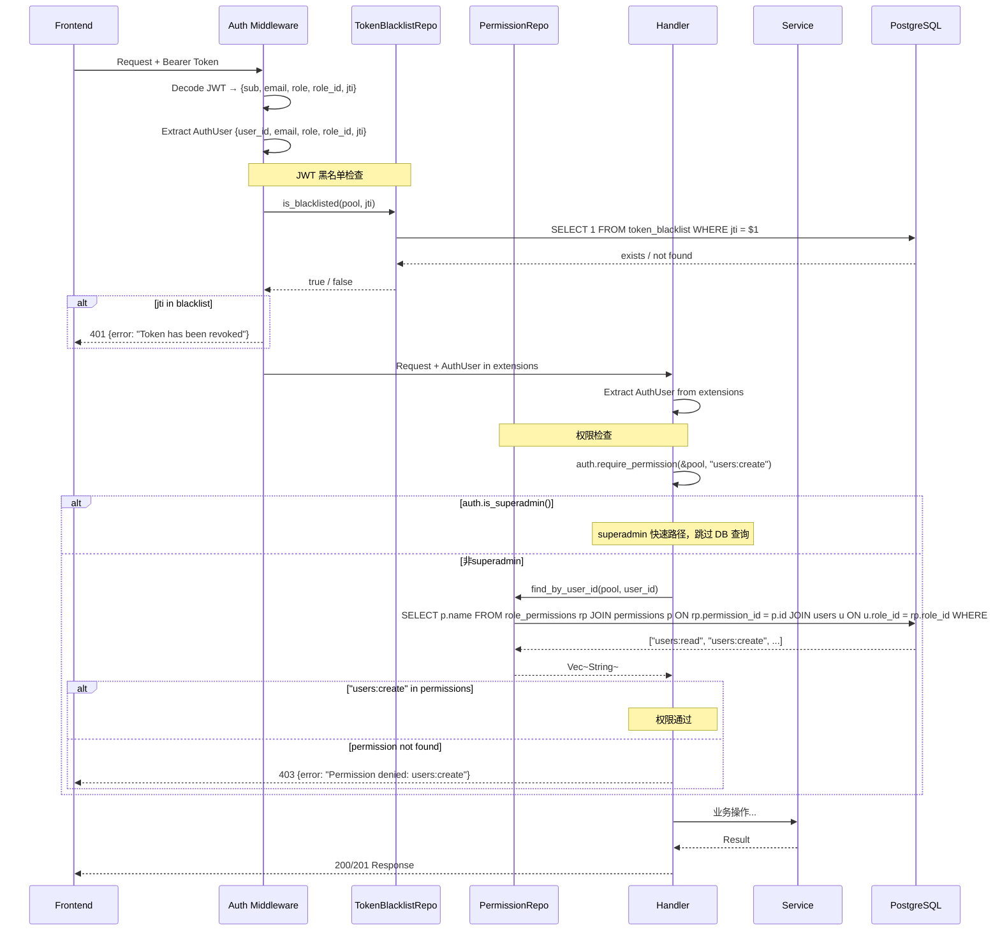
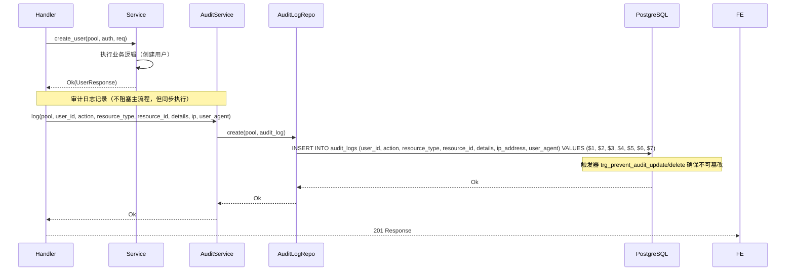
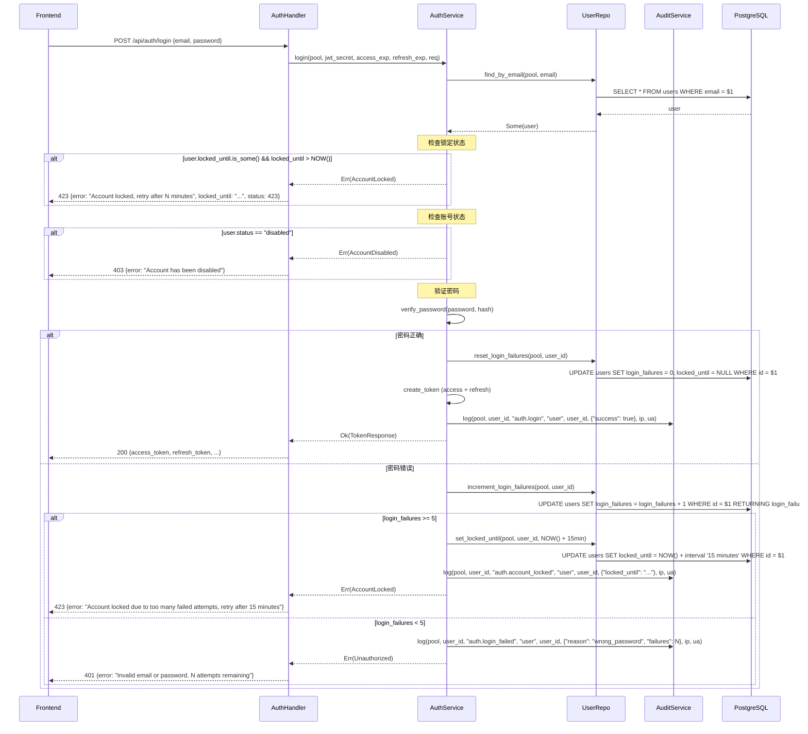
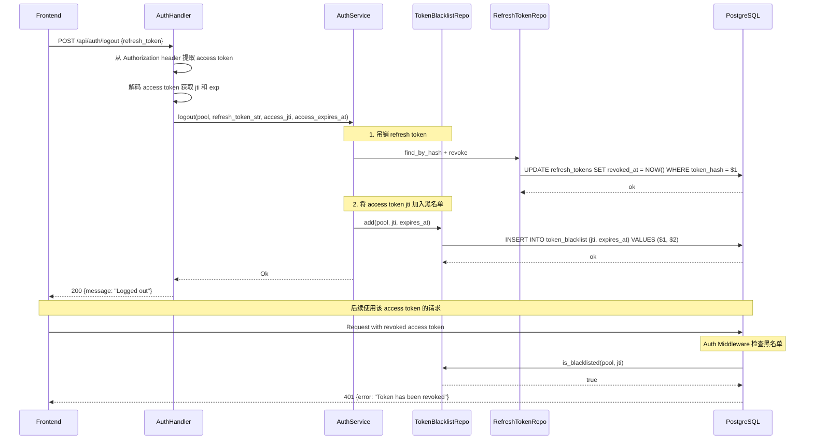
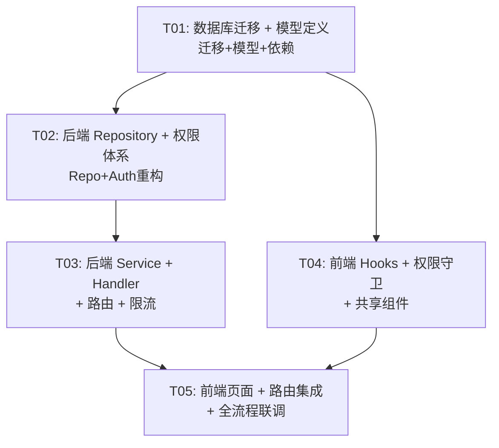

# Phase 2 Architecture: RBAC + 安全

## 1. 实现方案 + 框架选型

### 核心技术挑战

1. **权限体系迁移（角色 → 权限）**：Phase 1 使用硬编码 `Role` 枚举（user/admin/superadmin）做权限检查，Phase 2 需要升级为基于数据库的 RBAC 权限体系。关键挑战在于：
   - `users.role` 字段（VARCHAR）需迁移为 `users.role_id`（UUID 外键）
   - `AuthUser` 提取器需从"角色判断"改为"权限查询"
   - 所有 handler 中的 `require_admin()` / `require_superadmin()` 调用需改为 `require_permission("xxx")`
   - JWT claims 需要新增 `jti`（用于黑名单），但不在 JWT 中放权限列表（按用户确认决策 #4）
   - **向后兼容**：迁移期间保留 `users.role` 列，渐进切换到 `role_id`

2. **审计日志不可篡改**：audit_logs 表需通过 PostgreSQL 触发器禁止 UPDATE/DELETE，应用层也需确保仅 INSERT。

3. **JWT 黑名单**：用户确认使用数据库表方案。每次 auth 中间件验证 JWT 后，需额外查询 token_blacklist 表检查 jti 是否存在。需要关注性能影响（可通过缓存优化，但 Phase 2 先直查 DB）。

4. **登录失败锁定**：在 auth_service 的 login 流程中增加 `login_failures` 计数和 `locked_until` 时间戳管理，需在密码验证前先检查锁定状态。

5. **API 限流**：使用 tower-governor 集成 Axum，需区分全局限流和登录端点独立限流。

### 框架选型

| 领域 | 选用 | 版本 | 理由 |
|------|------|------|------|
| API 限流 | tower-governor | ^0.4 | 用户已确认选择；Axum 原生集成，基于 governor 算法 |
| CORS 配置 | tower-http（已有） | ^0.6 | 已有依赖，仅需将 `allow_origin(Any)` 改为白名单 |
| IP 地址解析 | axum 本身 + 正则 | — | 从 ConnectInfo 或 X-Forwarded-For 头提取 |

**无需引入的其他新依赖**：现有的 sqlx/argon2/jsonwebtoken/serde 完全满足 RBAC、黑名单、审计日志需求。

### 架构变更说明

#### 权限守卫迁移策略

Phase 1 的权限检查模式：
```rust
// Phase 1: Handler 中直接调用
auth.require_admin()?;
auth.require_superadmin()?;
```

Phase 2 的权限检查模式：
```rust
// Phase 2: 基于权限字符串的检查
auth.require_permission(&pool, "users:create").await?;

// superadmin 快速路径：is_system 角色直接放行，不查 DB
// 其他角色：查询 role_permissions JOIN permissions 表
```

迁移步骤：
1. 新建 roles/permissions/role_permissions 表，迁移现有硬编码角色为系统内置记录
2. users 表新增 role_id 列，数据迁移后 role_id 与 role 暂时并存
3. AuthUser 新增 `role_id` 和权限查询方法
4. JWT claims 新增 `jti`（UUID v4）和 `role_id`
5. 所有 handler 逐步替换为 `require_permission()` 调用
6. 前端 PermissionGuard 从角色检查改为权限检查

#### 分层架构保持不变

```
┌─────────────────────────────────────────────────────┐
│                    Routes (Axum Router)              │
│  + tower-governor 限流中间件                         │
├─────────────────────────────────────────────────────┤
│  Middleware Layer                                    │
│  ┌─────────────┐  ┌──────────────────────────────┐  │
│  │ require_auth │  │ JWT黑名单检查(jti)            │  │
│  │ (含jti检查)  │  │ 限流 (全局限流+登录限流)       │  │
│  └─────────────┘  └──────────────────────────────┘  │
├─────────────────────────────────────────────────────┤
│  Handler Layer                                       │
│  auth | user | role | audit_log                      │
├─────────────────────────────────────────────────────┤
│  Service Layer                                       │
│  auth | user | role | audit_log                      │
├─────────────────────────────────────────────────────┤
│  Repository Layer                                    │
│  user | refresh_token | role | permission |          │
│  audit_log | token_blacklist                         │
├─────────────────────────────────────────────────────┤
│  Database (PostgreSQL)                               │
│  users | refresh_tokens | roles | permissions |      │
│  role_permissions | audit_logs | token_blacklist     │
└─────────────────────────────────────────────────────┘
```

---

## 2. 文件列表及相对路径

### 数据库迁移文件

| # | 路径 | 操作 | 说明 |
|---|------|------|------|
| 1 | `apps/backend/migrations/20260522000001_phase2_rbac.sql` | 新增 | 创建 roles、permissions、role_permissions 表；修改 users 表新增 role_id、login_failures、locked_until；数据迁移；创建 token_blacklist 和 audit_logs 表；触发器防止审计日志篡改 |

### 后端文件（新增 / 修改）

| # | 路径 | 操作 | 说明 |
|---|------|------|------|
| 2 | `apps/backend/Cargo.toml` | 修改 | 新增 tower-governor 依赖 |
| 3 | `apps/backend/src/config.rs` | 修改 | 新增 RateLimitSettings、CorsWhitelistSettings 配置段 |
| 4 | `apps/backend/src/lib.rs` | 修改 | AppState 新增字段；集成限流中间件；CORS 白名单 |
| 5 | `apps/backend/src/error.rs` | 修改 | 新增 `TooManyRequests(String)` 和 `AccountLocked(String)` 错误变体 |
| 6 | `apps/backend/src/models/role.rs` | 新增 | Role（DB model）、RoleResponse、CreateRoleRequest、UpdateRoleRequest、UpdateRolePermissionsRequest |
| 7 | `apps/backend/src/models/permission.rs` | 新增 | Permission（DB model）、PermissionResponse |
| 8 | `apps/backend/src/models/audit_log.rs` | 新增 | AuditLog（DB model）、AuditLogResponse、AuditLogListQuery |
| 9 | `apps/backend/src/models/token_blacklist.rs` | 新增 | TokenBlacklist（DB model） |
| 10 | `apps/backend/src/models/user.rs` | 修改 | User 增加 role_id/login_failures/locked_until；UserResponse 增加 role_id/permissions；CreateUserRequest 改为 role_id；UpdateUserRequest 改为 role_id；新增 MeResponse（含 permissions） |
| 11 | `apps/backend/src/models/mod.rs` | 修改 | 新增 role/permission/audit_log/token_blacklist 模块导出 |
| 12 | `apps/backend/src/repository/role_repo.rs` | 新增 | 角色CRUD、角色权限关联查询、按ID/名称查找 |
| 13 | `apps/backend/src/repository/permission_repo.rs` | 新增 | 权限列表查询、按角色ID查询权限、批量关联/取消关联 |
| 14 | `apps/backend/src/repository/audit_log_repo.rs` | 新增 | 审计日志INSERT（不可UPDATE/DELETE）、分页+筛选查询、按ID查询 |
| 15 | `apps/backend/src/repository/token_blacklist_repo.rs` | 新增 | 黑名单INSERT、按jti查询、清理过期记录 |
| 16 | `apps/backend/src/repository/user_repo.rs` | 修改 | list/filter 支持按 role_id 筛选；create_user 支持 role_id；新增 increment_login_failures、reset_login_failures、set_locked_until |
| 17 | `apps/backend/src/repository/mod.rs` | 修改 | 新增 role/permission/audit_log/token_blacklist 模块导出 |
| 18 | `apps/backend/src/services/role_service.rs` | 新增 | 角色CRUD业务逻辑、权限分配、删除前检查是否有用户关联 |
| 19 | `apps/backend/src/services/audit_service.rs` | 新增 | 记录审计日志（统一入口）、查询审计日志（分页+筛选） |
| 20 | `apps/backend/src/services/auth_service.rs` | 修改 | login 增加锁定检查和失败计数；logout 增加 jti 黑名单写入；Claims 增加 jti；create_token 增加 jti；新增 get_user_permissions 辅助函数 |
| 21 | `apps/backend/src/services/user_service.rs` | 修改 | 权限检查从 require_admin/require_superadmin 改为 require_permission；各操作触发审计日志 |
| 22 | `apps/backend/src/services/mod.rs` | 修改 | 新增 role/audit 模块导出 |
| 23 | `apps/backend/src/handlers/role_handler.rs` | 新增 | 角色CRUD端点、权限分配端点 |
| 24 | `apps/backend/src/handlers/audit_handler.rs` | 新增 | 审计日志列表+详情端点 |
| 25 | `apps/backend/src/handlers/auth_handler.rs` | 修改 | login 响应增加错误详情（剩余次数/锁定时间）；logout 接收 access token jti |
| 26 | `apps/backend/src/handlers/user_handler.rs` | 修改 | get_me 返回 permissions 和 role_id；list_users 增加 role_id 筛选参数 |
| 27 | `apps/backend/src/handlers/mod.rs` | 修改 | 新增 role/audit 模块导出 |
| 28 | `apps/backend/src/extractors/auth.rs` | 修改 | AuthUser 增加 role_id、jti；新增 require_permission() 方法；保留 is_superadmin() 用于超级管理员快速路径 |
| 29 | `apps/backend/src/middleware/auth.rs` | 修改 | Claims 增加 jti/role_id；验证后检查 token 黑名单；提取客户端 IP |
| 30 | `apps/backend/src/routes/mod.rs` | 修改 | 新增角色路由、审计日志路由、权限路由；登录路由独立限流 |

### 前端文件（新增 / 修改）

| # | 路径 | 操作 | 说明 |
|---|------|------|------|
| 31 | `apps/frontend/src/types/api.ts` | 修改 | User 增加 role_id/permissions；新增 Role/Permission/AuditLog 类型；CreateUserRequest/UpdateUserRequest 改用 role_id；新增 CreateRoleRequest 等 |
| 32 | `apps/frontend/src/stores/authStore.ts` | 修改 | User 类型增加 permissions 数组；setUser 时同步 permissions |
| 33 | `apps/frontend/src/hooks/useRoles.ts` | 新增 | TanStack Query hooks：useRoles/useCreateRole/useUpdateRole/useDeleteRole/useUpdateRolePermissions |
| 34 | `apps/frontend/src/hooks/usePermissions.ts` | 新增 | usePermissions（获取系统权限列表） |
| 35 | `apps/frontend/src/hooks/useAuditLogs.ts` | 新增 | useAuditLogs（分页+筛选）、useAuditLogDetail |
| 36 | `apps/frontend/src/hooks/useUsers.ts` | 修改 | createUser/updateUser 改用 role_id；list 增加 role_id 筛选 |
| 37 | `apps/frontend/src/components/shared/PermissionGuard.tsx` | 修改 | 从角色检查改为权限检查（`permission="users:create"`）；保留 superadmin 自动放行 |
| 38 | `apps/frontend/src/components/shared/PermissionBadge.tsx` | 新增 | 权限标签组件（按模块分组颜色） |
| 39 | `apps/frontend/src/components/shared/PermissionSelector.tsx` | 新增 | 权限多选组件（按模块分组 checkbox） |
| 40 | `apps/frontend/src/components/shared/index.ts` | 修改 | 导出新组件 |
| 41 | `apps/frontend/src/components/roles/RoleListPage.tsx` | 新增 | 角色列表页 |
| 42 | `apps/frontend/src/components/roles/RoleCreateDialog.tsx` | 新增 | 创建角色弹窗 |
| 43 | `apps/frontend/src/components/roles/RoleEditDialog.tsx` | 新增 | 编辑角色弹窗 |
| 44 | `apps/frontend/src/components/roles/RoleDeleteDialog.tsx` | 新增 | 删除角色确认弹窗 |
| 45 | `apps/frontend/src/components/roles/index.ts` | 新增 | 模块导出 |
| 46 | `apps/frontend/src/components/audit/AuditLogListPage.tsx` | 新增 | 审计日志列表页 |
| 47 | `apps/frontend/src/components/audit/AuditLogFilterBar.tsx` | 新增 | 筛选栏组件 |
| 48 | `apps/frontend/src/components/audit/AuditLogDetailDialog.tsx` | 新增 | 日志详情弹窗 |
| 49 | `apps/frontend/src/components/audit/index.ts` | 新增 | 模块导出 |
| 50 | `apps/frontend/src/components/users/UserCreateDialog.tsx` | 修改 | 角色选择改为下拉（从 roles API 获取） |
| 51 | `apps/frontend/src/components/users/UserEditDialog.tsx` | 修改 | 角色选择改为下拉 |
| 52 | `apps/frontend/src/components/users/UserTable.tsx` | 修改 | 新增角色名称列 |
| 53 | `apps/frontend/src/components/users/UserSearchBar.tsx` | 修改 | 角色筛选改为 role_id |
| 54 | `apps/frontend/src/components/layout/Sidebar.tsx` | 修改 | 新增角色管理/审计日志菜单项，按权限控制显隐 |
| 55 | `apps/frontend/src/components/profile/ProfilePage.tsx` | 修改 | 新增当前用户权限列表展示（只读） |
| 56 | `apps/frontend/src/routes/index.tsx` | 修改 | 新增角色管理、审计日志路由；增加路由级权限守卫 |
| 57 | `apps/frontend/src/components/ui/checkbox.tsx` | 新增 | shadcn Checkbox 组件（权限选择用） |
| 58 | `apps/frontend/src/components/ui/accordion.tsx` | 新增 | shadcn Accordion 组件（权限按模块分组用） |

---

## 3. 数据结构和接口（类图）

```mermaid
classDiagram
    %% ===== Phase 2 新增枚举 =====

    %% ===== Phase 2 新增数据模型 =====

    class RoleRecord {
        +Uuid id
        +String name
        +Option~String~ description
        +bool is_system
        +DateTime created_at
        +DateTime updated_at
    }

    class RoleResponse {
        +Uuid id
        +String name
        +Option~String~ description
        +bool is_system
        +Vec~String~ permissions
        +DateTime created_at
        +DateTime updated_at
    }

    class PermissionRecord {
        +Uuid id
        +String name
        +Option~String~ description
        +String module
        +DateTime created_at
    }

    class PermissionResponse {
        +Uuid id
        +String name
        +Option~String~ description
        +String module
        +DateTime created_at
    }

    class AuditLog {
        +Uuid id
        +Option~Uuid~ user_id
        +String action
        +Option~String~ resource_type
        +Option~Uuid~ resource_id
        +Option~Value~ details
        +Option~String~ ip_address
        +Option~String~ user_agent
        +DateTime created_at
    }

    class AuditLogResponse {
        +Uuid id
        +Option~Uuid~ user_id
        +Option~String~ user_email
        +String action
        +Option~String~ resource_type
        +Option~Uuid~ resource_id
        +Option~Value~ details
        +Option~String~ ip_address
        +Option~String~ user_agent
        +DateTime created_at
    }

    class TokenBlacklist {
        +Uuid jti
        +DateTime expires_at
        +DateTime created_at
    }

    %% ===== Phase 1 模型（Phase 2 修改部分用 ~标记~） =====

    class User {
        +Uuid id
        +String email
        +String password_hash
        +Option~String~ name
        +String role
        +Option~Uuid~ role_id  ~NEW~
        +String status
        +bool must_change_password
        +i32 login_failures  ~NEW~
        +Option~DateTime~ locked_until  ~NEW~
        +Option~DateTime~ created_at
        +Option~DateTime~ updated_at
    }

    class UserResponse {
        +Uuid id
        +String email
        +Option~String~ name
        +String role
        +Option~Uuid~ role_id  ~NEW~
        +String status
        +bool must_change_password
        +Option~DateTime~ created_at
        +Option~DateTime~ updated_at
    }

    class MeResponse {
        +Uuid id
        +String email
        +Option~String~ name
        +String role
        +Uuid role_id
        +String status
        +bool must_change_password
        +Vec~String~ permissions  ~NEW~
        +Option~DateTime~ created_at
        +Option~DateTime~ updated_at
    }

    %% ===== Phase 2 新增请求类型 =====

    class CreateRoleRequest {
        +String name
        +Option~String~ description
        +Vec~Uuid~ permission_ids
    }

    class UpdateRoleRequest {
        +Option~String~ name
        +Option~String~ description
    }

    class UpdateRolePermissionsRequest {
        +Vec~Uuid~ permission_ids
    }

    class AuditLogListQuery {
        +Option~i64~ page
        +Option~i64~ per_page
        +Option~Uuid~ user_id
        +Option~String~ action
        +Option~String~ from
        +Option~String~ to
    }

    %% ===== Phase 2 修改后的提取器 =====

    class AuthUser {
        +Uuid user_id
        +String email
        +String role
        +Option~Uuid~ role_id  ~NEW~
        +Uuid jti  ~NEW~
        +is_superadmin() bool
        +require_permission(pool, permission) Result~AuthUser, AppError~  ~NEW~
        +require_permissions(pool, permissions) Result~AuthUser, AppError~  ~NEW~
    }

    %% ===== Phase 2 新增 Repository =====

    class RoleRepo {
        +find_by_id(pool, id) Option~RoleRecord~
        +find_by_name(pool, name) Option~RoleRecord~
        +list_all(pool) Vec~RoleRecord~
        +list_with_permissions(pool) Vec~RoleResponse~
        +create(pool, name, description, permission_ids) RoleRecord
        +update(pool, id, name, description) RoleRecord
        +delete(pool, id) ()
        +count_users_by_role(pool, role_id) i64
    }

    class PermissionRepo {
        +list_all(pool) Vec~PermissionRecord~
        +find_by_role_id(pool, role_id) Vec~PermissionResponse~
        +find_by_user_id(pool, user_id) Vec~String~
        +set_role_permissions(pool, role_id, permission_ids) ()
    }

    class AuditLogRepo {
        +create(pool, log) ()
        +find_by_id(pool, id) Option~AuditLog~
        +list_paginated(pool, query) (Vec~AuditLogResponse~, i64)
    }

    class TokenBlacklistRepo {
        +add(pool, jti, expires_at) ()
        +is_blacklisted(pool, jti) bool
        +cleanup_expired(pool) ()
    }

    %% ===== Phase 2 新增 Service =====

    class RoleService {
        +list_roles(pool) Vec~RoleResponse~
        +get_role(pool, id) RoleResponse
        +create_role(pool, auth, req) RoleResponse
        +update_role(pool, auth, id, req) RoleResponse
        +delete_role(pool, auth, id) ()
        +update_permissions(pool, auth, id, req) RoleResponse
    }

    class AuditService {
        +log(pool, user_id, action, resource_type, resource_id, details, ip, user_agent) ()
        +list_logs(pool, auth, query) (Vec~AuditLogResponse~, i64)
        +get_log_detail(pool, auth, id) AuditLogResponse
    }

    %% ===== Phase 2 新增 Handler =====

    class RoleHandler {
        +list_roles() Json~Vec~RoleResponse~~
        +create_role() Json~RoleResponse~
        +get_role() Json~RoleResponse~
        +update_role() Json~RoleResponse~
        +delete_role() Json~Value~
        +update_permissions() Json~RoleResponse~
        +list_permissions() Json~Vec~PermissionResponse~~
    }

    class AuditHandler {
        +list_logs() Json~Value~
        +get_log_detail() Json~AuditLogResponse~
    }

    %% ===== 前端新增类型 =====

    class FrontendRole {
        +string id
        +string name
        +string|null description
        +boolean is_system
        +string[] permissions
        +string|null created_at
        +string|null updated_at
    }

    class FrontendPermission {
        +string id
        +string name
        +string|null description
        +string module
        +string|null created_at
    }

    class FrontendAuditLog {
        +string id
        +string|null user_id
        +string|null user_email
        +string action
        +string|null resource_type
        +string|null resource_id
        +any|null details
        +string|null ip_address
        +string|null user_agent
        +string created_at
    }

    %% ===== 关系 =====
    User --> RoleRecord : has (via role_id)
    RoleRecord --> PermissionRecord : many-to-many (via role_permissions)
    UserResponse --> RoleRecord : references
    MeResponse --> PermissionRecord : has many
    RoleResponse --> PermissionRecord : has many
    AuthUser --> RoleRecord : references (via role_id)
    AuthUser --> TokenBlacklist : checked against
    RoleRepo ..> RoleRecord : accesses
    RoleRepo ..> RoleResponse : returns
    PermissionRepo ..> PermissionRecord : accesses
    AuditLogRepo ..> AuditLog : accesses
    AuditLogRepo ..> AuditLogResponse : returns
    TokenBlacklistRepo ..> TokenBlacklist : accesses
    RoleService ..> RoleRepo : uses
    RoleService ..> PermissionRepo : uses
    RoleService ..> AuthUser : checks permission
    AuditService ..> AuditLogRepo : uses
    AuditService ..> AuthUser : checks permission
    RoleHandler ..> RoleService : delegates
    AuditHandler ..> AuditService : delegates
```



---

## 4. 程序调用流程（时序图）

### 4.1 RBAC 权限检查流程



### 4.2 审计日志记录流程



### 4.3 登录失败锁定流程



### 4.4 JWT 黑名单 + 登出流程



---

## 5. 任务列表

### T01: 数据库迁移 + 后端模型定义 + 依赖安装

**描述**：创建 Phase 2 所有数据库表（roles、permissions、role_permissions、audit_logs、token_blacklist），修改 users 表（新增 role_id、login_failures、locked_until），完成数据迁移。定义所有新增 Rust 数据模型和 TypeScript 类型。安装新增依赖（tower-governor 等）。

**源文件**：
- `apps/backend/migrations/20260522000001_phase2_rbac.sql` (新增)
- `apps/backend/Cargo.toml` (修改)
- `apps/backend/src/config.rs` (修改)
- `apps/backend/src/error.rs` (修改)
- `apps/backend/src/models/role.rs` (新增)
- `apps/backend/src/models/permission.rs` (新增)
- `apps/backend/src/models/audit_log.rs` (新增)
- `apps/backend/src/models/token_blacklist.rs` (新增)
- `apps/backend/src/models/user.rs` (修改)
- `apps/backend/src/models/mod.rs` (修改)
- `apps/frontend/src/types/api.ts` (修改)

**依赖**：无
**优先级**：P0
**复杂度**：L
**验证**：运行 `sqlx migrate run` 成功；`cargo build` 编译通过；所有 24 个 Phase 1 集成测试仍通过

---

### T02: 后端核心 — Repository 层 + Auth 权限体系重构

**描述**：实现所有新增 Repository（role_repo、permission_repo、audit_log_repo、token_blacklist_repo），修改 user_repo 支持新字段。重构 AuthUser 提取器增加 `require_permission()` 方法。重构 auth middleware 增加 jti 黑名单检查。修改 auth_service 增加登录锁定逻辑和登出黑名单逻辑。

**源文件**：
- `apps/backend/src/repository/role_repo.rs` (新增)
- `apps/backend/src/repository/permission_repo.rs` (新增)
- `apps/backend/src/repository/audit_log_repo.rs` (新增)
- `apps/backend/src/repository/token_blacklist_repo.rs` (新增)
- `apps/backend/src/repository/user_repo.rs` (修改)
- `apps/backend/src/repository/mod.rs` (修改)
- `apps/backend/src/extractors/auth.rs` (修改)
- `apps/backend/src/middleware/auth.rs` (修改)
- `apps/backend/src/services/auth_service.rs` (修改)
- `apps/backend/src/services/mod.rs` (修改)

**依赖**：T01
**优先级**：P0
**复杂度**：L
**验证**：`cargo build` 编译通过；可编写单元测试验证 require_permission 逻辑

---

### T03: 后端 API — Service + Handler + 路由 + 限流

**描述**：实现 role_service、audit_service；实现 role_handler、audit_handler；修改 user_service 和 user_handler 的权限检查从角色改为权限字符串；修改 auth_handler 增加锁定错误详情；注册新路由；集成 tower-governor 限流；CORS 白名单配置。

**源文件**：
- `apps/backend/src/services/role_service.rs` (新增)
- `apps/backend/src/services/audit_service.rs` (新增)
- `apps/backend/src/services/user_service.rs` (修改)
- `apps/backend/src/handlers/role_handler.rs` (新增)
- `apps/backend/src/handlers/audit_handler.rs` (新增)
- `apps/backend/src/handlers/auth_handler.rs` (修改)
- `apps/backend/src/handlers/user_handler.rs` (修改)
- `apps/backend/src/handlers/mod.rs` (修改)
- `apps/backend/src/routes/mod.rs` (修改)
- `apps/backend/src/lib.rs` (修改)

**依赖**：T02
**优先级**：P0
**复杂度**：L
**验证**：`cargo build` 编译通过；编写后端集成测试覆盖角色CRUD、权限检查、审计日志记录、登录锁定、JWT黑名单

---

### T04: 前端基础设施 — Hooks + 权限守卫 + 共享组件

**描述**：更新前端类型定义和 authStore；实现 useRoles、usePermissions、useAuditLogs hooks；重构 PermissionGuard 从角色检查改为权限检查；新增 PermissionBadge、PermissionSelector 共享组件；安装 shadcn checkbox、accordion 组件；更新 useUsers hooks 支持 role_id；更新 UserCreateDialog/UserEditDialog 使用角色下拉。

**源文件**：
- `apps/frontend/src/types/api.ts` (修改)
- `apps/frontend/src/stores/authStore.ts` (修改)
- `apps/frontend/src/hooks/useRoles.ts` (新增)
- `apps/frontend/src/hooks/usePermissions.ts` (新增)
- `apps/frontend/src/hooks/useAuditLogs.ts` (新增)
- `apps/frontend/src/hooks/useUsers.ts` (修改)
- `apps/frontend/src/components/shared/PermissionGuard.tsx` (修改)
- `apps/frontend/src/components/shared/PermissionBadge.tsx` (新增)
- `apps/frontend/src/components/shared/PermissionSelector.tsx` (新增)
- `apps/frontend/src/components/shared/index.ts` (修改)
- `apps/frontend/src/components/ui/checkbox.tsx` (新增)
- `apps/frontend/src/components/ui/accordion.tsx` (新增)
- `apps/frontend/src/components/users/UserCreateDialog.tsx` (修改)
- `apps/frontend/src/components/users/UserEditDialog.tsx` (修改)
- `apps/frontend/src/components/users/UserTable.tsx` (修改)
- `apps/frontend/src/components/users/UserSearchBar.tsx` (修改)

**依赖**：T01
**优先级**：P0
**复杂度**：L
**验证**：`npm run build` 编译通过；PermissionGuard 按权限正确显示/隐藏

---

### T05: 前端页面 — 角色管理 + 审计日志 + 路由集成 + 全流程联调

**描述**：实现角色管理页面（RoleListPage + CRUD dialogs）、审计日志页面（AuditLogListPage + FilterBar + DetailDialog）；更新 Sidebar 增加新菜单项（按权限控制）；更新 ProfilePage 展示权限列表；更新路由配置增加新页面和路由级权限守卫；全流程端到端联调。

**源文件**：
- `apps/frontend/src/components/roles/RoleListPage.tsx` (新增)
- `apps/frontend/src/components/roles/RoleCreateDialog.tsx` (新增)
- `apps/frontend/src/components/roles/RoleEditDialog.tsx` (新增)
- `apps/frontend/src/components/roles/RoleDeleteDialog.tsx` (新增)
- `apps/frontend/src/components/roles/index.ts` (新增)
- `apps/frontend/src/components/audit/AuditLogListPage.tsx` (新增)
- `apps/frontend/src/components/audit/AuditLogFilterBar.tsx` (新增)
- `apps/frontend/src/components/audit/AuditLogDetailDialog.tsx` (新增)
- `apps/frontend/src/components/audit/index.ts` (新增)
- `apps/frontend/src/components/layout/Sidebar.tsx` (修改)
- `apps/frontend/src/components/profile/ProfilePage.tsx` (修改)
- `apps/frontend/src/routes/index.tsx` (修改)

**依赖**：T03, T04
**优先级**：P0
**复杂度**：L
**验证**：全功能端到端测试通过；角色CRUD、权限分配、审计日志查询、登录锁定、限流均正常工作

---

## 6. 依赖包列表

### Rust Crates 新增

```
- tower-governor@^0.4: 基于 IP 的滑动窗口 API 限流，与 Axum 深度集成
```

### Rust Crates 已有（Phase 1 继续使用）

```
- axum@0.8: Web 框架
- sqlx@0.8: 数据库访问（含 QueryBuilder）
- jsonwebtoken@9: JWT 签发/验证
- argon2@0.5: 密码哈希
- sha2@0.10: Refresh token 哈希
- serde@1 / serde_json@1: 序列化
- validator@0.20: 请求验证
- uuid@1: UUID 生成
- chrono@0.4: 时间处理
- tower@0.5: 中间件基础设施
- tower-http@0.6: CORS、Trace
- tracing@0.1: 日志
```

### npm 新增依赖

```
- @radix-ui/react-checkbox@^1.0.0: Checkbox 组件（权限选择）
- @radix-ui/react-accordion@^1.0.0: Accordion 组件（权限按模块分组）
```

### npm 已有依赖（Phase 1 继续使用）

```
- zustand@^5.0.0: 状态管理
- @tanstack/react-query@^5.0.0: 服务端状态 + 缓存
- react-router-dom@^7.0.0: 路由
- react-hook-form@^7.0.0: 表单
- zod@^3.0.0: Schema 验证
- axios@^1.0.0: HTTP 客户端
- lucide-react@^0.468.0: 图标
- shadcn/ui (radix-ui primitives): UI 组件库
```

---

## 7. 共享知识（跨文件约定）

### 权限字符串命名规范

```
格式: {module}:{action}

预置权限列表:
- users:create / users:read / users:update / users:delete
- users:manage_status / users:reset_password
- roles:create / roles:read / roles:update / roles:delete
- roles:manage_permissions
- audit:read
- system:manage
```

### 后端权限检查约定

```rust
// 1. superadmin 快速路径：is_superadmin() → 直接放行，不查 DB
// 2. 其他角色：查询 role_permissions JOIN permissions → 检查权限字符串
// 3. 权限检查统一在 handler 层调用，service 层不做权限判断
// 4. require_permission() 返回 Result<&AuthUser, AppError>

// Handler 中的典型用法：
pub async fn create_user(
    State(state): State<Arc<AppState>>,
    auth: AuthUser,
    Json(req): Json<CreateUserRequest>,
) -> Result<Json<UserResponse>, AppError> {
    auth.require_permission(&state.db, "users:create").await?;
    // ... business logic
}
```

### 审计日志 action 命名规范

```
格式: {resource}.{action}

预定义 actions:
- auth.login / auth.login_failed / auth.logout / auth.account_locked
- user.create / user.update / user.delete / user.status_change / user.password_reset / user.password_change
- role.create / role.update / role.delete / role.permissions_change
```

### 审计日志记录约定

```rust
// 1. 审计日志记录不阻塞主业务流程的错误（日志写入失败不影响业务返回）
// 2. 但目前采用同步写入（后续可改为异步 channel）
// 3. IP 地址从 ConnectInfo 或 X-Forwarded-For 头提取
// 4. details 使用 JSONB，记录变更前后值
```

### 登录锁定约定

```
- MAX_LOGIN_FAILURES = 5
- LOCK_DURATION = 15 minutes
- 锁定时设置 locked_until = NOW() + 15min
- 成功登录后重置 login_failures = 0, locked_until = NULL
- 错误信息："Invalid email or password. {remaining} attempts remaining"
- 锁定信息："Account locked due to too many failed attempts, retry after {N} minutes"
```

### API 限流约定

```
- 全局限流: 100 req/min/IP, 适用于所有 /api/* 端点
- 登录限流: 5 req/min/IP, 仅适用于 POST /api/auth/login
- 超出限流返回: 429 Too Many Requests
- 响应头: X-RateLimit-Limit, X-RateLimit-Remaining, X-RateLimit-Reset (P1)
```

### JWT 结构（Phase 2）

```rust
// Phase 2 Claims
struct Claims {
    sub: String,      // user_id (UUID string)
    email: String,
    role: String,     // 保留，用于快速判断 superadmin
    role_id: String,  // 新增，用于权限查询
    jti: String,      // 新增，JWT ID (UUID v4)，用于黑名单
    exp: i64,
}
// 注意：不在 JWT 中放 permissions 数组（用户确认决策 #4）
```

### 前端权限检查约定

```tsx
// PermissionGuard 从角色检查改为权限检查
// Phase 2 用法：
<PermissionGuard permission="users:create">
  <Button>新增用户</Button>
</PermissionGuard>

// superadmin 自动放行（permissions 包含全部，或 authStore 中标记 is_superadmin）
// 菜单隐藏 + 路由拦截（显示 403）双重守卫
```

### 错误码约定（Phase 2 新增）

```
- 429 Too Many Requests: 限流触发
- 423 Locked: 账号被锁定（非标准但语义明确，或用 403 + 特定错误信息）
```

### 向后兼容约定

```
- users.role 列保留不删除，与 role_id 并存
- JWT 中保留 role 字符串字段
- 前端 User 类型保留 role: Role 字段
- Phase 1 的 24 个集成测试必须全部继续通过
```

---

## 8. 任务依赖图



---

## 9. 待明确事项

1. **423 vs 403**：账号锁定时返回 423 Locked（非标准 HTTP 状态码，但语义清晰）还是 403 Forbidden + 特定错误消息？建议用 403 + 明确错误消息，前端通过错误消息内容判断是否为锁定。~~PRD 中提到 429 用于限流，但锁定未指定具体状态码。~~ **已确定**：使用 403 + 特定错误消息，前端根据 `locked_until` 字段判断。

2. **审计日志写入失败处理**：审计日志写入如果失败，是否应该回滚业务操作？建议不回滚（审计日志不应阻塞业务），但需记录 tracing::error。

3. **token_blacklist 清理策略**：过期黑名单记录的清理时机。建议在 auth middleware 中偶尔触发（如 1% 概率），或添加一个定时任务。Phase 2 可先不做自动清理，手动执行 SQL 即可。

4. **超级管理员快速路径实现**：`is_superadmin()` 判断是基于 JWT 中的 `role` 字段（字符串比较），还是基于 `roles` 表的 `is_system` 标志？建议两者结合：JWT 中 `role == "superadmin"` 为快速判断，代码中硬编码 `is_superadmin()` 即可，不依赖 DB。

5. **audit_logs 的 user_email 关联**：PRD 审计日志响应中包含 `user_email` 字段，但 audit_logs 表不存 user_email（因为用户可能被删除）。查询时需 LEFT JOIN users 表。如果用户被删除，user_email 为 null。这是可接受的行为。

6. **前端路由级权限守卫的 403 页面**：需要在 routes 中增加一个通用的 403 Forbidden 页面组件，当用户无权限访问某路由时展示。

7. **限流配置参数的位置**：限流参数（100 req/min、5 req/min）是硬编码还是放在 config 中？建议放在 config 中，便于调整但 Phase 2 不做界面管理。
