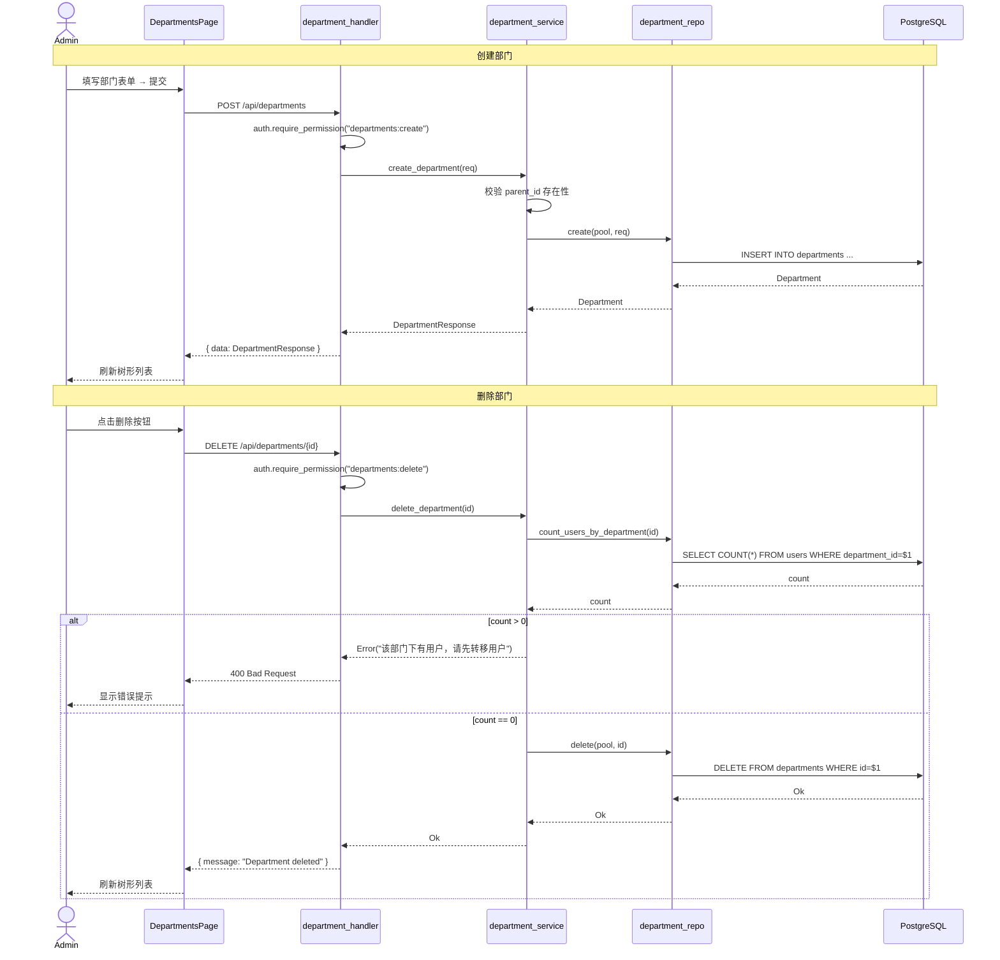
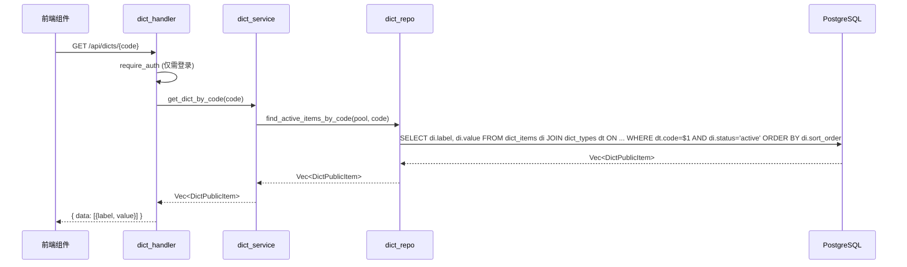
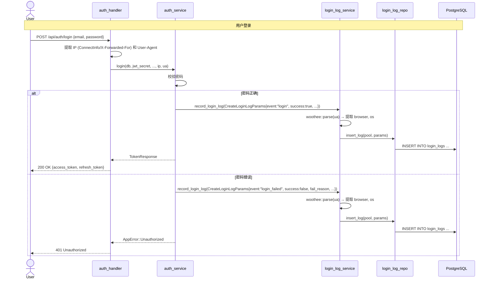
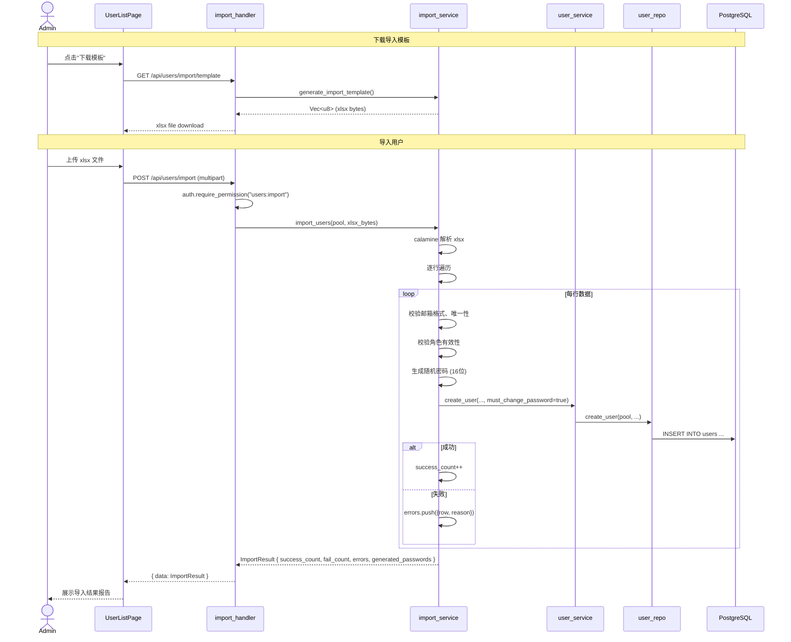
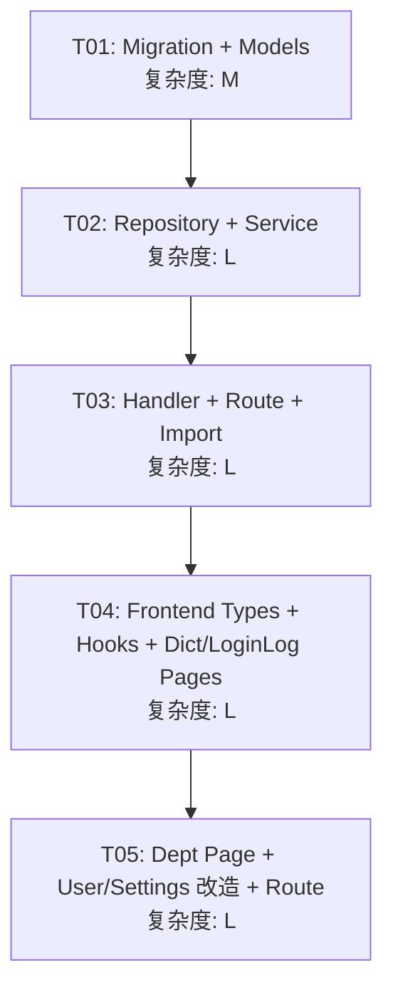

# Phase 6 系统架构设计 — Cradle 功能补齐

## 1. 实现方案

### 1.1 核心技术挑战

| # | 挑战 | 解决方案 |
|---|------|----------|
| C1 | 部门树形结构管理 | 自引用 `parent_id` 模式，复用 MenusPage 的树形展示方案。后端提供扁平列表，前端递归构建树。 |
| C2 | 字典公共查询 API 需要认证但不需权限 | 在 `routes/mod.rs` 中注册为 `authenticated` 路由组（只经过 `require_auth` 中间件，不检查具体权限）。 |
| C3 | 登录日志自动写入 | 在 `auth_service::login` 和 `auth_service::logout` 流程中异步插入 `login_logs` 记录，需要从 HTTP request 提取 IP、UA。 |
| C4 | 用户 Excel 导入（解析 + 校验 + 批量创建） | 使用 `calamine` crate 解析 xlsx，逐行校验邮箱/角色/密码，自动生成随机密码 + `must_change_password=true`，返回导入报告。 |
| C5 | UA 解析（浏览器/OS 提取） | 使用 `woothee` crate 解析 User-Agent 字符串，轻量级。 |
| C6 | SettingsPage Tab 改造 | 在现有只读 SettingsPage 上增加 Tabs（shadcn/ui Tabs），复用已有的 `useConfigGroup` / `useUpdateConfig` hooks。 |

### 1.2 框架和库选型

#### 后端新增 Crate

| Crate | 用途 |
|-------|------|
| `calamine` ^0.26 | 读取 xlsx 文件（用户导入） |
| `woothee` ^0.13 | 解析 User-Agent 字符串（提取浏览器、OS） |

#### 前端新增 npm 包

| Package | 用途 |
|---------|------|
| 无新增 | 全部使用已有的 shadcn/ui 组件（Tabs、Tree 可用自定义实现） |

### 1.3 架构模式

沿用 Phase 1-5 的分层架构，严格遵循已有模式：

```
Request → Handler → Service → Repository → Database
              ↓
           Model (请求/响应类型)
```

- **Handler**：参数提取、权限校验、调用 Service
- **Service**：业务逻辑编排、事务控制
- **Repository**：SQL 查询、数据库操作
- **Model**：数据结构定义（DB model + Request/Response DTO）

---

## 2. 文件列表

### 2.1 数据库 Migration（新增）

| 文件路径 | 说明 |
|----------|------|
| `apps/backend/migrations/20260527000001_phase6.sql` | 新建 departments、dict_types、dict_items、login_logs 表；users 增加 department_id；新增权限种子和配置项种子 |

### 2.2 后端新增文件

| 文件路径 | 说明 |
|----------|------|
| `apps/backend/src/models/department.rs` | 部门模型：Department, DepartmentResponse, DepartmentTreeNode, CreateDepartmentRequest, UpdateDepartmentRequest |
| `apps/backend/src/models/dict.rs` | 字典模型：DictType, DictItem, DictTypeResponse, DictItemResponse, CreateDictTypeRequest, UpdateDictTypeRequest, CreateDictItemRequest, UpdateDictItemRequest, DictPublicResponse |
| `apps/backend/src/models/login_log.rs` | 登录日志模型：LoginLog, LoginLogResponse, LoginLogListParams |
| `apps/backend/src/repository/department_repo.rs` | 部门 CRUD：find_by_id, list_all, create, update, delete, count_users_by_department |
| `apps/backend/src/repository/dict_repo.rs` | 字典类型/字典项 CRUD：list_dict_types_paginated, find_dict_type_by_id, create_dict_type, update_dict_type, delete_dict_type, list_items_by_type, find_item_by_id, create_item, update_item, delete_item, find_active_items_by_code |
| `apps/backend/src/repository/login_log_repo.rs` | 登录日志：insert_log, list_logs_paginated, find_by_id |
| `apps/backend/src/services/department_service.rs` | 部门业务逻辑：list_departments, build_tree, create_department, update_department, delete_department |
| `apps/backend/src/services/dict_service.rs` | 字典业务逻辑：CRUD + 公共查询 get_dict_by_code |
| `apps/backend/src/services/login_log_service.rs` | 登录日志业务逻辑：record_login_log, list_logs, get_log_detail |
| `apps/backend/src/services/import_service.rs` | 用户导入：import_users (解析 xlsx + 校验 + 批量创建), generate_import_template |
| `apps/backend/src/handlers/department_handler.rs` | 部门 API handlers |
| `apps/backend/src/handlers/dict_handler.rs` | 字典 API handlers（类型 CRUD + 字典项 CRUD + 公共查询） |
| `apps/backend/src/handlers/login_log_handler.rs` | 登录日志 API handlers |
| `apps/backend/src/handlers/import_handler.rs` | 用户导入 API handlers（导入 + 模板下载） |

### 2.3 后端修改文件

| 文件路径 | 修改内容 |
|----------|----------|
| `apps/backend/src/models/mod.rs` | 增加 pub mod department, dict, login_log |
| `apps/backend/src/models/user.rs` | User 增加 department_id 字段；UserResponse 增加 department_id、department_name；CreateUserRequest/UpdateUserRequest 增加 department_id |
| `apps/backend/src/repository/mod.rs` | 增加 pub mod department_repo, dict_repo, login_log_repo |
| `apps/backend/src/repository/user_repo.rs` | ListParams 增加 department_id 过滤；create_user/update_user 增加 department_id 参数 |
| `apps/backend/src/services/mod.rs` | 增加 pub mod department_service, dict_service, login_log_service, import_service |
| `apps/backend/src/services/auth_service.rs` | login/logout 函数签名增加 ip_address、user_agent 参数，内部调用 login_log_service::record_login_log |
| `apps/backend/src/handlers/mod.rs` | 增加 pub mod department_handler, dict_handler, login_log_handler, import_handler |
| `apps/backend/src/handlers/auth_handler.rs` | login/logout handler 从 Request 中提取 IP 和 UA，传递给 service |
| `apps/backend/src/handlers/user_handler.rs` | create_user/update_user 处理 department_id |
| `apps/backend/src/routes/mod.rs` | 新增 department_routes, dict_routes, dict_public_routes, login_log_routes, import_routes 函数 |
| `apps/backend/src/lib.rs` | 注册新路由组 |
| `apps/backend/Cargo.toml` | 添加 calamine, woothee 依赖 |

### 2.4 前端新增文件

| 文件路径 | 说明 |
|----------|------|
| `apps/frontend/src/types/department.ts` | 部门类型定义：Department, DepartmentTreeNode, CreateDepartmentRequest, UpdateDepartmentRequest |
| `apps/frontend/src/types/dict.ts` | 字典类型定义：DictType, DictItem, DictPublicResponse |
| `apps/frontend/src/types/loginLog.ts` | 登录日志类型定义：LoginLog, LoginLogListParams |
| `apps/frontend/src/hooks/useDepartments.ts` | 部门 API hooks：useDepartments, useCreateDepartment, useUpdateDepartment, useDeleteDepartment |
| `apps/frontend/src/hooks/useDicts.ts` | 字典 API hooks：useDictTypes, useDictItems, useCreateDictType, useUpdateDictType, useDeleteDictType, useCreateDictItem, useUpdateDictItem, useDeleteDictItem, useDictByCode (公共查询) |
| `apps/frontend/src/hooks/useLoginLogs.ts` | 登录日志 API hooks：useLoginLogs, useLoginLogDetail |
| `apps/frontend/src/hooks/useImport.ts` | 用户导入 hooks：useImportUsers, useDownloadImportTemplate |
| `apps/frontend/src/components/departments/DepartmentsPage.tsx` | 部门管理页面（左右分栏：树形 + 详情/编辑） |
| `apps/frontend/src/components/dicts/DictsPage.tsx` | 字典管理页面（类型列表 + 字典项管理） |
| `apps/frontend/src/components/loginLogs/LoginLogListPage.tsx` | 登录日志列表页 |
| `apps/frontend/src/components/loginLogs/LoginLogFilterBar.tsx` | 登录日志筛选栏 |
| `apps/frontend/src/components/loginLogs/LoginLogDetailDialog.tsx` | 登录日志详情弹窗 |
| `apps/frontend/src/components/loginLogs/index.ts` | barrel export |
| `apps/frontend/src/components/users/ImportUsersDialog.tsx` | 用户导入弹窗组件 |

### 2.5 前端修改文件

| 文件路径 | 修改内容 |
|----------|----------|
| `apps/frontend/src/routes/index.tsx` | 新增 departments, dicts, login-logs 路由；SettingsPage 替换为 Tabs 版本 |
| `apps/frontend/src/components/dashboard/SettingsPage.tsx` | 增加系统配置编辑 Tab（网站配置、安全配置、登录配置） |
| `apps/frontend/src/components/users/UserListPage.tsx` | 增加导入按钮 + 导入弹窗集成；增加 department_id 筛选；创建/编辑弹窗增加部门选择 |
| `apps/frontend/src/types/api.ts` | User 类型增加 department_id, department_name；CreateUserRequest/UpdateUserRequest 增加 department_id；ListUsersParams 增加 department_id |
| `apps/frontend/src/hooks/useUsers.ts` | useUsers params 增加 department_id；useCreateUser/useUpdateUser 传递 department_id |
| `apps/frontend/src/locales/en.ts` | 增加 Phase 6 相关翻译 key |
| `apps/frontend/src/locales/zh.ts` | 增加 Phase 6 相关翻译 key |

---

## 3. 数据结构和接口

### 3.1 数据库表结构（ER 概览）

```mermaid
classDiagram
    class departments {
        +UUID id PK
        +UUID parent_id FK
        +VARCHAR name
        +VARCHAR code UK
        +INT sort_order
        +VARCHAR status
        +VARCHAR leader
        +TIMESTAMPTZ created_at
        +TIMESTAMPTZ updated_at
    }
    departments ||--o| departments : parent

    class dict_types {
        +UUID id PK
        +VARCHAR name
        +VARCHAR code UK
        +VARCHAR status
        +TEXT remark
        +TIMESTAMPTZ created_at
        +TIMESTAMPTZ updated_at
    }

    class dict_items {
        +UUID id PK
        +UUID dict_type_id FK
        +VARCHAR label
        +VARCHAR value
        +INT sort_order
        +VARCHAR status
        +TEXT remark
        +TIMESTAMPTZ created_at
        +TIMESTAMPTZ updated_at
    }
    dict_types ||--o{ dict_items : has

    class login_logs {
        +UUID id PK
        +UUID user_id FK
        +VARCHAR email
        +VARCHAR event
        +VARCHAR ip_address
        +TEXT user_agent
        +VARCHAR os
        +VARCHAR browser
        +BOOLEAN success
        +TEXT fail_reason
        +TIMESTAMPTZ login_at
    }

    class users {
        +UUID id PK
        +UUID department_id FK
        +VARCHAR email
        +TEXT password_hash
        +VARCHAR name
        +VARCHAR role
        +UUID role_id FK
        +VARCHAR status
        +BOOLEAN must_change_password
        +TIMESTAMPTZ created_at
        +TIMESTAMPTZ updated_at
    }
    departments ||--o{ users : contains
    users ||--o{ login_logs : generates
```

### 3.2 后端核心数据结构

#### Department Models (`models/department.rs`)

```rust
// DB Model
pub struct Department {
    pub id: Uuid,
    pub parent_id: Option<Uuid>,
    pub name: String,
    pub code: String,
    pub sort_order: i32,
    pub status: String,         // "active" | "disabled"
    pub leader: Option<String>,
    pub created_at: Option<DateTime<Utc>>,
    pub updated_at: Option<DateTime<Utc>>,
}

// 响应 DTO
pub struct DepartmentResponse {
    pub id: Uuid,
    pub parent_id: Option<Uuid>,
    pub name: String,
    pub code: String,
    pub sort_order: i32,
    pub status: String,
    pub leader: Option<String>,
    pub created_at: Option<DateTime<Utc>>,
    pub updated_at: Option<DateTime<Utc>>,
}

// 树形节点
pub struct DepartmentTreeNode {
    pub id: Uuid,
    pub name: String,
    pub code: String,
    pub sort_order: i32,
    pub status: String,
    pub leader: Option<String>,
    pub children: Vec<DepartmentTreeNode>,
}

// 请求 DTO
pub struct CreateDepartmentRequest {
    pub parent_id: Option<Uuid>,
    pub name: String,          // len 1..100
    pub code: String,          // len 1..100, unique
    pub sort_order: Option<i32>,
    pub status: Option<String>,
    pub leader: Option<String>,
}

pub struct UpdateDepartmentRequest {
    pub name: Option<String>,
    pub sort_order: Option<i32>,
    pub status: Option<String>,
    pub leader: Option<String>,
}
```

#### Dict Models (`models/dict.rs`)

```rust
pub struct DictType {
    pub id: Uuid,
    pub name: String,
    pub code: String,
    pub status: String,
    pub remark: Option<String>,
    pub created_at: Option<DateTime<Utc>>,
    pub updated_at: Option<DateTime<Utc>>,
}

pub struct DictItem {
    pub id: Uuid,
    pub dict_type_id: Uuid,
    pub label: String,
    pub value: String,
    pub sort_order: i32,
    pub status: String,
    pub remark: Option<String>,
    pub created_at: Option<DateTime<Utc>>,
    pub updated_at: Option<DateTime<Utc>>,
}

// 公共查询响应（前端下拉使用）
pub struct DictPublicItem {
    pub label: String,
    pub value: String,
}

// 请求 DTOs
pub struct CreateDictTypeRequest { pub name, pub code, pub status, pub remark }
pub struct UpdateDictTypeRequest { pub name, pub status, pub remark }
pub struct CreateDictItemRequest { pub label, pub value, pub sort_order, pub status, pub remark }
pub struct UpdateDictItemRequest { pub label, pub value, pub sort_order, pub status, pub remark }

// 分页参数
pub struct DictTypeListParams { pub search, pub status, pub page, pub per_page }
```

#### LoginLog Models (`models/login_log.rs`)

```rust
pub struct LoginLog {
    pub id: Uuid,
    pub user_id: Option<Uuid>,
    pub email: Option<String>,
    pub event: String,           // "login" | "logout" | "login_failed"
    pub ip_address: Option<String>,
    pub user_agent: Option<String>,
    pub os: Option<String>,
    pub browser: Option<String>,
    pub success: bool,
    pub fail_reason: Option<String>,
    pub login_at: Option<DateTime<Utc>>,
}

// 用于插入的参数
pub struct CreateLoginLogParams {
    pub user_id: Option<Uuid>,
    pub email: String,
    pub event: String,
    pub ip_address: Option<String>,
    pub user_agent: Option<String>,
    pub os: Option<String>,
    pub browser: Option<String>,
    pub success: bool,
    pub fail_reason: Option<String>,
}

// 列表查询参数
pub struct LoginLogListParams {
    pub email: Option<String>,
    pub event: Option<String>,
    pub ip_address: Option<String>,
    pub from: Option<DateTime<Utc>>,
    pub to: Option<DateTime<Utc>>,
    pub page: i64,
    pub per_page: i64,
}
```

### 3.3 后端 API 接口

#### Department API

| Method | Path | Handler | 权限 | 说明 |
|--------|------|---------|------|------|
| GET | `/api/departments` | `list_departments` | `departments:read` | 获取全部部门（扁平列表），支持 `?format=tree` |
| POST | `/api/departments` | `create_department` | `departments:create` | 创建部门 |
| PUT | `/api/departments/{id}` | `update_department` | `departments:update` | 更新部门 |
| DELETE | `/api/departments/{id}` | `delete_department` | `departments:delete` | 删除部门（有用户时拒绝） |

#### Dict API

| Method | Path | Handler | 权限 | 说明 |
|--------|------|---------|------|------|
| GET | `/api/dict-types` | `list_dict_types` | `dicts:read` | 字典类型分页列表 |
| POST | `/api/dict-types` | `create_dict_type` | `dicts:create` | 创建字典类型 |
| PUT | `/api/dict-types/{id}` | `update_dict_type` | `dicts:update` | 更新字典类型 |
| DELETE | `/api/dict-types/{id}` | `delete_dict_type` | `dicts:delete` | 删除字典类型 |
| GET | `/api/dict-types/{id}/items` | `list_dict_items` | `dicts:read` | 获取字典项列表 |
| POST | `/api/dict-types/{id}/items` | `create_dict_item` | `dicts:create` | 创建字典项 |
| PUT | `/api/dict-items/{id}` | `update_dict_item` | `dicts:update` | 更新字典项 |
| DELETE | `/api/dict-items/{id}` | `delete_dict_item` | `dicts:delete` | 删除字典项 |
| GET | `/api/dicts/{code}` | `get_dict_by_code` | 🔒 需认证，无权限检查 | 公共字典查询 |

#### Login Log API

| Method | Path | Handler | 权限 | 说明 |
|--------|------|---------|------|------|
| GET | `/api/login-logs` | `list_login_logs` | `login-logs:read` | 分页列表 + 筛选 |
| GET | `/api/login-logs/{id}` | `get_login_log` | `login-logs:read` | 详情 |

#### Import/Export API

| Method | Path | Handler | 权限 | 说明 |
|--------|------|---------|------|------|
| POST | `/api/users/import` | `import_users` | `users:import` | multipart xlsx 导入 |
| GET | `/api/users/import/template` | `download_import_template` | `users:import` | 下载空白导入模板 |

### 3.4 前端类型定义

#### `types/department.ts`

```typescript
export interface Department {
  id: string
  parent_id: string | null
  name: string
  code: string
  sort_order: number
  status: "active" | "disabled"
  leader: string | null
  created_at: string | null
  updated_at: string | null
}

export interface DepartmentTreeNode {
  id: string
  name: string
  code: string
  sort_order: number
  status: string
  leader: string | null
  children: DepartmentTreeNode[]
}

export interface CreateDepartmentRequest {
  parent_id?: string
  name: string
  code: string
  sort_order?: number
  status?: string
  leader?: string
}

export interface UpdateDepartmentRequest {
  name?: string
  sort_order?: number
  status?: string
  leader?: string
}
```

#### `types/dict.ts`

```typescript
export interface DictType {
  id: string
  name: string
  code: string
  status: string
  remark: string | null
  created_at: string | null
  updated_at: string | null
}

export interface DictItem {
  id: string
  dict_type_id: string
  label: string
  value: string
  sort_order: number
  status: string
  remark: string | null
  created_at: string | null
  updated_at: string | null
}

export interface DictPublicItem {
  label: string
  value: string
}
```

#### `types/loginLog.ts`

```typescript
export interface LoginLog {
  id: string
  user_id: string | null
  email: string | null
  event: "login" | "logout" | "login_failed"
  ip_address: string | null
  user_agent: string | null
  os: string | null
  browser: string | null
  success: boolean
  fail_reason: string | null
  login_at: string | null
}

export interface LoginLogListParams {
  page?: number
  per_page?: number
  email?: string
  event?: string
  ip_address?: string
  from?: string
  to?: string
}
```

---

## 4. 程序调用流程

### 4.1 部门管理流程



### 4.2 字典公共查询流程



### 4.3 登录日志记录流程



### 4.4 用户导入流程



---

## 5. 任务列表

### 5.1 任务依赖与排序

| Task ID | 任务名 | 涉及文件 | 依赖 | 复杂度 | 说明 |
|---------|--------|----------|------|--------|------|
| **T01** | **数据库 Migration + 后端模型层** | `migrations/20260527000001_phase6.sql`, `models/department.rs`, `models/dict.rs`, `models/login_log.rs`, `models/mod.rs`, `models/user.rs` (修改) | 无 | M | 新建4张表 + users增加字段 + 权限种子 + 配置项种子 + 所有新增 Rust model 文件 |
| **T02** | **后端 Repository + Service 层（部门+字典+登录日志）** | `repository/department_repo.rs`, `repository/dict_repo.rs`, `repository/login_log_repo.rs`, `repository/mod.rs`, `repository/user_repo.rs`(修改), `services/department_service.rs`, `services/dict_service.rs`, `services/login_log_service.rs`, `services/mod.rs`, `services/auth_service.rs`(修改) | T01 | L | 部门/字典/登录日志的全部 CRUD + 用户 repo 增加 department_id 过滤 + auth_service 增加日志写入 |
| **T03** | **后端 Handler + 路由 + 用户导入导出** | `handlers/department_handler.rs`, `handlers/dict_handler.rs`, `handlers/login_log_handler.rs`, `handlers/import_handler.rs`, `handlers/auth_handler.rs`(修改), `handlers/user_handler.rs`(修改), `handlers/mod.rs`, `services/import_service.rs`, `routes/mod.rs`, `lib.rs`, `Cargo.toml` | T02 | L | 全部 API handler + 导入逻辑(calamine) + UA 解析(woothee) + 路由注册 |
| **T04** | **前端类型定义 + Hooks + 字典/登录日志页面** | `types/department.ts`, `types/dict.ts`, `types/loginLog.ts`, `types/api.ts`(修改), `hooks/useDepartments.ts`, `hooks/useDicts.ts`, `hooks/useLoginLogs.ts`, `hooks/useImport.ts`, `components/dicts/DictsPage.tsx`, `components/loginLogs/LoginLogListPage.tsx`, `components/loginLogs/LoginLogFilterBar.tsx`, `components/loginLogs/LoginLogDetailDialog.tsx`, `components/loginLogs/index.ts` | T03 | L | 全部新增前端类型、hooks、字典管理页、登录日志页 |
| **T05** | **前端部门页面 + 用户页面改造 + 设置页改造 + 路由集成** | `components/departments/DepartmentsPage.tsx`, `components/users/UserListPage.tsx`(修改), `components/users/ImportUsersDialog.tsx`, `components/dashboard/SettingsPage.tsx`(修改), `hooks/useUsers.ts`(修改), `routes/index.tsx`(修改), `locales/en.ts`(修改), `locales/zh.ts`(修改) | T04 | L | 部门树形管理页 + UserListPage 增加导入/部门筛选 + SettingsPage Tabs 改造 + 路由注册 + i18n |

### 5.2 任务依赖图



---

## 6. 依赖包列表

### 6.1 后端新增 Crate

```
# apps/backend/Cargo.toml 新增
calamine = "0.26"     # 读取 xlsx 文件（用户导入）
woothee = "0.13"      # 解析 User-Agent（提取浏览器、OS 信息）
```

已有的相关 Crate（无需新增）：
- `rust_xlsxwriter` — 用于生成 xlsx（导出模板）
- `csv` — CSV 处理
- `rand` — 生成随机密码
- `argon2` — 密码哈希

### 6.2 前端（无新增依赖）

全部使用已有的：
- `@tanstack/react-query` — 数据请求
- `axios` — HTTP 客户端
- `@radix-ui/react-tabs` — shadcn/ui Tabs（已在 ui 组件库中）
- `react-router-dom` — 路由
- `react-hook-form` + `zod` — 表单校验
- `lucide-react` — 图标

---

## 7. 共享知识（跨文件约定）

### 7.1 后端约定

| 约定 | 说明 |
|------|------|
| **API 响应格式** | 成功：`{ "data": T }`；失败：`{ "error": "message", "status": 4xx }` |
| **权限校验** | Handler 层使用 `auth.require_permission(&state.db, "xxx:yyy")` |
| **Superadmin 快速路径** | `is_superadmin()` 自动跳过权限查询 |
| **错误处理** | 所有错误通过 `AppError` 枚举返回，统一 `IntoResponse` |
| **Repository 层** | 纯 SQL 操作，返回 `Result<T, AppError>`，不做业务逻辑 |
| **Service 层** | 业务编排，调用多个 repo 函数，控制事务边界 |
| **分页查询** | 返回 `(Vec<T>, i64)` 即 (数据列表, 总数)，Handler 层组装 `{ data, pagination }` |
| **UUID 主键** | 所有表使用 `gen_random_uuid()` 自动生成 |
| **时间戳** | `TIMESTAMPTZ`，Rust 侧用 `chrono::DateTime<Utc>` |
| **权限命名** | `<模块>:<动作>` 格式，如 `departments:read` |
| **导入密码** | 自动生成 16 位随机密码，`must_change_password = true` |
| **部门删除** | 有用户时禁止删除（返回 400），必须先转移用户 |
| **字典公共接口** | `/api/dicts/{code}` 需要登录认证但不检查权限 |
| **登录日志** | 在 `auth_service::login` 和 `auth_service::logout` 中记录，UA 使用 `woothee` 解析 |

### 7.2 前端约定

| 约定 | 说明 |
|------|------|
| **API 基础路径** | 通过 `@/lib/api.ts` 的 axios 实例，baseURL 为 `/api` |
| **Token 刷新** | 拦截器自动处理 401 → 刷新 token → 重试 |
| **Query Keys** | 每个 hook 文件定义 `xxxKeys` 对象，如 `deptKeys`, `dictKeys` |
| **i18n** | 所有 UI 文本通过 `useTranslation()` 的 `t()` 函数 |
| **路由守卫** | `PermissionRouteGuard` 包裹需要权限的页面 |
| **组件目录结构** | `components/<module>/<Page>.tsx`，复杂页面拆分为子组件 |
| **类型定义** | 集中在 `types/` 目录，按功能模块拆分文件 |
| **shadcn/ui** | 使用 `@/components/ui/` 下的基础组件 |

### 7.3 登录日志字段映射

| 登录事件 | event 值 | success | fail_reason |
|----------|----------|---------|-------------|
| 登录成功 | `login` | `true` | null |
| 登录失败（密码错误） | `login_failed` | `false` | "Invalid credentials" |
| 登录失败（账户锁定） | `login_failed` | `false` | "Account locked" |
| 登录失败（账户禁用） | `login_failed` | `false` | "Account disabled" |
| 用户登出 | `logout` | `true` | null |

---

## 8. 待明确事项

| # | 事项 | 当前假设 | 备注 |
|---|------|----------|------|
| 1 | 导入模板的列定义 | 模板列：Email, Name, Role（admin/user）, Department Code | 可后续扩展 |
| 2 | 登录日志 location（IP 归属地） | P1 需求，Phase 6 暂不实现，字段留空 | PRD P1-02 |
| 3 | 导入文件大小限制 | 使用已有的 multipart 限制（默认 10MB） | 足以覆盖 <1000 行的 xlsx |
| 4 | 字典公共接口缓存策略 | 前端 TanStack Query 默认缓存，后端不做 Redis 缓存 | 后续可加 P2-03 字典缓存刷新 |
| 5 | 部门树形组件实现 | 使用自定义递归组件（参考 MenusPage 的树形实现） | 不引入第三方树组件 |
| 6 | 登录日志记录的异步性 | 同步写入（阻塞当前请求），确保日志不丢失 | 后续可优化为异步 channel |
| 7 | 批量导入事务策略 | 逐行独立事务：某行失败不影响其他行成功 | 适合 "尽可能导入" 策略 |
| 8 | 前端 Tabs 组件 | shadcn/ui 的 Tabs 组件需确认是否已安装 | 若未安装则 `npx shadcn@latest add tabs` |
