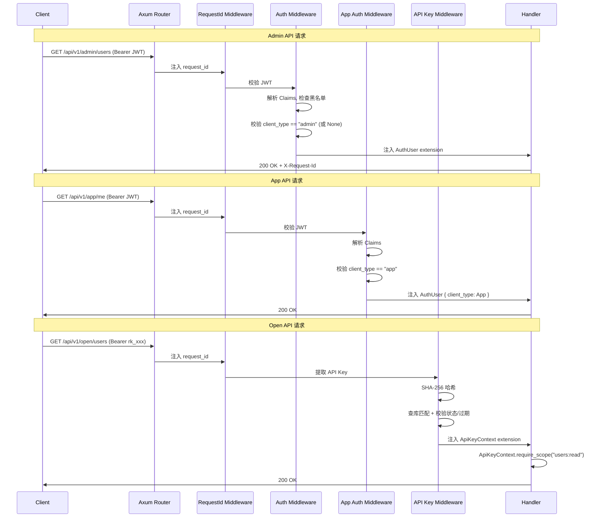
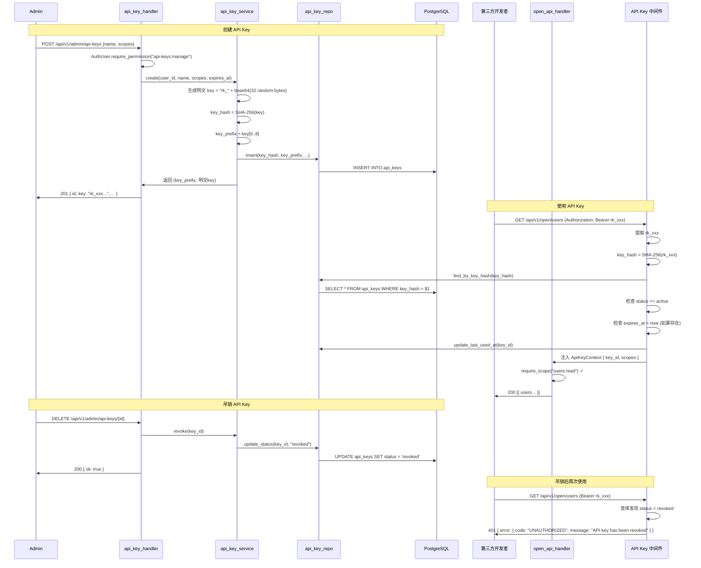
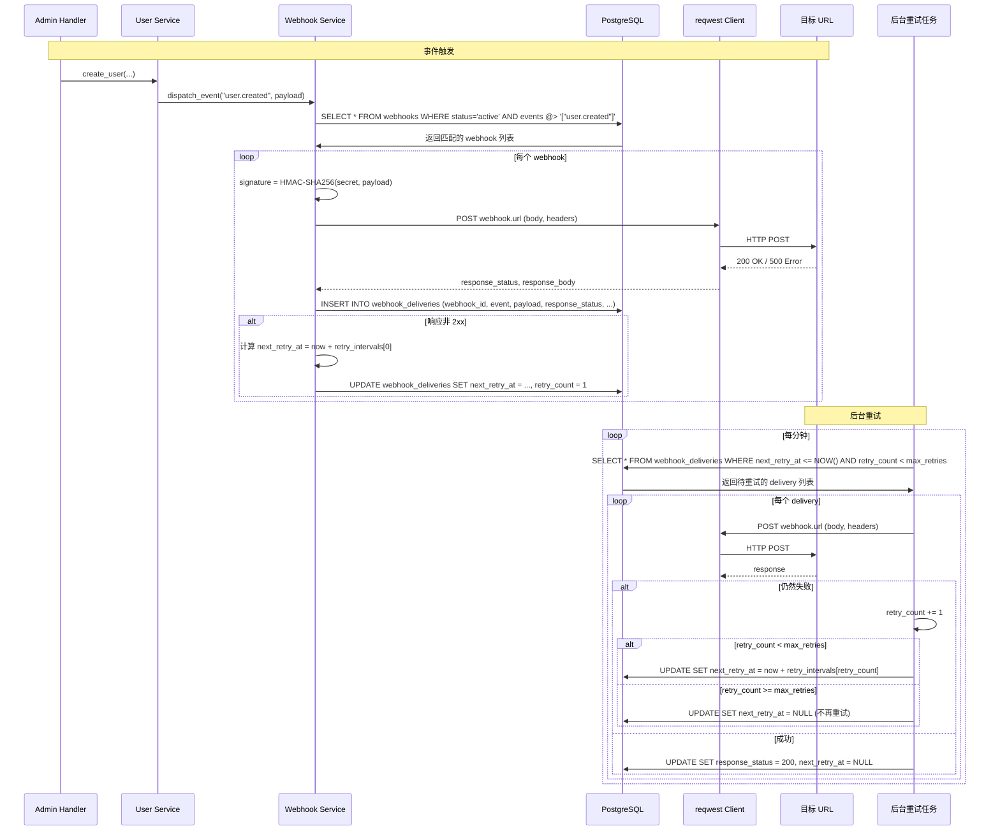
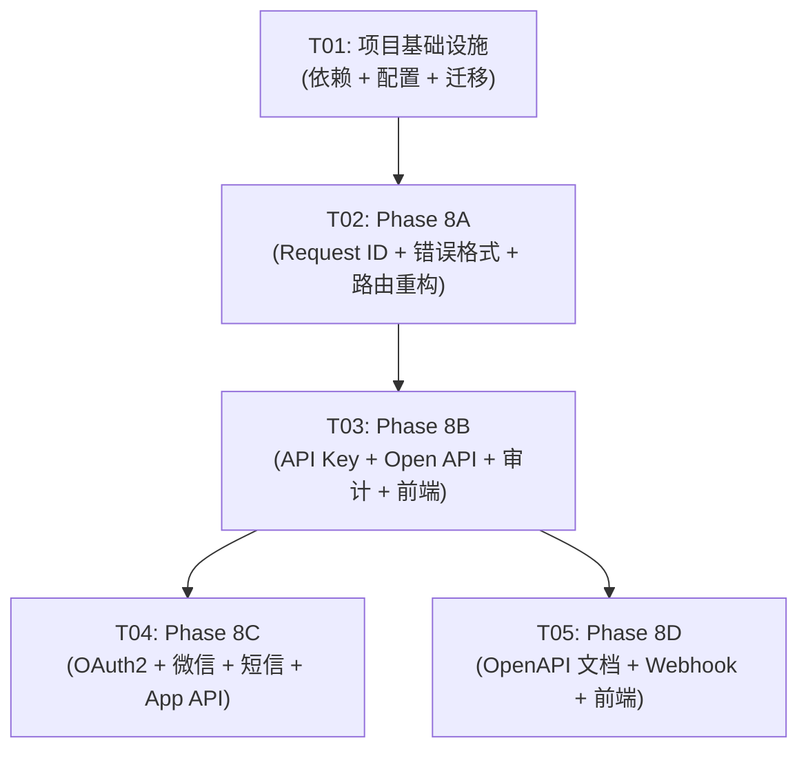

# Phase 8 系统架构设计 — 多端 API 基础设施

## 1. 实现方案 + 框架选型

### 1.1 路由重构策略（三端分层）

**现状**：所有路由在 `lib.rs` 的 `app()` 函数中通过 `Router::merge()` 挂载在 `/api/*` 下。

**方案**：在 `routes/mod.rs` 中引入三层嵌套路由结构：

```
/api/v1/admin/*  →  admin_routes()    — JWT 认证 + RBAC
/api/v1/app/*    →  app_routes()      — JWT 认证（client_type=app）
/api/v1/open/*   →  open_routes()     — API Key 认证
/api/*           →  legacy_routes()   — 旧路由兼容层（内部 fallback 代理）
```

在 `lib.rs` 的 `app()` 中：
1. 将现有所有 `routes::xxx_routes()` 的路径前缀从 `/api/xxx` 改为 `/api/v1/admin/xxx`
2. 新增 `routes::admin_api_routes()` 注册 API Key / Webhook 管理路由
3. 新增 `routes::app_api_routes()` 注册 App API 路由
4. 新增 `routes::open_api_routes()` 注册 Open API 路由
5. 新增 `routes::legacy_routes()` 作为旧路由兼容层

### 1.2 旧路由兼容方案（内部 Fallback 代理）

**不使用 301 重定向**，而是通过 Axum 的 `fallback` 机制实现内部代理：

1. 先尝试匹配新路由 `/api/v1/admin/*`
2. 未匹配的 `/api/*` 请求进入 `legacy_fallback` handler
3. `legacy_fallback` 解析请求路径，将 `/api/users` 映射为 `/api/v1/admin/users`，然后通过 `axum::body::Body` 重新构造请求并内部 dispatch 到对应 handler
4. 配置项 `api.legacy_routes_enabled` 控制是否启用（默认 true）
5. 响应头添加 `Deprecation: true` + `X-Legacy-Route: true`

**实现方式**：由于 Axum 不支持运行时内部 dispatch，采用**路由镜像注册**方案更可靠：
- 旧路由函数保留原有路径，同时注册新路径
- 在 `app()` 中同时 merge 旧路由和新路由
- 旧路由上添加 `deprecation` 响应头中间件
- 2 个 minor 版本后移除旧路由注册

这样无需修改 handler 代码，完全向后兼容。

### 1.3 认证中间件链设计

```
三端认证策略：

/api/v1/admin/*  →  require_auth (JWT)
                     ↓
                     AuthUser { ..., client_type: "admin" }

/api/v1/app/*    →  require_app_auth (JWT + 校验 client_type)
                     ↓
                     AuthUser { ..., client_type: "app" }

/api/v1/open/*   →  require_api_key (API Key)
                     ↓
                     ApiKeyContext { key_id, scopes, name }

/api/* (legacy)  →  require_auth (JWT，兼容旧路由)
```

**关键设计**：
- JWT Claims 新增 `client_type` 字段（`"admin"` | `"app"`）
- `require_app_auth` 在 `require_auth` 基础上增加 `client_type == "app"` 校验
- `require_api_key` 是独立中间件，从 `Authorization: Bearer rk_xxx` 或 `X-API-Key: rk_xxx` 提取
- 三种中间件互不干扰，各自注入不同的 extension 类型

### 1.4 错误响应统一方案

扩展现有 `AppError`：

```rust
// 新的错误响应格式
{
    "error": {
        "code": "UNAUTHORIZED",       // 新增：大写枚举错误码
        "message": "Invalid token",   // 原有的 message
        "request_id": "uuid-v4",      // 新增：请求 ID
        "details": null               // 新增：可选的详细信息
    },
    "status": 401                     // 保留原有字段
}
```

**实现**：修改 `AppError::into_response()` 方法，从请求扩展中获取 `RequestId`，组装新的响应格式。使用 `std::any::Any` downcast 从 `Response` extensions 获取 request_id。

### 1.5 Request ID 实现方案

使用 `tower` 中间件层：

```rust
// middleware/request_id.rs
pub async fn request_id_layer(
    mut request: axum::extract::Request,
    next: Next,
) -> Response {
    let request_id = request
        .headers()
        .get("X-Request-Id")
        .and_then(|v| v.to_str().ok())
        .map(|s| s.to_string())
        .unwrap_or_else(|| uuid::Uuid::new_v4().to_string());

    request.extensions_mut().insert(RequestId(request_id.clone()));

    let mut response = next.run(request).await;
    response.headers_mut().insert(
        "X-Request-Id",
        HeaderValue::from_str(&request_id).unwrap(),
    );
    response
}
```

### 1.6 API Key 认证完整流程

1. **创建**：Admin 调用 `POST /api/v1/admin/api-keys`，生成 `rk_` + 32 字节 base64 的明文 Key
2. **存储**：SHA-256 哈希后存入 `api_keys.key_hash`，明文仅返回一次
3. **使用**：请求携带 `Authorization: Bearer rk_xxx` 或 `X-API-Key: rk_xxx`
4. **验证**：中间件提取 Key → SHA-256 哈希 → 查库匹配 → 校验 status + expires_at → 更新 last_used_at
5. **Scope 检查**：`ApiKeyContext::require_scope("users:read")` 校验 scopes 数组
6. **吊销**：`DELETE /api/v1/admin/api-keys/{id}` 将 status 设为 `revoked`

### 1.7 Webhook 出站架构

```
事件发生（如 user.created）
    ↓
WebhookService::dispatch_event(event, payload)
    ↓
查询 webhooks 表中 status=active 且 events 包含该事件的记录
    ↓
对每个 webhook：
  ├── 生成 HMAC-SHA256 签名（用 secret + payload）
  ├── 异步 HTTP POST 到 webhook.url
  ├── 记录 webhook_deliveries
  └── 失败时设置 next_retry_at（指数退避：1min → 5min → 30min）

后台定时任务（tokio interval）：
  └── 每分钟扫描 next_retry_at <= NOW() 的 delivery 记录并重试
```

使用 `reqwest` 作为 HTTP Client，`tokio::spawn` 异步投递。

### 1.8 OpenAPI 文档集成方案

使用 `utoipa` + `utoipa-swagger-ui`：

1. 在 `OpenApi` 结构体中通过 `#[derive(OpenApi)]` + `#[openapi(paths(...), components(...))]` 注解生成 spec
2. Admin/App/Open 三端路由分别用 tags 分组
3. `SwaggerUi` 作为路由挂载在 `/docs` 路径
4. 通过 `api.docs_enabled` 配置控制是否启用

---

## 2. 文件列表及相对路径

### 后端（apps/backend/）

#### 新增文件

| 文件路径 | 说明 |
|---------|------|
| `src/middleware/request_id.rs` | Request ID 中间件 |
| `src/middleware/api_key_auth.rs` | API Key 认证中间件 |
| `src/middleware/app_auth.rs` | App JWT 认证中间件（client_type 校验） |
| `src/extractors/api_key.rs` | ApiKeyContext extractor |
| `src/extractors/request_id.rs` | RequestId extractor |
| `src/models/api_key.rs` | API Key 数据模型 |
| `src/models/webhook.rs` | Webhook + WebhookDelivery 数据模型 |
| `src/models/oauth_account.rs` | OAuth 账号数据模型 |
| `src/handlers/api_key_handler.rs` | API Key CRUD handler |
| `src/handlers/open_api_handler.rs` | Open API 健康检查 + 只读端点 handler |
| `src/handlers/webhook_handler.rs` | Webhook 管理 handler |
| `src/handlers/app_auth_handler.rs` | App OAuth2 + 短信登录 handler |
| `src/handlers/app_user_handler.rs` | App 用户相关 handler（me/password/avatar） |
| `src/handlers/docs_handler.rs` | OpenAPI 文档 handler |
| `src/repository/api_key_repo.rs` | API Key 数据访问 |
| `src/repository/webhook_repo.rs` | Webhook 数据访问 |
| `src/repository/oauth_account_repo.rs` | OAuth 账号数据访问 |
| `src/services/api_key_service.rs` | API Key 业务逻辑（创建/哈希/验证） |
| `src/services/webhook_service.rs` | Webhook 投递 + 重试业务逻辑 |
| `src/services/oauth_service.rs` | OAuth2 授权码流程 |
| `src/services/sms_service.rs` | 短信验证码服务 |
| `src/services/wechat_service.rs` | 微信登录服务 |
| `src/services/open_api_service.rs` | Open API 业务逻辑（过滤敏感字段） |
| `migrations/20260529000001_phase8_api_keys.sql` | api_keys 表迁移 |
| `migrations/20260529000002_phase8_oauth_accounts.sql` | oauth_accounts 表迁移 |
| `migrations/20260529000003_phase8_webhooks.sql` | webhooks + webhook_deliveries 表迁移 |
| `migrations/20260529000004_phase8_seed_permissions.sql` | 新权限种子数据 |

#### 修改文件

| 文件路径 | 变更说明 |
|---------|---------|
| `src/lib.rs` | 路由注册重构为三端分层 + Request ID 中间件层 + SwaggerUi |
| `src/routes/mod.rs` | 路由函数改为 `/api/v1/admin/*` 前缀 + 新增 app/open/admin 子模块路由 |
| `src/middleware/mod.rs` | 新增 mod 声明 |
| `src/middleware/auth.rs` | Claims 新增 client_type 字段，AuthUser 新增 client_type |
| `src/extractors/auth.rs` | AuthUser 新增 client_type 字段 |
| `src/extractors/mod.rs` | 新增 mod 声明 |
| `src/error.rs` | 扩展错误响应格式（code + request_id） |
| `src/models/mod.rs` | 新增 mod 声明 |
| `src/handlers/mod.rs` | 新增 mod 声明 |
| `src/repository/mod.rs` | 新增 mod 声明 |
| `src/services/mod.rs` | 新增 mod 声明 |
| `src/services/auth_service.rs` | JWT Claims 新增 client_type 字段 |
| `src/config.rs` | Settings 新增 api/webhook 配置组 |
| `config/default.toml` | 新增 [api]、[webhook] 配置段 |
| `Cargo.toml` | 新增 utoipa/utoipa-swagger-ui/reqwest/hmac-sha256 依赖 |

### 前端（apps/frontend/）

#### 新增文件

| 文件路径 | 说明 |
|---------|------|
| `src/routes/api-keys.tsx` | API Key 管理页 |
| `src/routes/webhooks.tsx` | Webhook 管理页 |
| `src/types/apiKey.ts` | API Key 类型定义 |
| `src/types/webhook.ts` | Webhook 类型定义 |

#### 修改文件

| 文件路径 | 变更说明 |
|---------|---------|
| `src/routes/index.tsx` | 新增 /dashboard/api-keys、/dashboard/webhooks 路由 |
| `src/types/api.ts` | 错误响应类型更新（新增 code/request_id） |

---

## 3. 数据结构和接口

### 3.1 核心结构体关系

```mermaid
classDiagram
    class AppState {
        +db: PgPool
        +jwt_secret: String
        +access_exp_secs: i64
        +refresh_exp_secs: i64
        +started_at: Instant
        +max_connections: u32
        +settings: Settings
        +totp_encryption_key: String
        +config_cache: Arc~RwLock~HashMap~~
        +notification_tx: broadcast::Sender
        +http_client: reqwest::Client
    }

    class Settings {
        +server: ServerSettings
        +database: DatabaseSettings
        +jwt: JwtSettings
        +rate_limit: RateLimitSettings
        +storage: StorageSettings
        +totp: TotpSettings
        +api: ApiSettings
        +webhook: WebhookSettings
    }

    class ApiSettings {
        +version: String
        +legacy_routes_enabled: bool
        +docs_enabled: bool
        +wechat: WechatSettings
        +sms: SmsSettings
    }

    class WechatSettings {
        +enabled: bool
        +app_id: String
        +app_secret: String
    }

    class SmsSettings {
        +enabled: bool
        +provider: String
        +template_id: String
    }

    class WebhookSettings {
        +max_retries: u32
        +retry_intervals_secs: Vec~u64~
        +timeout_secs: u64
    }

    class AuthUser {
        +user_id: Uuid
        +email: String
        +role: String
        +role_id: Option~Uuid~
        +department_id: Option~Uuid~
        +jti: Uuid
        +client_type: ClientType
        +is_admin() bool
        +is_superadmin() bool
        +require_admin() Result
        +require_superadmin() Result
        +require_permission(pool, perm) Result
        +require_permissions(pool, perms) Result
        +get_visible_department_ids(pool) Option~Vec~
    }

    class ClientType {
        <<enumeration>>
        Admin
        App
    }

    class RequestId {
        +value: String
    }

    class ApiKey {
        +id: Uuid
        +name: String
        +key_hash: String
        +key_prefix: String
        +user_id: Uuid
        +scopes: Vec~String~
        +rate_limit: Option~i32~
        +expires_at: Option~DateTime~
        +last_used_at: Option~DateTime~
        +status: ApiKeyStatus
        +created_at: DateTime
        +updated_at: DateTime
    }

    class ApiKeyStatus {
        <<enumeration>>
        Active
        Revoked
    }

    class ApiKeyContext {
        +key_id: Uuid
        +name: String
        +scopes: Vec~String~
        +require_scope(scope) Result
        +require_scopes(scopes) Result
    }

    class CreateApiKeyRequest {
        +name: String
        +scopes: Vec~String~
        +expires_at: Option~DateTime~
    }

    class ApiKeyResponse {
        +id: Uuid
        +name: String
        +key_prefix: String
        +scopes: Vec~String~
        +status: String
        +expires_at: Option~DateTime~
        +last_used_at: Option~DateTime~
        +created_at: DateTime
    }

    class CreateApiKeyResponse {
        +id: Uuid
        +name: String
        +key: String
        +key_prefix: String
        +scopes: Vec~String~
        +expires_at: Option~DateTime~
    }

    class Webhook {
        +id: Uuid
        +name: String
        +url: String
        +secret: String
        +events: Vec~String~
        +api_key_id: Option~Uuid~
        +status: WebhookStatus
        +created_at: DateTime
        +updated_at: DateTime
    }

    class WebhookStatus {
        <<enumeration>>
        Active
        Disabled
    }

    class WebhookDelivery {
        +id: Uuid
        +webhook_id: Uuid
        +event: String
        +payload: Value
        +response_status: Option~i32~
        +response_body: Option~String~
        +delivered_at: DateTime
        +next_retry_at: Option~DateTime~
        +retry_count: i32
    }

    class CreateWebhookRequest {
        +name: String
        +url: String
        +events: Vec~String~
    }

    class UpdateWebhookRequest {
        +name: Option~String~
        +url: Option~String~
        +events: Option~Vec~String~~
        +status: Option~String~
    }

    class OAuthAccount {
        +id: Uuid
        +user_id: Uuid
        +provider: String
        +provider_user_id: String
        +union_id: Option~String~
        +created_at: DateTime
    }

    class ErrorResponse {
        +error: ErrorDetail
        +status: u16
    }

    class ErrorDetail {
        +code: String
        +message: String
        +request_id: String
        +details: Option~Value~
    }

    Settings --> ApiSettings
    Settings --> WebhookSettings
    ApiSettings --> WechatSettings
    ApiSettings --> SmsSettings
    AppState --> Settings
    AuthUser --> ClientType
    ApiKey --> ApiKeyStatus
    Webhook --> WebhookStatus
```



### 3.2 JWT Claims 扩展

```rust
// services/auth_service.rs 中的 Claims 扩展
#[derive(Debug, Serialize)]
struct Claims {
    sub: String,
    email: String,
    role: String,
    role_id: Option<String>,
    department_id: Option<String>,
    jti: String,
    exp: i64,
    two_factor_pending: Option<bool>,
    client_type: Option<String>,  // 新增: "admin" | "app"，默认 "admin"
}

// middleware/auth.rs 中的 Claims 解析扩展
#[derive(Debug, Deserialize)]
struct Claims {
    sub: String,
    email: String,
    role: String,
    role_id: Option<String>,
    department_id: Option<String>,
    jti: Option<String>,
    exp: i64,
    client_type: Option<String>,  // 新增
}
```

### 3.3 错误码映射表

| AppError 变体 | HTTP Status | code 字段 |
|--------------|-------------|-----------|
| `NotFound` | 404 | `NOT_FOUND` |
| `Unauthorized` | 401 | `UNAUTHORIZED` |
| `Forbidden` | 403 | `FORBIDDEN` |
| `BadRequest` | 400 | `BAD_REQUEST` |
| `Conflict` | 409 | `CONFLICT` |
| `AccountDisabled` | 403 | `ACCOUNT_DISABLED` |
| `AccountLocked` | 423 | `ACCOUNT_LOCKED` |
| `TooManyRequests` | 429 | `TOO_MANY_REQUESTS` |
| `TwoFactorRequired` | 401 | `TWO_FACTOR_REQUIRED` |
| `PayloadTooLarge` | 413 | `PAYLOAD_TOO_LARGE` |
| `Database` | 500 | `INTERNAL_ERROR` |
| `Internal` | 500 | `INTERNAL_ERROR` |

---

## 4. 程序调用流程

### 4.1 三端请求认证流程



### 4.2 API Key 创建 → 使用 → 吊销流程



### 4.3 Webhook 投递 + 重试流程



---

## 5. 任务列表（按实现顺序排列）

### T01: 项目基础设施 — 依赖声明 + 配置扩展 + 数据库迁移

**涉及文件**：
- `apps/backend/Cargo.toml`
- `apps/backend/config/default.toml`
- `apps/backend/src/config.rs`
- `apps/backend/migrations/20260529000001_phase8_api_keys.sql`
- `apps/backend/migrations/20260529000002_phase8_oauth_accounts.sql`
- `apps/backend/migrations/20260529000003_phase8_webhooks.sql`
- `apps/backend/migrations/20260529000004_phase8_seed_permissions.sql`

**具体工作**：
1. 在 `Cargo.toml` 新增依赖：
   - `utoipa = "5"` + `utoipa-swagger-ui = "8"`
   - `reqwest = { version = "0.12", features = ["json"] }`
   - `hmac = "0.12"` + `sha2 = "0.10"`（sha2 已有）
   - `tokio-cron-scheduler = "0.13"`（或用简单的 tokio interval）
2. 在 `config.rs` 新增 `ApiSettings`、`WechatSettings`、`SmsSettings`、`WebhookSettings` 结构体，并在 `Settings` 中添加 `api` 和 `webhook` 字段（均使用 `#[serde(default)]`）
3. 在 `default.toml` 添加 `[api]`、`[api.wechat]`、`[api.sms]`、`[webhook]` 配置段
4. 创建数据库迁移文件，包含 `api_keys`、`oauth_accounts`、`webhooks`、`webhook_deliveries` 四张表及索引
5. 创建权限种子迁移，插入 `api-keys:manage` 和 `webhooks:manage` 权限

**依赖**：无
**预估工作量**：M

---

### T02: Phase 8A — Request ID + 统一错误格式 + 路由版本化重构 + App/Open 路由骨架

**涉及文件**：
- `apps/backend/src/middleware/mod.rs`
- `apps/backend/src/middleware/request_id.rs`（新建）
- `apps/backend/src/middleware/auth.rs`（修改）
- `apps/backend/src/extractors/auth.rs`（修改）
- `apps/backend/src/extractors/request_id.rs`（新建）
- `apps/backend/src/extractors/mod.rs`（修改，添加 mod 声明）
- `apps/backend/src/error.rs`（修改）
- `apps/backend/src/routes/mod.rs`（重构）
- `apps/backend/src/lib.rs`（重构 app() 函数）

**具体工作**：

**8A-1: Request ID 中间件**
1. 新建 `middleware/request_id.rs`：
   - 定义 `RequestId` newtype wrapper（`pub struct RequestId(pub String)`）
   - 实现 `request_id_layer` 中间件函数：从 `X-Request-Id` header 读取或生成 UUID v4，注入 extension，写入响应头
2. 新建 `extractors/request_id.rs`：实现 `FromRequestParts` 从 extensions 获取 `RequestId`
3. 修改 `middleware/mod.rs`：添加 `pub mod request_id;`

**8A-2: 统一错误格式**
1. 修改 `error.rs`：
   - 新增 `ErrorDetail` 结构体：`{ code: String, message: String, request_id: String, details: Option<serde_json::Value> }`
   - 新增 `ErrorResponse` 结构体：`{ error: ErrorDetail, status: u16 }`
   - 新增 `fn error_code(&self) -> &str` 方法，将 `AppError` 枚举映射到大写错误码
   - 修改 `IntoResponse::into_response()`：组装新的 `ErrorResponse` JSON 格式，`request_id` 字段从请求扩展获取（需要通过 `axum::Extension` 或在 response extensions 中传递）
   - **实现策略**：由于 `IntoResponse` 无法直接访问请求，改为在 `into_response` 中生成 response 后，由 Request ID 中间件在 response 中注入 request_id。具体：`AppError::into_response()` 生成 body 时 request_id 暂为空字符串，然后在最外层中间件替换

2. **更好的方案**：将错误响应的组装移到中间件层。在 `request_id_layer` 中间件中，捕获下游 handler 返回的错误响应，读取其中的 JSON 并注入 request_id。但这会导致性能问题。

3. **最终方案**：使用 Axum 的 `#[axum::debug_handler]` 不现实。改为：
   - `AppError::into_response()` 中 request_id 为空字符串
   - 在 response extensions 中存入标记
   - `request_id_layer` 中间件在 response 返回后检查是否是错误响应，如果是则注入 request_id

   **实际上最简单的方案**：让 handler 可以直接访问 RequestId，然后在 AppError 的变体中增加 request_id 字段，或者在 handler 层统一处理。

   **最终决定**：修改 `AppError::into_response()` 使错误体中的 request_id 为空占位符 `"__REQUEST_ID__"`，然后在 `request_id_layer` 中间件中对 response body 做字符串替换。虽然不优雅但最简单。

   **更优方案**：不修改 body，而是在 response extensions 中存储 request_id，让前端从 header `X-Request-Id` 获取。错误响应中的 request_id 字段设为 `null` 或 header 值的引用说明。

   **最优方案（最终采用）**：
   - `AppError` 新增 `fn into_response_with_request_id(&self, request_id: &str) -> Response` 方法
   - 在 handler 中使用 `RequestId` extractor 获取 request_id
   - 当 handler 返回 `Result<T, AppError>` 时，由 `IntoResponse` 自动处理
   - 由于 `AppError::into_response()` 无法获取 request_id，改为：在 `request_id_layer` 中间件中拦截错误响应，读取 response body JSON，注入 request_id 后重新组装

   具体实现：
   ```rust
   // middleware/request_id.rs
   let mut response = next.run(request).await;
   // 注入 X-Request-Id header
   response.headers_mut().insert("X-Request-Id", ...);

   // 如果是错误响应，注入 request_id 到 body
   if response.status().is_client_error() || response.status().is_server_error() {
       // 读取 body，解析 JSON，注入 request_id，重新组装
   }
   ```

**8A-3: 路由版本化重构 + 旧路由兼容**
1. 重构 `routes/mod.rs`：
   - 所有现有路由函数的 `.nest()` 路径从 `/api/xxx` 改为 `/api/v1/admin/xxx`
   - 保留原路由函数作为 legacy 版本（路径不变），新增 `pub fn legacy_routes()` 聚合所有旧路径路由
   - 新增 `pub fn admin_new_routes()` 聚合 API Key + Webhook 管理路由
   - 新增 `pub fn app_routes()` App API 路由骨架
   - 新增 `pub fn open_routes()` Open API 路由骨架（health 端点）

2. 修改 `lib.rs` 的 `app()` 函数：
   ```
   Router::new()
       // 新版 Admin API
       .merge(admin_routes().layer(require_auth))
       .merge(admin_new_routes().layer(require_auth))
       // App API
       .merge(app_routes().layer(require_app_auth))
       // Open API（部分需要 API Key，部分不需要）
       .merge(open_public_routes())           // /api/v1/open/health（无认证）
       .merge(open_protected_routes().layer(require_api_key))  // 需要认证的 Open API
       // Auth（保持原路径，不版本化）
       .merge(auth_routes().layer(login_governor))
       .merge(auth_protected_routes().layer(require_auth))
       // SSE、i18n、public config（保持原路径）
       .merge(sse_routes())
       .merge(i18n_routes())
       .merge(config_public_routes())
       // 旧路由兼容层
       .merge(legacy_routes().layer(deprecation_header).layer(require_auth))
   ```

3. 旧路由兼容方案：
   - `legacy_routes()` 函数返回所有旧路径路由（`/api/users`、`/api/roles` 等）
   - 这些路由复用现有 handler，不需要任何修改
   - 添加 `deprecation_header` 中间件，在响应头添加 `Deprecation: true` 和 `X-Legacy-Route: true`
   - 通过 `api.legacy_routes_enabled` 配置控制是否注册

4. `AuthUser` 扩展：
   - 新增 `client_type: ClientType` 字段
   - 定义 `ClientType` 枚举：`Admin` | `App`
   - `middleware/auth.rs` 中解析 Claims 的 `client_type` 字段，默认为 `Admin`
   - 现有所有 handler 不受影响，因为 `ClientType::Admin` 是默认值

5. 新增 `middleware/app_auth.rs`：
   - `require_app_auth` 中间件：调用 `require_auth` 逻辑后额外校验 `client_type == App`
   - 如果 `client_type != App`，返回 403 `"Admin token cannot be used for App API"`

**8A-4/8A-5: App/Open 路由骨架**
1. 在 `routes/mod.rs` 中新增骨架路由：
   ```rust
   pub fn app_routes() -> Router<Arc<AppState>> {
       Router::new().nest("/api/v1/app", Router::new()
           .route("/me", get(user_handler::get_me))  // 临时复用
           // 后续 8C 阶段添加更多路由
       )
   }

   pub fn open_routes() -> Router<Arc<AppState>> {
       Router::new().nest("/api/v1/open", Router::new()
           .route("/health", get(open_api_handler::health))
       )
   }
   ```

2. 新建 `handlers/open_api_handler.rs`：实现 `health` handler 返回版本、启动时间等

**依赖**：T01
**预估工作量**：L

---

### T03: Phase 8B — API Key 认证 + Open API 端点 + 审计 + 前端 API Key 管理页

**涉及文件**：
- `apps/backend/src/models/api_key.rs`（新建）
- `apps/backend/src/middleware/api_key_auth.rs`（新建）
- `apps/backend/src/extractors/api_key.rs`（新建）
- `apps/backend/src/handlers/api_key_handler.rs`（新建）
- `apps/backend/src/handlers/open_api_handler.rs`（修改）
- `apps/backend/src/repository/api_key_repo.rs`（新建）
- `apps/backend/src/services/api_key_service.rs`（新建）
- `apps/backend/src/services/open_api_service.rs`（新建）
- `apps/backend/src/routes/mod.rs`（修改）
- `apps/backend/src/models/mod.rs`（修改）
- `apps/backend/src/handlers/mod.rs`（修改）
- `apps/backend/src/repository/mod.rs`（修改）
- `apps/backend/src/services/mod.rs`（修改）
- `apps/frontend/src/routes/api-keys.tsx`（新建）
- `apps/frontend/src/routes/index.tsx`（修改）
- `apps/frontend/src/types/apiKey.ts`（新建）

**具体工作**：

**8B-1: api_keys 数据模型 + repo**
1. 新建 `models/api_key.rs`：
   - `ApiKey` 结构体（对应数据库表，`sqlx::FromRow`）
   - `ApiKeyStatus` 枚举
   - `CreateApiKeyRequest`、`ApiKeyResponse`、`CreateApiKeyResponse` 请求/响应类型
2. 新建 `repository/api_key_repo.rs`：
   - `create(pool, key_hash, key_prefix, user_id, name, scopes, expires_at) -> ApiKey`
   - `find_by_key_hash(pool, key_hash) -> Option<ApiKey>`
   - `find_by_id(pool, id) -> Option<ApiKey>`
   - `list_by_user(pool, user_id, page, per_page) -> (Vec<ApiKey>, i64)`
   - `update_status(pool, id, status) -> Result<()>`
   - `update_last_used_at(pool, id) -> Result<()>`

**8B-2: API Key 中间件 + Extractor**
1. 新建 `middleware/api_key_auth.rs`：
   - `require_api_key` 中间件
   - 从 `Authorization: Bearer rk_xxx` 或 `X-API-Key: rk_xxx` 提取 key
   - SHA-256 哈希 → 查库 → 校验 status 和 expires_at
   - 更新 last_used_at
   - 注入 `ApiKeyContext` extension
2. 新建 `extractors/api_key.rs`：
   - `ApiKeyContext` 结构体：`key_id`, `name`, `scopes`
   - `require_scope(&self, scope: &str)` 方法
   - `require_scopes(&self, scopes: &[&str])` 方法
   - `FromRequestParts` 实现

**8B-3: API Key CRUD handler + service**
1. 新建 `services/api_key_service.rs`：
   - `create(pool, user_id, req) -> CreateApiKeyResponse`：生成 key（`rk_` + 32 字节 base64），哈希，存库
   - `list(pool, user_id, page, per_page) -> PaginatedResponse<ApiKeyResponse>`
   - `revoke(pool, key_id) -> Result<()>`
2. 新建 `handlers/api_key_handler.rs`：
   - `create_api_key` handler：`POST /api/v1/admin/api-keys`，需要 `api-keys:manage` 权限
   - `list_api_keys` handler：`GET /api/v1/admin/api-keys`
   - `revoke_api_key` handler：`DELETE /api/v1/admin/api-keys/{id}`，需要 `api-keys:manage` 权限

**8B-4: Open API 健康检查 + 只读端点**
1. 修改 `handlers/open_api_handler.rs`：
   - `health` handler：返回 `{ version, started_at, uptime_secs }`
   - `list_users` handler：`GET /api/v1/open/users`，需要 `users:read` scope，调用 `open_api_service::list_users` 过滤敏感字段
   - `get_user` handler：`GET /api/v1/open/users/{id}`，需要 `users:read` scope
   - `list_departments` handler：`GET /api/v1/open/departments`，需要 `departments:read` scope
2. 新建 `services/open_api_service.rs`：
   - `list_users`：调用 `user_repo` 查询，返回过滤后的 `OpenApiUserResponse`（排除 password_hash, totp_secret, recovery_codes 等）
   - `get_user`：同上
   - `list_departments`：调用 `department_repo` 查询

**8B-5: API Key 审计集成**
1. 在 `middleware/api_key_auth.rs` 的 `require_api_key` 中间件中，成功认证后写入审计日志：
   - `action: "open_api.request"`
   - `resource_type: "api_key"`
   - `resource_id: key_id`
   - `details: { method, path }`

**8B-6: 前端 API Key 管理页**
1. 新建 `apps/frontend/src/types/apiKey.ts`：类型定义
2. 新建 `apps/frontend/src/routes/api-keys.tsx`：
   - 列表视图：使用 shadcn/ui Table 组件
   - 创建弹窗：Dialog + form（名称、scopes 多选、过期时间）
   - 创建结果弹窗：展示完整 Key + 警告提示
   - 吊销操作：AlertDialog 确认
3. 修改 `apps/frontend/src/routes/index.tsx`：添加路由

**依赖**：T02
**预估工作量**：L

---

### T04: Phase 8C — OAuth2 + 第三方登录 + App API

**涉及文件**：
- `apps/backend/src/models/oauth_account.rs`（新建）
- `apps/backend/src/handlers/app_auth_handler.rs`（新建）
- `apps/backend/src/handlers/app_user_handler.rs`（新建）
- `apps/backend/src/repository/oauth_account_repo.rs`（新建）
- `apps/backend/src/services/oauth_service.rs`（新建）
- `apps/backend/src/services/sms_service.rs`（新建）
- `apps/backend/src/services/wechat_service.rs`（新建）
- `apps/backend/src/services/auth_service.rs`（修改，添加 create_app_token）
- `apps/backend/src/routes/mod.rs`（修改，添加 App API 路由）
- `apps/backend/src/models/mod.rs`（修改）
- `apps/backend/src/handlers/mod.rs`（修改）
- `apps/backend/src/repository/mod.rs`（修改）
- `apps/backend/src/services/mod.rs`（修改）

**具体工作**：

**8C-1: oauth_accounts 数据模型 + repo**
1. 新建 `models/oauth_account.rs`：
   - `OAuthAccount` 结构体
   - `SocialBindRequest`、`SocialUnbindRequest` 请求类型
2. 新建 `repository/oauth_account_repo.rs`：
   - `create`, `find_by_provider_user`, `find_by_user_id`, `delete`

**8C-2: OAuth2 授权码流程**
1. 新建 `services/oauth_service.rs`：
   - `get_authorization_url(provider, redirect_uri, state)` → 构建第三方授权 URL
   - `handle_callback(provider, code, redirect_uri)` → 用 code 换 access_token，获取用户信息
   - `find_or_create_user(pool, provider, provider_user_id, ...)` → 查找关联用户或自动创建
2. 新建 `handlers/app_auth_handler.rs`：
   - `authorize` handler：`GET /api/v1/app/auth/authorize?provider=xxx&redirect_uri=xxx` → 302 重定向
   - `callback` handler：`GET /api/v1/app/auth/callback?provider=xxx&code=xxx&state=xxx` → 换 token + 登录/注册 → 返回 JWT（client_type=app）
   - `list_providers` handler：`GET /api/v1/app/auth/providers`
   - `social_bind` handler：`POST /api/v1/app/auth/social-bind`
   - `social_unbind` handler：`POST /api/v1/app/auth/social-unbind`

**8C-3: 微信登录**
1. 新建 `services/wechat_service.rs`：
   - `get_wechat_auth_url(app_id, redirect_uri, state)` → 微信开放平台授权 URL
   - `handle_wechat_callback(app_id, app_secret, code)` → code 换 access_token + openid
   - `handle_miniprogram_login(app_id, app_secret, js_code)` → 小程序 code 换 session_key + openid

**8C-4: 手机验证码登录**
1. 新建 `services/sms_service.rs`：
   - `send_verification_code(pool, phone)` → 生成 6 位验证码，存储到 DB/Redis（带过期时间），调用 SMS Provider 发送
   - `verify_code(pool, phone, code)` → 校验验证码
2. 在 `app_auth_handler.rs` 中添加：
   - `send_sms` handler：`POST /api/v1/app/auth/sms/send`
   - `verify_sms` handler：`POST /api/v1/app/auth/sms/verify`

**8C-5: App Token client_type 区分 + App API 扩展**
1. 修改 `services/auth_service.rs`：
   - 新增 `create_app_token` 函数，Claims 中 `client_type = "app"`
   - 所有 App 登录流程使用 `create_app_token` 而非 `create_token`
2. 新建 `handlers/app_user_handler.rs`：
   - `get_app_me` handler：`GET /api/v1/app/me`（返回 App 专属字段子集）
   - `change_app_password` handler：`PUT /api/v1/app/me/password`
   - `upload_app_avatar` handler：`POST /api/v1/app/me/avatar`
3. 修改 `routes/mod.rs`：扩展 `app_routes()` 注册所有 App API 路由

**依赖**：T03
**预估工作量**：L

---

### T05: Phase 8D — OpenAPI 文档 + Webhook 出站

**涉及文件**：
- `apps/backend/src/models/webhook.rs`（新建）
- `apps/backend/src/handlers/webhook_handler.rs`（新建）
- `apps/backend/src/handlers/docs_handler.rs`（新建）
- `apps/backend/src/repository/webhook_repo.rs`（新建）
- `apps/backend/src/services/webhook_service.rs`（新建）
- `apps/backend/src/routes/mod.rs`（修改）
- `apps/backend/src/lib.rs`（修改，启动 Webhook 重试任务 + SwaggerUi）
- `apps/backend/src/models/mod.rs`（修改）
- `apps/backend/src/handlers/mod.rs`（修改）
- `apps/backend/src/repository/mod.rs`（修改）
- `apps/backend/src/services/mod.rs`（修改）
- `apps/backend/src/services/user_service.rs`（修改，触发 webhook 事件）
- `apps/frontend/src/routes/webhooks.tsx`（新建）
- `apps/frontend/src/routes/index.tsx`（修改）
- `apps/frontend/src/types/webhook.ts`（新建）

**具体工作**：

**8D-1: utoipa 集成 + Swagger UI**
1. 新建 `handlers/docs_handler.rs`：
   - 定义 `OpenApi` 结构体（`#[derive(utoipa::OpenApi)]`）
   - 通过 `#[openapi(paths(...), components(...), tags(...))]` 注解聚合所有路由
   - 三个 tag：`Admin API`、`App API`、`Open API`
2. 修改 `lib.rs`：
   - 使用 `SwaggerUi::new("/docs").url("/docs/openapi.json", ApiDoc::openapi())`
   - 通过 `api.docs_enabled` 配置控制是否注册
   - 注意：SwaggerUi 路由应在 auth 中间件之外，或可选地加上 auth

**8D-2: webhooks 数据模型 + repo**
1. 新建 `models/webhook.rs`：
   - `Webhook`、`WebhookDelivery` 结构体
   - `CreateWebhookRequest`、`UpdateWebhookRequest`、`WebhookDeliveryResponse` 请求/响应类型
2. 新建 `repository/webhook_repo.rs`：
   - `create`, `find_by_id`, `list`, `update`, `delete`
   - `find_active_by_event(pool, event) -> Vec<Webhook>`
   - `create_delivery`, `find_deliveries_by_webhook_id`, `update_delivery_retry`

**8D-3: Webhook 投递服务 + 重试**
1. 新建 `services/webhook_service.rs`：
   - `dispatch_event(pool, http_client, event, payload)`：查询匹配 webhook，异步投递
   - `deliver_webhook(http_client, webhook, event, payload) -> DeliveryResult`：实际 HTTP POST + HMAC 签名
   - `retry_failed_deliveries(pool, http_client)`：扫描待重试的 delivery 并执行
   - `start_retry_worker(pool, http_client)`：启动 tokio::spawn 定时任务（每分钟执行一次）
2. 在 `lib.rs` 中启动 Webhook 重试后台任务
3. 在关键 service 中触发 webhook 事件：
   - `user_service::create_user` → `dispatch_event("user.created", ...)`
   - `user_service::update_user` → `dispatch_event("user.updated", ...)`
   - `role_service::update_role` → `dispatch_event("role.updated", ...)`

**8D-4: Webhook 管理 API**
1. 新建 `handlers/webhook_handler.rs`：
   - `create_webhook`：`POST /api/v1/admin/webhooks`，需要 `webhooks:manage` 权限
   - `list_webhooks`：`GET /api/v1/admin/webhooks`
   - `update_webhook`：`PUT /api/v1/admin/webhooks/{id}`，需要 `webhooks:manage`
   - `delete_webhook`：`DELETE /api/v1/admin/webhooks/{id}`，需要 `webhooks:manage`
   - `list_deliveries`：`GET /api/v1/admin/webhooks/{id}/deliveries`

**8D-5: 前端 Webhook 管理页**
1. 新建 `apps/frontend/src/types/webhook.ts`
2. 新建 `apps/frontend/src/routes/webhooks.tsx`：
   - 列表视图 + 创建/编辑弹窗 + 投递日志展开
3. 修改 `apps/frontend/src/routes/index.tsx`

**依赖**：T03
**预估工作量**：L

---

## 6. 依赖包列表

### 后端新增 Crate

| Crate | 版本 | 用途 |
|-------|------|------|
| `utoipa` | `5` | OpenAPI 3.0 spec 生成（derive 宏） |
| `utoipa-swagger-ui` | `8` | Swagger UI 嵌入 |
| `reqwest` | `0.12` | Webhook 出站 HTTP Client |
| `hmac` | `0.12` | Webhook HMAC-SHA256 签名 |

> 注：`sha2` 已存在于项目中，可用于 API Key 哈希。`uuid` 已有 `v4` feature。

### 前端新增依赖

无额外 npm 包，使用现有的 shadcn/ui + Tailwind 组件。

---

## 7. 共享知识（跨文件约定）

### 7.1 路由注册约定

```rust
// routes/mod.rs 中的命名约定：
pub fn admin_routes() -> Router<Arc<AppState>>      // /api/v1/admin/* - 管理后台
pub fn app_routes() -> Router<Arc<AppState>>         // /api/v1/app/* - 移动端
pub fn open_public_routes() -> Router<Arc<AppState>> // /api/v1/open/* - 无需认证的 Open API
pub fn open_protected_routes() -> Router<Arc<AppState>> // /api/v1/open/* - 需要 API Key 的 Open API
pub fn legacy_routes() -> Router<Arc<AppState>>      // /api/* - 旧路由兼容

// 认证中间件在 lib.rs 的 app() 中统一挂载：
admin_routes().layer(require_auth)           // JWT
app_routes().layer(require_app_auth)          // JWT + client_type=app
open_protected_routes().layer(require_api_key) // API Key
```

### 7.2 错误码命名约定

```
UPPER_SNAKE_CASE 格式，与 HTTP Status 对应：
- UNAUTHORIZED (401)
- FORBIDDEN (403)
- NOT_FOUND (404)
- BAD_REQUEST (400)
- CONFLICT (409)
- ACCOUNT_DISABLED (403)
- ACCOUNT_LOCKED (423)
- TOO_MANY_REQUESTS (429)
- TWO_FACTOR_REQUIRED (401)
- PAYLOAD_TOO_LARGE (413)
- INTERNAL_ERROR (500)
```

### 7.3 Scope 命名约定

```
resource:action 格式，与 RBAC permissions 独立：
- users:read        - 读取用户列表/详情
- departments:read  - 读取部门列表
- roles:read        - 读取角色列表
- api-keys:manage   - 管理 API Key
- webhooks:manage   - 管理 Webhook
```

### 7.4 API Key 前缀约定

```
格式: rk_{base64_url_safe(32 random bytes)}
示例: rk_a1B2c3D4e5F6g7H8i9J0k1L2m3N4o5P6
前缀: 前 8 字符用于列表展示识别（如 "rk_a1B2c"）
哈希: SHA-256(key) 存入数据库 key_hash 字段
```

### 7.5 配置分组约定

```toml
[api]                    # API 基础设置
[api.wechat]             # 微信登录配置
[api.sms]                # 短信服务配置
[webhook]                # Webhook 配置
```

### 7.6 Webhook 事件命名约定

```
resource.action 格式：
- user.created    - 用户创建后
- user.updated    - 用户更新后
- user.deleted    - 用户删除后
- role.updated    - 角色更新后
- role.permissions_changed - 角色权限变更后
```

### 7.7 审计日志约定

```rust
// Open API 请求审计
action: "open_api.request"
resource_type: "api_key"
resource_id: api_key_id
details: { "method": "GET", "path": "/api/v1/open/users" }

// API Key 管理审计
action: "api_key.created" / "api_key.revoked"
resource_type: "api_key"
resource_id: api_key_id
```

---

## 8. 任务依赖图



---

## 9. 待明确事项

| # | 问题 | 影响 | 建议默认处理 |
|---|------|------|-------------|
| Q1 | 旧路由兼容期多长？ | 兼容层代码何时移除 | 默认兼容 2 个 minor 版本，通过配置 `api.legacy_routes_enabled` 控制 |
| Q2 | 微信登录需要开放平台还是仅小程序？ | `wechat_service.rs` 的实现范围 | Phase 8 先实现开放平台扫码登录，小程序登录作为扩展点预留 |
| Q3 | 短信服务选型？ | `sms_service.rs` 的 Provider 实现 | Phase 8 先定义接口 + 内存存储验证码（开发环境），具体 Provider 后续集成 |
| Q4 | OpenAPI 文档是否需要登录？ | `/docs` 路由的认证策略 | 默认不强制登录，生产环境可通过配置 `api.docs_enabled = false` 关闭 |
| Q5 | Webhook 出站 HTTP Client？ | `webhook_service.rs` 依赖 | 使用 `reqwest`，默认启用 TLS 证书验证 |
| Q6 | App API 的 `/me` 字段子集？ | `AppMeResponse` 的定义 | 先返回与管理端相同的字段（排除敏感信息），后续按需求裁剪 |
| Q7 | API Key scopes 与 RBAC 的关系？ | 权限模型复杂度 | 独立维护，scope 是 API Key 级别的权限，不与 RBAC permissions 表打通 |
